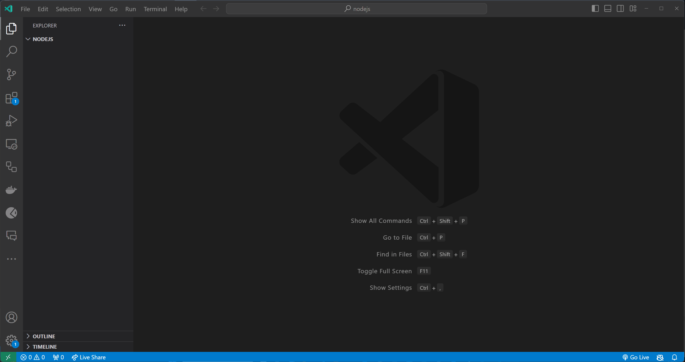

# Andmestruktuurid

Selles peatükis räägime täpsemalt sellistest andmestruktuuridest, nagu objektid. Uurime, mis on objekt, kuidas objekte kasutada ja kuidas objekte manipuleerida.


Pildi allikas: Dall-E by OpenAI

- [Andmestruktuurid](#andmestruktuurid)
  - [Õpiväljundid](#õpiväljundid)
  - [Mis on andmestruktuur?](#mis-on-andmestruktuur)
  - [Objekt](#objekt)
    - [`Object.keys()` Meetod](#objectkeys-meetod)
    - [`Object.values()` Meetod](#objectvalues-meetod)
    - [`Object.entries()` Meetod](#objectentries-meetod)
  - [Harjutused](#harjutused)
    - [Harjutus 3 - Põhilised objekti toimingud](#harjutus-3---põhilised-objekti-toimingud)
    - [Harjutus 4 - Objekti omaduste muutmine](#harjutus-4---objekti-omaduste-muutmine)

## Õpiväljundid

Pärast selle teema läbimist oskad:

- Määratleda, mis on andmestruktuur
- Selgitada, mis on objekt
- Kasutada massiive ja objekte

## Mis on andmestruktuur?

Me juba teame, mis on muutuja ja et seda kasutatakse andmete hoidmiseks. Kuid seni oleme suutnud salvestada muutujasse ainult ühe väärtuse või kirjeldada ainult ühte asja. Näiteks võime omada muutujat nimega `firstName`, mis salvestab inimese **eesnime**. Aga mis siis, kui soovime salvestada inimese **eesnime**, **perekonnanime**, **vanuse** ja **aadressi**? Võiksime luua igaühe jaoks eraldi muutuja, kuid see oleks väga ebaefektiivne. Selle asemel saame kasutada andmestruktuuri, et salvestada kõik need väärtused ühe muutuja sisse.

Andmestruktuur on viis andmete korraldamiseks arvuti mälus. Andmestruktuure kasutatakse andmekogumite salvestamiseks.

Javascript võimaldab kasutada järgmiseid andmestruktuure:

- Massiivid (Arrays)
- Objektid (Objects)
- Mapid (Maps)
- Setid (Sets)

> Selle teema raames keskendume objektidele.

## Objekt

Objekt on **võti**-**väärtus** paaride kogum, mis on salvestatud ühte muutujasse. Objekte kasutatakse juhul, kui on vaja talletada informatsiooni, mis koosneb paljudest omadustest. Näiteks saame kasutada objekti inimese kohta käiva info salvestamiseks (_eesnimi_, _perekonnanimi_, _vanus_, _aadress_ jne).

Objekti loomiseks kasutame `{}` operaatorit. Näiteks saame luua objekti nimega `person`, mis sisaldab omadusi:

- eesnimi: `John`,
- perekonnanimi: `Doe`,
- vanus: `25` nii:

```javascript
const person = {
  firstName: "John",
  lastName: "Doe",
  age: 25,
};
```

Objektis olevatele väärtustele pääseme ligi kasutades väärtuse võtit. Kui soovime lugeda `person` objekti eesnime, saame kasutada võtit `firstName` nii:

```javascript
const person = {
  firstName: "John",
  lastName: "Doe",
  age: 25,
};

console.log(person.firstName); // John
```

Samuti saame võtit kasutades muuta objektis olevat väärtust. Näiteks, kui soovime muuta `person` objekti eesnime `Jane`-ks, saame kasutada võtit `firstName` nii:

```javascript
const person = {
  firstName: "John",
  lastName: "Doe",
  age: 25,
};

person.firstName = "Jane";

console.log(person); // { firstName: 'Jane', lastName: 'Doe', age: 25 }
```

Nagu massiivide puhul, on ka objektide manipuleerimiseks palju meetodeid. Näiteks saame kasutada `Object.keys()` meetodit, et saada objekti võtmete massiiv, `Object.values()` meetodit, et saada objekti väärtuste massiiv, ja `Object.entries()` meetodit, et saada objekti võtme-väärtuse paaride massiiv.

### `Object.keys()` Meetod

`Object.keys()` meetod tagastab objekti võtmed massiivina. Näiteks, kui soovime saada `person` objekti võtmed massiivina, saame kasutada `Object.keys()` meetodit nii:

```javascript
const person = {
  firstName: "John",
  lastName: "Doe",
  age: 25,
};

console.log(Object.keys(person)); // [ 'firstName', 'lastName', 'age' ]
```

Seda võib kasutada ka objekti omaduste iteratsiooniks. Näiteks, kui soovime väljastada iga võtme `person` objektis, saame kasutada `Object.keys()` meetodit nii:

```javascript
const person = {
  firstName: "John",
  lastName: "Doe",
  age: 25,
};

for (let key of Object.keys(person)) {
  console.log(key);
}

// Väljund:
// firstName
// lastName
// age
```

Kui me ei soovi kasutada `for...of` tsüklit, saame kasutada ka `for` tsüklit nii:

```javascript
const person = {
  firstName: "John",
  lastName: "Doe",
  age: 25,
};

for (let i = 0; i < Object.keys(person).length; i++) {
  console.log(Object.keys(person)[i]);
}

// Väljund:
// firstName
// lastName
// age
```

### `Object.values()` Meetod

`Object.values()` meetod tagastab objekti väärtused massiivina. Näiteks, kui soovime saada `person` objekti väärtused massiivina, saame kasutada `Object.values()` meetodit nii:

```javascript
const person = {
  firstName: "John",
  lastName: "Doe",
  age: 25,
};

console.log(Object.values(person)); // [ 'John', 'Doe', 25 ]
```

### `Object.entries()` Meetod

`Object.entries()` meetod tagastab objekti võtme-väärtuse paaride massiivina. Näiteks, kui soovime saada `person` objekti võtme-väärtuse paarid massiivina, saame kasutada `Object.entries()` meetodit nii:

```javascript
const person = {
  firstName: "John",
  lastName: "Doe",
  age: 25,
};

console.log(Object.entries(person)); // [ [ 'firstName', 'John' ], [ 'lastName', 'Doe' ], [ 'age', 25 ] ]
```

Kui me soovime nüüd näiteks väljastada ühekaupa võtme-väärtuse paare, saame kasutada `for` tsüklit nii:

```javascript
const person = {
  firstName: "John",
  lastName: "Doe",
  age: 25,
};

for (let i = 0; i < Object.entries(person).length; i++) {
  console.log(Object.entries(person)[i]);
}

// Väljund:
// [ 'firstName', 'John' ]
// [ 'lastName', 'Doe' ]
// [ 'age', 25 ]
```

Kõik objekti meetodid on loetletud [Objekti meetodid](https://developer.mozilla.org/en-US/docs/Web/JavaScript/Reference/Global_Objects/Object) jaotises Mozilla Developer Network (MDN) veebidokumentatsioonis.

## Harjutused

Loo fail nimega `index.js` (või mõni muu sinu valikul olev nimi) ja alusta allpool toodud harjutuste lahenduste lisamist.

> Testi alati oma koodi, käivitades `index.js` faili käsu `node index.js` abil.

### Harjutus 3 - Põhilised objekti toimingud

**Eesmärk**: Objekti loomine ja selle omaduste väljastamine.

**Kirjeldus**: Defineeri JavaScript objekt nimega `car` omadustega `mark`, `model` ja `year`. Määra igale omadusele sobivad väärtused. Seejärel moodust ja väljasta lause, mis sisaldab auto mudelit, marki ja aastat.

> Objekti omadustele pääsed ligi kasutades `.` operaatorit.
>
> Stringide ühendamiseks saad kasutada `+` operaatorit või kasutada mallistringi.

<details>
  <summary>Lahendus</summary>

```javascript
const car = {
  mark: "Toyota",
  model: "Corolla",
  year: 2019,
};

console.log(`Ma sõidan ${car.year} aasta ${car.mark} ${car.model}iga.`);
```

**Oodatav väljund**:

```bash
Ma sõidan 2019 aasta Toyota Corollaga.
```



</details>

### Harjutus 4 - Objekti omaduste muutmine

**Eesmärk**: Uuenda ja lisa objektile uusi omadusi.

**Kirjeldus**: Antud on objekt `student` omadustega `name`, `age` ja `class`. Uuenda `age` omadust, lisa uus omadus `subject` ja seejärel väljasta kogu objekt.

Näide `student` objektist:

```javascript
const student = {
  name: "John Doe",
  age: 16,
  class: 10,
};
```

> Objekti omadusi saad uuendada kasutades `.` operaatorit.
>
> Uute omaduste lisamiseks objektile saad kasutada `.` operaatorit.
>
> Kasuta `console.log()` funktsiooni, et väljastada kogu objekt.

<details>
  <summary>Lahendus</summary>

```javascript
const student = {
  name: "John Doe",
  age: 16,
  class: 10,
};

student.age = 17;

student.subject = "Matemaatika";

console.log(student);
```

**Oodatav väljund**:

```js
{ name: 'John Doe', age: 17, class: 10, subject: 'Matemaatika' }
```

</details>

Kui soovid lahendada lisaülesandeid objektide kohta, siis leiad mõned siit: [Lisaülesanded objektide kohta](Exercises-Objects.md).
