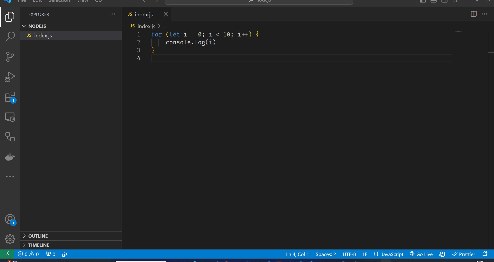

# Silumine (*Debugging*)

Selles teemas õpime NodeJS-s silumise kohta.

Pildi allikas: Dall-E by OpenAI

- [Silumine (*Debugging*)](#silumine-debugging)
  - [Õpiväljundid](#õpiväljundid)
  - [Mis on Silumine?](#mis-on-silumine)
  - [Silumisvahendid](#silumisvahendid)
  - [Silumisnõuanded](#silumisnõuanded)

## Õpiväljundid

Pärast selle teema läbimist suudad:

- Määratleda, mis on silumine
- Kasutada erinevaid meetodeid oma koodi silumiseks

## Mis on Silumine?

Kui tahame reaalses elus teada, kuidas midagi töötab, saame protsessi jälgida, mõnikord saame protsessi katkestada ja vaadelda, mis juhtub. Näiteks kui me teeme süüa, saame mõõta mõningaid toidu *parameetreid* nagu toidu maitse, temperatuur ja aeg. Mõõtmise tulemuse põhjal saame otsustada, mida edasi teha - lisada soola või muid maitseaineid, muuta temperatuuri või kohandada küpsetusaega.

Programmeerimisel on mõnikord raske aru saada, miks programm ei tööta oodatud viisil. Sellisel juhul saame kasutada sama lähenemist nagu reaalses elus - jälgime protsessi ja vaatleme, mis juhtub. Seda protsessi nimetatakse **silumiseks**.

Silumine on protsess, mille käigus otsitakse ja parandatakse programmeerimisvigu. Viga on programmiviga, mis põhjustab programmi töötamisel ootamatu käitumise. Silumine on programmeerijate jaoks oluline oskus, kuna see võimaldab neil leida ja parandada vigu  programmides.

## Silumisvahendid

Kuigi NodeJS-l on olemas ka sisseehitatud silur, on lihtsam kasutada koodiredaktori silurit. Enamikul koodiredaktoritel on oma silurid, mis võimaldavad meil samm-sammult läbi koodi liikuda ja igal sammul muutujate väärtusi kontrollida. Visual Studio Code'i-s on samuti sisseehitatud silur, mida me saame kasutada.

Visual Studio Code'i sisseehitatud siluri kasutamiseks peame käivitama oma programmi silumisrežiimis, vajutades `F5` või klõpsates menüüüksusel `Run > Start Debugging`. Seejärel saame valida silumiskeskkonna, mis meie puhul on `Node.js`. Seejärel saame oma koodis määrata **murdepunkte** (*breakpoint*) klõpsates reanumbril, kus soovime murdepunkti seada. Murdepunkt on koht meie koodis, kus soovime, et silur peataks täitmise ja võimaldaks meil muutujate väärtusi kontrollida.

Lihtsate programmide puhul saame kasutada ka `console.log()` meetodit, et erinevates oma koodi punktides muutujate väärtusi väljastada. Näiteks kui soovime teada muutuja `x` väärtust teatud punktis oma koodis, saame sellesse punkti lisada `console.log(x)` avalduse ja käivitada oma programmi. Seejärel saame kontrollida `console.log(x)` väljundit, et näha muutuja `x` väärtust selles koodipunktis. See on lihtne viis oma koodi silumiseks, kuid see pole väga tõhus, sest peame oma koodi lisama `console.log()` avaldusi ja käivitama oma programmi iga kord, kui soovime muutuja väärtust kontrollida. Samuti tuleks meeles pidada, et `console.log()` avaldused tuleks hiljem eemaldada.

## Silumisnõuanded

Esiteks peaksime oma koodi testima jooksvalt, kui seda kirjutame. Me ei tohiks oodata, kuni oleme kirjutanud palju koodi, enne kui seda testime. Peaksime oma koodi sageli testima. See aitab meil varakult leida vigu oma koodis ja parandada neid enne, kui need hiljem suuremateks probleemideks kasvavad.

- Kasutage sisseehitatud silurit murdepunktide seadmiseks oma koodis ja muutujate väärtuste kontrollimiseks nendes murdepunktides.
- Kasutage `console.log()` avaldusi, et erinevates oma koodi punktides muutujate väärtusi printida.
- Testige koodi jooksvalt ja tihti.
