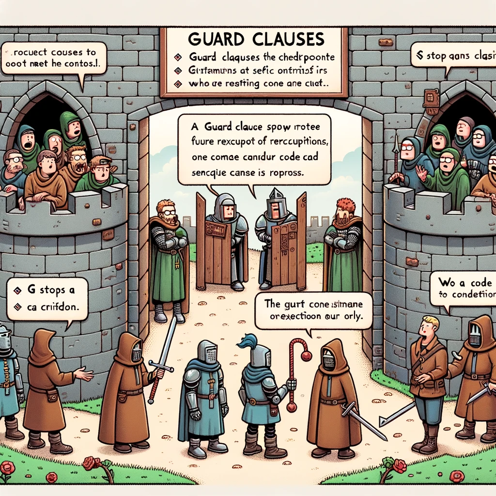

# Guard Clause



Pildi allikas: Dall-E by OpenAI

## Õpiväljundid

Pärast selle teema läbimist suudate:

- Määratleda, mis on Guard Clause;
- Selgitada, miks kasutada Guard Clause;
- Kasutada Guard Clause programmeerimisel.

## Mis on Guard Clause?

Guard clause on programmeerimisstiil, kus funktsiooni alguses kontrollitakse kõik eeldused, mille korral funktsiooni edasine töö ei ole mõistlik. Kui eeldused ei ole täidetud, siis funktsioon lõpetatakse ja tagastatakse väärtus.

## Miks kasutada Guard Clause?

Guard clause on kasulik, kuna:

- See muudab koodi loetavamaks, kuna kõik eeldused on funktsiooni alguses
- See vähendab `if` lausete sügavust, ehk vähendab _nesting_ probleemi (kui `if` laused on üksteise sees)
- See vähendab _else_ lausete kasutamist ja muudab seetõttu koodi loetavamaks

## Näide

Selle asemel, et teha nii:

```javascript
function calculatePrice(price, discount) {
  if (price >= 0) {
    if (discount >= 0 && discount <= 100) {
      return price * (1 - discount / 100);
    } else {
      return "Discount must be between 0 and 100";
    }
  } else {
    return "Price cannot be negative";
  }
}
```

Saab teha nii:

```javascript
function calculatePrice(price, discount) {
  if (price < 0) {
    return "Price cannot be negative";
  }

  if (discount < 0 || discount > 100) {
    return "Discount must be between 0 and 100";
  }

  return price * (1 - discount / 100);
}
```

Selle asemel, et kontrollida kõiki eeldusi ühe _if_ lause sees, on eeldused kontrollitud eraldi _if_ lausetega. See muudab koodi paremini loetavaks.

## Ülesanne

### Kasutaja vanuse kontroll Guard Clause'iga

**Probleem:** Kirjuta funktsioon, mis kontrollib kasutaja vanust ja tagastab vastava teate. Funktsioon peaks tagastama erinevad teated sõltuvalt sellest, kas kasutaja on alaealine (alla 18-aastane), täisealine (18 kuni 65-aastane) või seenior (üle 65-aastane). Kasuta Guard Clause'id, et muuta koodi puhtamaks ja lihtsamini loetavaks.

**Nõuded:**

1. Kui kasutaja vanus on alla 18, funktsioon tagastab "Kasutaja on alaealine".
2. Kui kasutaja vanus on vahemikus 18 kuni 65, funktsioon tagastab "Kasutaja on täisealine".
3. Kui kasutaja vanus on suurem kui 65, funktsioon tagastab "Kasutaja on seenior".
4. Funktsioon peaks kontrollima, et vanus on mõistlik (positiivne arv). Kui sisend ei ole kehtiv, tagasta "Vigane sisend".

**Oodatav tulemus:**

```javascript
console.log(checkUserAge(10));  // Kasutaja on alaealine
console.log(checkUserAge(20));  // Kasutaja on täisealine
console.log(checkUserAge(70));  // Kasutaja on seenior
console.log(checkUserAge("kakskümmend"));  // Vigane sisend
```

<details>
  <summary>Lahendus</summary>

```javascript
function checkUserAge(age) {
  // Guard Clause: kontrollib vigast sisendit
  if (typeof age !== 'number' || age <= 0) {
    return "Vigane sisend";
  }

  // Guard Clause: kontrollib alaealisust
  if (age < 18) {
    return "Kasutaja on alaealine";
  }

  // Guard Clause: kontrollib seeniori vanust
  if (age > 65) {
    return "Kasutaja on seenior";
  }

  // Kui ükski ülaltoodud tingimustest ei kehti, peab kasutaja olema täisealine
  return "Kasutaja on täisealine";
}
```

</details>
