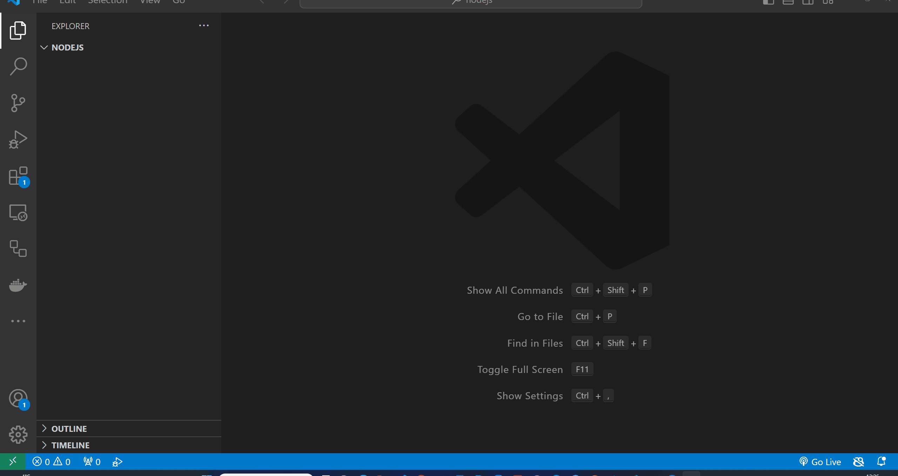

# Hello World!

Selles peatükis räägime, mis on *Hello World*, kuidas kirjutada *Hello World* programm Javascriptis ja kuidas seda käivitada..

- [Hello World!](#hello-world)
  - [Õpitulemused](#õpitulemused)
  - [Mis on Hello World?](#mis-on-hello-world)
  - [Kuidas kirjutada Hello World! programmi Javascriptis?](#kuidas-kirjutada-hello-world-programmi-javascriptis)
  - [Kuidas käivitada Hello World! programmi NodeJS-is?](#kuidas-käivitada-hello-world-programmi-nodejs-is)
  - [Harjutused](#harjutused)

## Õpitulemused

Pärast selle teema läbimist suudate:

- Määratleda, mis on *Hello World!* programm
- Kirjutada *Hello World!* programmi Javascriptis
- Käivitada *Hello World!* programmi NodeJS-is

## Mis on Hello World?

Tavaliselt, kui alustatakse programmeerimise või uue programmeerimiskeele õppimist, on esimene kood, mida kirjtuatakse, kood, mis kuvab ekraanile **Hello World!**. Seda nimetatakse **Hello World** programmiks. See on lihtne programm, mida kasutatakse programmeerimiskeele põhisüntaksi demonstreerimiseks ja veendumaks, et me saame programmi oma arvutis käivitada. Seda kasutatakse ka arenduskeskkonna testimiseks ja veendumaks, et kõik töötab korrektselt.

Mõnes programmeerimiskeele (nagu `C`) peame kirjutama *Hello World!*-i jaoks üsna palju kood, kuid Javascriptis saame hakkama ühe reaga.

## Kuidas kirjutada Hello World! programmi Javascriptis?

*Hello World!*-i kirjutamiseks Javascriptis peame avama tekstiredaktori ja tippima järgmise koodi:

```javascript
console.log('Hello World!');
```

Seejärel tuleb faili salvestada näiteks nimega `helloWorld.js` ja käivitada selle kasutades NodeJS-i.

> console.log() on meetod, mida kasutatakse sõnumi printimiseks konsooli. See võtab ühe argumendi, mis on sõnum, mida me soovime konsooli printida. Praegusel juhul on sõnum "Hello World!".

## Kuidas käivitada Hello World! programmi NodeJS-is?

*Hello World!*-i käivitamiseks NodeJS-is peame avama terminali ja tippima terminalis `node helloWorld.js`, kus `helloWorld.js` on faili nimi, mis sisaldab programmi.



## Harjutused

Kirjutage programm, mis kuvab ekraanile sõnad "Hello World!".

Käivitage programm kasutades Node JS-i.

> Vihje: Saate kasutada `console.log()` meetodit sõnumi kuvamiseks konsooli.

> Vihje: Saate kasutada `node fileName.js` käsku Javascripti faili käivitamiseks.
