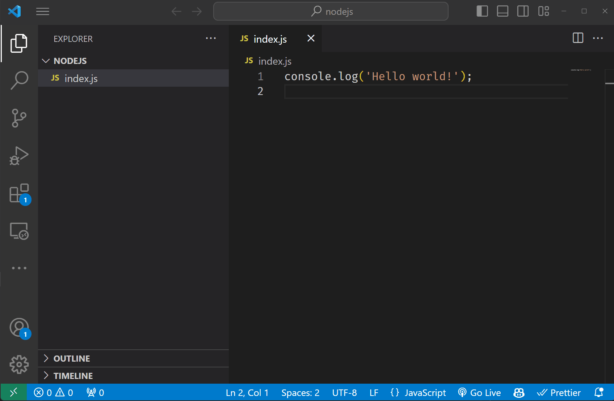

# Javascript

Selles peatükis räägime Javascriptist, mis on selle programmeerimiskeele eelised ja miinused ning kuidas käivitada Javascripti Node JS-is.


Pildi allikas: Dall-E by OpenAI

- [Javascript](#javascript)
  - [Õpiväljundid](#õpiväljundid)
  - [Mis on Javascript?](#mis-on-javascript)
  - [Javascripti ajalugu](#javascripti-ajalugu)
  - [Javascripti eelised](#javascripti-eelised)
  - [Javascripti puudused](#javascripti-puudused)
  - [Kuidas Javascripti koodi kirjutatakse?](#kuidas-javascripti-koodi-kirjutatakse)
  - [Kuidas käivitada Javascripti?](#kuidas-käivitada-javascripti)
  - [Javascripti käivitamine Node JS-is](#javascripti-käivitamine-node-js-is)

## Õpiväljundid

Pärast selle teema läbimist suudate:

- Määratleda, mis on Javascript
- Loetleda Javascripti eelised
- Loetleda Javascripti puudused
- Selgitada, kuidas käivitada Javascripti Node JS-is

## Mis on Javascript?

Javascript on programmeerimiskeel, mis on algselt mõeldud interaktiivsete veebilehtede loomiseks. Minevikus kasutati Javascripti ainult kliendipoolselt (veebilehitsejas, *Front-End*). Tänapäeval on võimalus kasutada Javascripti ka serveripoolselt, kasutades NodeJS-i (*Back-End*). Selle kursuse raames kasutame Javascripti just sellepärast, et saaksime õppida nii kliendi- kui ka serveripoolset arendust kasutades sama programmeerimiskeelt.

## Javascripti ajalugu

**Javascripti** lõi Brendan Eich 1995. aastal. Algselt nimetati seda *Mochaks*, seejärel nimetati ümber *LiveScriptiks* ja lõpuks *Javascriptiks*. Javascripti valiti nimeks, sest *Java* oli sel ajal väga populaarne ja Javascripti nime kasutati Java arendajate meelitamiseks Javascripti kasutama.

## Javascripti eelised

- Javascripti on lihtne õppida
- Javascripti on lihtne kasutada
- Javascript on väga populaarne
- Javascripti toetavad kõik peamised veebilehitsejad
- Javascripti kasutama hakkamine on väga lihtne
- Javascripti saab kasutada nii kliendi- kui ka serveripoolse arenduse jaoks

## Javascripti puudused

- Javascript on nõrgalt tüübitud, see tähendab, et muutuja tüüpi saab programmi täitmise ajal muuta
- Javascript ei ole kompileeritud keel, see tähendab, et koodi ei kompileerita enne selle täitmist
- Mõnikord on koodi raske mõista tüübiteabe puudumise tõttu

## Kuidas Javascripti koodi kirjutatakse?

Javascripti kirjutamiseks võib kasutada lihtsat tekstiredaktorit, kuid soovitatav on kasutada spetsiaalset koodiredaktorit, mis toetab Javascripti. Koodi kirjutamiseks tuleb luua uus fail laiendiga `.js` ja kirjutada kood sellesse faili.

Näiteks:

```js
console.log('Hello, World!');
```

Seejärel tuleb fail salvestada ja seejärel on juba võimalik kirjutatud kood käivitada.

## Kuidas käivitada Javascripti?

Javascripti käivitamiseks on mitu võimalust. Me saame salvestada Javascripti koodi faili ja käivitada kasutades *Node JS*-i või veebilehitsejat. Samuti saame käivitada Javascripti koodi veebilehitseja konsooli kirjutades või sinna koodi kleepides.

## Javascripti käivitamine Node JS-is

Javascripti käivitamiseks Node JS-is peame avama terminali ja tippima terminalis `node fileName.js`, kus `fileName.js` on faili nimi, mis sisaldab Javascripti koodi.


