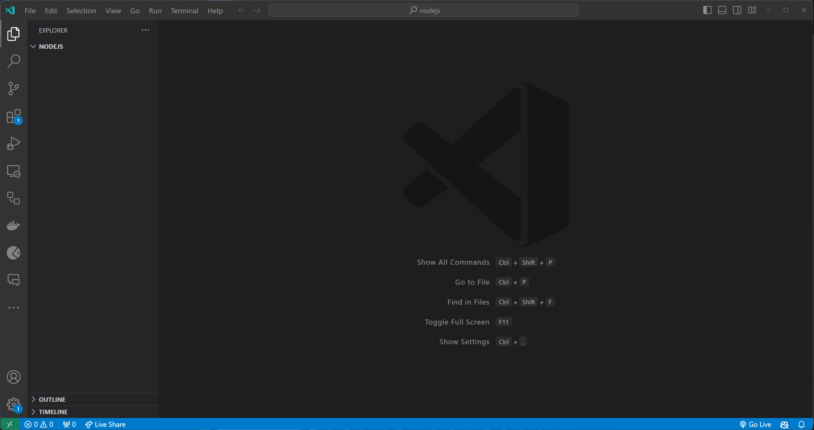

# Moodulid

Selles teemas räägime sellest, mis on moodulid Javascriptis ja kuidas neid kasutada.

Sisseehitatud moodulitest saad lugeda [siit](../Modules-Built-In/README.md).

Kolmanda osapoole moodulitest saad lugeda [siit](../Modules-Third-Party/README.md).


Pildi allikas: Dall-E by OpenAI

- [Moodulid](#moodulid)
  - [Õpiväljundid](#õpiväljundid)
  - [Mis on moodul?](#mis-on-moodul)
  - [Kuidas eksportida moodulit?](#kuidas-eksportida-moodulit)
  - [Kuidas importida moodulit?](#kuidas-importida-moodulit)
  - [Kuidas kasutada moodulit?](#kuidas-kasutada-moodulit)
  - [Moodulite kasutamise näide](#moodulite-kasutamise-näide)
  - [Harjutused](#harjutused)
    - [Harjutus 1 - Mooduli eksport ja import](#harjutus-1---mooduli-eksport-ja-import)
    - [Harjutus 2 - Mitme funktsiooni eksportimine](#harjutus-2---mitme-funktsiooni-eksportimine)
    - [Harjutus 3 - Objekti eksportimine](#harjutus-3---objekti-eksportimine)

## Õpiväljundid

Pärast selle teema läbimist oskad:

- Määratleda, mis on moodul
- Selgitada, kuidas eksportida moodulit
- Selgitada, kuidas importida moodulit
- Selgitada, kuidas kasutada moodulit

## Mis on moodul?

Moodul on Javascripti fail, mis sisaldab koodi, mida saab taaskasutada teistes Javascripti failides. Mooduleid kasutatakse koodi organiseerimiseks loogilistesse üksustesse, mida saab taaskasutada programmi teistes osades. Moodulid võivad sisaldada funktsioone, objekte, klasse, muutujaid ja muid Javascripti koodi osi.

## Kuidas eksportida moodulit?

Esiteks peaks meil olema fail, milles olevat koodi soovime eksportida. See fail võib sisaldada funktsioone, objekte, klasse, muutujaid ja muid Javascripti koodi osi.

Mooduli eksportimiseks peame kasutama `module.exports` võtmesõna, millele järgneb mooduli nimi, mida soovime eksportida. Näiteks, kui soovime eksportida moodulit nimega `myModule`, saame tippida `module.exports = myModule;` või `module.exports = { myModule, myModule1 };` (kui meil on mitu eksporti) Javascripti failis, kust soovime moodulit eksportida.

```javascript
const myModule = {
  // defineerida moodul nimega myModule
  myFunction() {
    // funktsiooni sisu
  },
};

module.exports = myModule; // eksportida moodul nimega myModule
```

või

```javascript
module.exports = { myModule, myModule1 }; // eksportida mitu moodulit nimega myModule ja myModule1
```

## Kuidas importida moodulit?

Mooduli importimiseks peame kasutama `require` võtmesõna, millele järgneb faili nimi, mis sisaldab moodulit, mida soovime importida. Näiteks, kui soovime importida moodulit nimega `myModule` failist `moduleFileName.js`, saame tippida `require('./moduleFileName');` Javascripti failis, kus soovime moodulit importida (osaga `./` täpsustatakse faili teed, mis sisaldab mooduleid, mida soovime importida).

```javascript
const myModule = require("./moduleFileName"); // importida moodul failist nimega `moduleFileName.js`
```

või

```javascript
import { myModule, myModule1 } from "./moduleFileName"; // importida mitu moodulit nimega myModule ja myModule1 failist `moduleFileName.js`
```

## Kuidas kasutada moodulit?

Mooduli kasutamiseks peame selle esmalt importima. Pärast mooduli importimist saame seda oma koodis kasutada. Näiteks, kui meil on fail nimega `calculate`, mis sisaldab funktsiooni nimega `add`, saame importida mooduli ja kasutada funktsiooni nii:

Faili `calculate.js` sisu võiks olla midagi sellist:

```javascript
function add(a, b) {
  return a + b;
}

function subtract(a, b) {
  return a - b;
}

module.exports = { add, subtract }; // eksportida add ja subtract funktsioonid
```

Faili `index.js` sisu võiks olla midagi sellist:

```javascript
const calculate = require("./calculate"); // importida calculate moodul

const sum = calculate.add(5, 3); // kutsuda add funktsioon calculate moodulist ja määrata tulemus muutujale sum

console.log(sum); // trükkida muutuja sum väärtus konsooli
```

## Moodulite kasutamise näide

Järgmises näites loome uue faili nimega `index.js`, loome faili `calculate.js`, eksportime `add` ja `subtract` funktsioonid `calculate.js` failist, impordime `calculate.js` faili `index.js` failis ja kasutame `add` funktsiooni oma koodis.


[Klõpsa siia, et alla laadida video](UsingModule.mp4)

## Harjutused

Loo failid, nagu kirjeldatud allpool toodud harjutustes.

Testi oma koodi, käivitades `index.js` faili käsu `node index.js` abil.

### Harjutus 1 - Mooduli eksport ja import

**Eesmärk**: Mooduli loomine, selle eksportimine, importimine ja kasutamine.

**Kirjeldus**: Loo kaks faili, `greetings.js` ja `index.js`. Failis `greetings.js` defineeri funktsioon, mis väljastab konsooli "Hello, World!". Eskpordi see funktsioon. Failis `index.js`, impordi `greetings.js` ja käivita imporditud funktsioon.

> Vihje: Ära unusta kasutada `module.exports` võtmesõna funktsiooni eksportimiseks.
>
> Vihje: Kasuta `require` võtmesõna funktsiooni importimiseks.

<details>
  <summary>Lahendus</summary>

```javascript
// greetings.js
function sayHello() {
  console.log("Hello, World!");
}

module.exports = sayHello;
```

```javascript
// index.js
const sayHello = require("./greetings");

sayHello();
```



</details>

### Harjutus 2 - Mitme funktsiooni eksportimine

**Eesmärk**: Mitme funktsiooniga mooduli eksport, import ja kasutamine.

**Kirjeldus**: Loo kaks faili, `greetings.js` ja `index.js`. Failis `greetings.js`, defineeri kaks funktsiooni, üks, mis trükib konsooli "Hello, World!" ja teine, mis võtab argumendina nime ja trükib konsooli "Hello, [nimi]!". Eskpordi mõlemad funktsioonid. Failis `index.js`, impordi `greetings.js` ja kutsu imporditud funktsioonid.

> Vihje: Mitme funktsiooni eksportimiseks saad kasutada `module.exports` võtmesõna, millele järgneb objekt, mis sisaldab eksportida soovitud funktsioone.

<details>
  <summary>Lahendus</summary>

```javascript
// greetings.js
function sayHello() {
  console.log("Hello, World!");
}

function sayHelloTo(name) {
  console.log(`Hello, ${name}!`);
}

module.exports = { sayHello, sayHelloTo };
```

```javascript
// index.js
const { sayHello, sayHelloTo } = require("./greetings");

sayHello();
sayHelloTo("Jaan");
```

</details>

### Harjutus 3 - Objekti eksportimine

**Eesmärk**: Eskpordida objekt, mis sisaldab mitut meetodit.

**Kirjeldus**: Loo fail `utils.js` objektiga, mis omab kahte meetodit: `square` (tagastab numbri ruudu) ja `cube` (tagastab numbri kuubi). Eskpordi see objekt. Failis `index.js`, impordi see objekt ja kasuta selle meetodeid.

> Vihje: Funktsioonide lisamiseks objekti saad kasutada järgmist süntaksit:
>
> ```javascript
> const myObject = {
>   myFunction() {
>     // funktsiooni sisu
>   },
> };
> ```
>
> Vihje: Funktsiooni kutsumiseks objektist saad kasutada järgmist süntaksit:,
>
> ```javascript
> myObject.myFunction();
> ```
