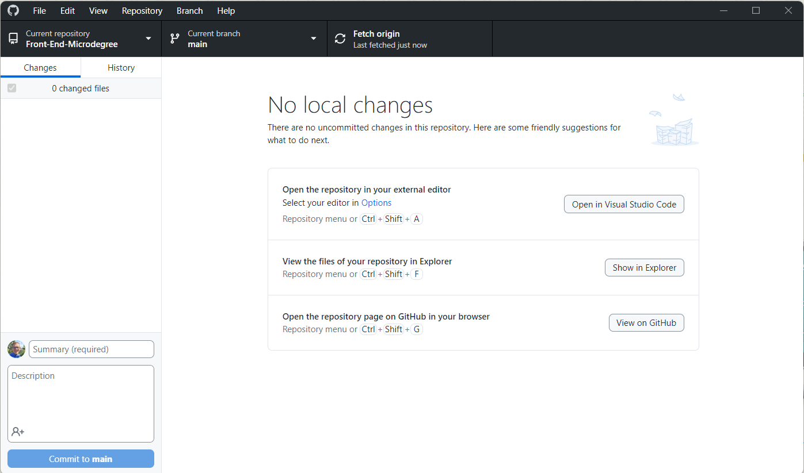

# Tööriistad

Selles peatükis räägime täpsemalt tööriistadest, mida kasutame sellel kursusel.

- [Tööriistad](#tööriistad)
  - [Õpitulemused](#õpitulemused)
  - [Koodiredaktor](#koodiredaktor)
  - [Veebilehitseja](#veebilehitseja)
  - [Terminal](#terminal)
  - [Git](#git)
  - [GitHub](#github)
  - [GitHub Desktop](#github-desktop)

## Õpitulemused

Pärast selle teema läbimist suudad vastata järgmistele küsimustele:
- mis on koodiredaktor
- mis on brauser
- mis on terminal
- mis on Git
- mis on GitHub
- mis on GitHub Desktop

## Koodiredaktor

Koodiredaktor on programm, mida kasutatakse lähtekoodi kirjutamiseks ja redigeerimiseks. On palju erinevaid koodiredaktoreid, kuid kõige populaarsemad on:
- Visual Studio Code
- Sublime Text
- Atom
- jne

Tehniliselt võiksime kirjutada koodi kasutades tavalisi tekstiredaktoreid, kuid koodiredaktoritel on palju funktsioone, mis teevad koodi kirjutamise lihtsamaks - nagu süntaksi esiletõstmine, koodi lõpetamine ja koodi vormindamine.

Sellel kursusel kasutame koodiredaktorina [Visual Studio Code](https://code.visualstudio.com/), kuid igaüks võib kasutada endale meelepärast koodiredaktorit. **Visual Studio Code** on tasuta ja avatud lähtekoodiga koodiredaktor, mida arendab Microsoft. See on saadaval Windowsile, Macile ja Linuxile ning sellel on palju funktsioone ja laiendamisvõimalusi, mis teevad sellest suurepärase valiku algajatele.

## Veebilehitseja

Veebilehitseja on programm, mida kasutatakse veebilehtede vaatamiseks. Saadaval on palju erinevaid Veebilehitsejaid, kuid kõige populaarsemad on:
- Google Chrome
- Mozilla Firefox
- Microsoft Edge

Sellel kursusel kasutame vaikimisi brauserina [Google Chrome](https://www.google.com/chrome/), kuid jällegi, igaüks võib kasutada endale meelepärast brauserit.

## Terminal

Terminal on programm, mida kasutatakse operatsioonisüsteemiga suhtlemiseks. Seda tuntakse ka kui käsurea liidest (CLI) või shelli. Nagu paljude teiste rakendustegagi, on võimalus kasutada palju erinevaid terminale, kuid kõige populaarsemad on:

- Windows Terminal
- iTerm2
- Hyper
- jne

Sellel kursusel kasutame vaikimisi Visual Studio Code'i sisseehitatud terminali, kuid igaüks võib taas kasutada endale meelepärast terminali. Kasutame terminale erinevate ülesannete täitmiseks, nagu failide loomine, pakettide installimine ja programmide käivitamine.

## Git

[Git](https://git-scm.com/) on versioonihaldussüsteem, mida kasutatakse failide ja kaustade muudatuste jälgimiseks. See on **hajutatud** versioonihaldussüsteem, mis tähendab, et igal arendajal on kogu projekti koopia oma arvutis. Git'i saab kasutada käsurealt või GUI (graafiline kasutajaliides) abil.

## GitHub

[GitHub](https://www.github.com) on veebipõhine majutusteenus Git'i repositooriumitele. See on platvorm, mis võimaldab arendajatel koostööd teha projektide kallal ja jagada koodi üksteisega. See on ka arendajate sotsiaalvõrgustik, kus nad saavad jälgida üksteist, kommenteerida üksteise projekte jne. Sellel kursusel kasutame GitHubi õppematerjalide ja projektide majutamiseks ja teiste õpilastega koostöö tegemiseks.

## GitHub Desktop

Nagu eespool mainitud, saame Git'i kasutada käsurealt või GUI-st. Sellel kursusel kasutame meie Git GUI-na [GitHub Desktop](https://desktop.github.com/) rakendust, kuid igaüks võib kasutada endale meelepärast Git GUI-d. **GitHub Desktop **on tasuta ja avatud lähtekoodiga Git-i graafilise kasutajaliidesega tööriist, mida arendab GitHub. See on saadaval Windowsile ja Macile ning sellel on palju funktsioone, mis teevad sellest suurepärase valiku algajatele.

Sellel kursusel läbime eraldi teema Git'i ja GitHubi kohta, kus õpime, kuidas kasutada Git'i ja GitHubi meie projektide muudatuste jälgimiseks ja teistega koostöö tegemiseks.

Kursuse jooksul lisandub veel tööriistu, mida kasutame vastavalt teemadele, kuid eelpool nimetatud on peamised tööriistad, mida hakkame kasutama.
