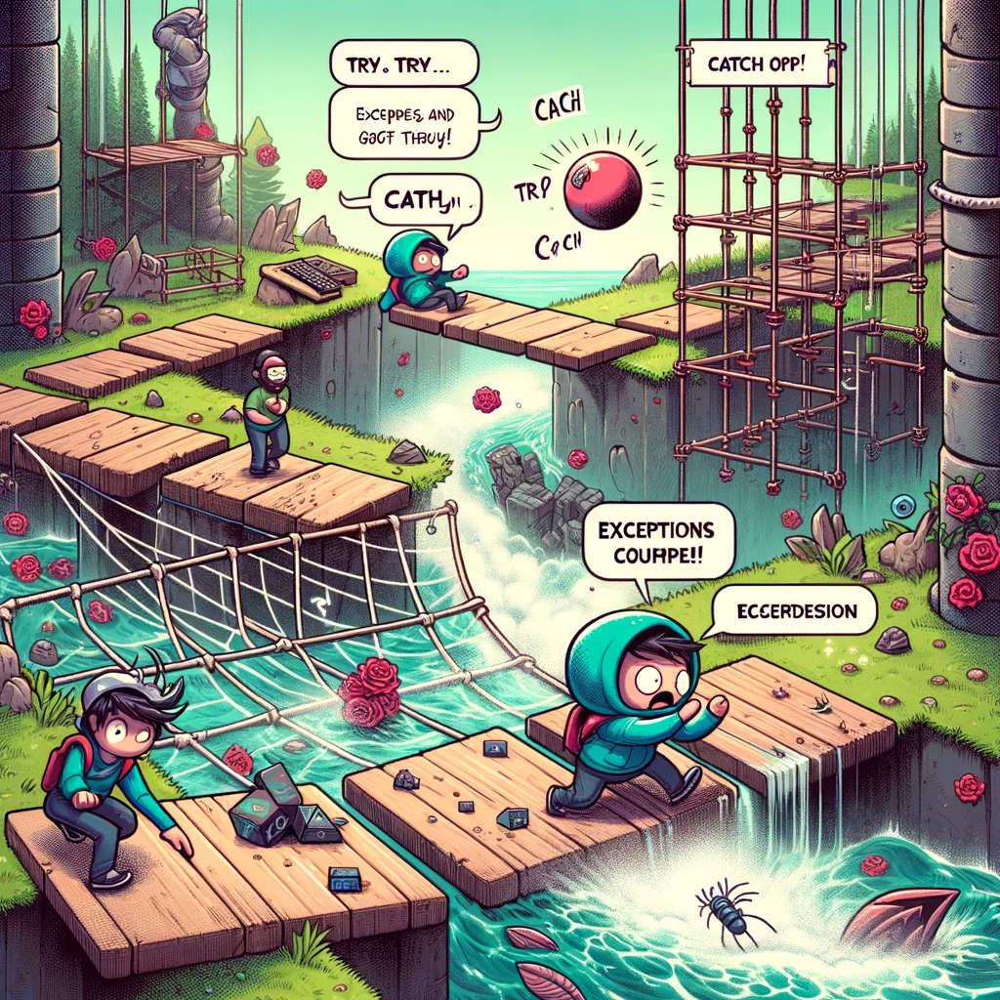
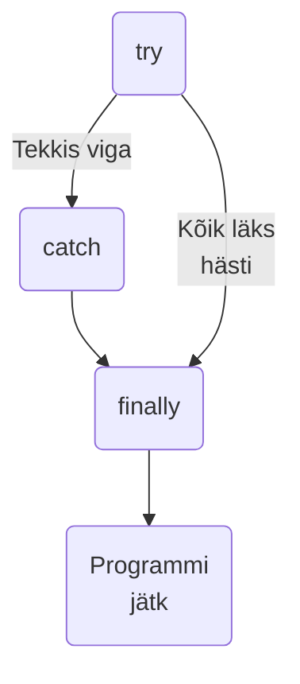
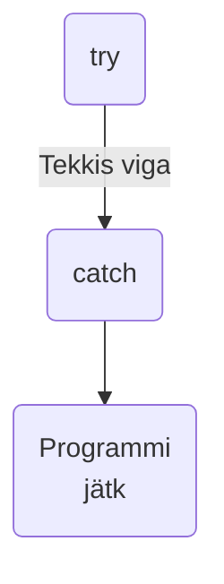
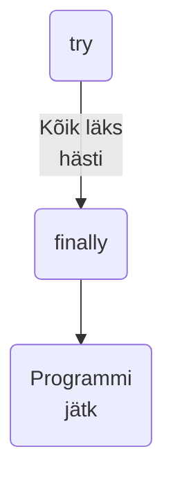

# Try..catch



Pildi allikas: Dall-E by OpenAI

- [Try..catch](#trycatch)
  - [Õpiväljundid](#õpiväljundid)
  - [Mis on `try...catch` lause?](#mis-on-trycatch-lause)
  - [Süntaks](#süntaks)
    - [try...catch...finally](#trycatchfinally)
    - [try...catch](#trycatch-1)
    - [try...finally](#tryfinally)
  - [Kuidas `try...catch` lauset kasutada?](#kuidas-trycatch-lauset-kasutada)

## Õpiväljundid

Pärast selle teema läbimist suudate:

- Määratleda, mis on `try...catch` lause;
- Selgitada, kuidas `try...catch` lauset kasutada;
- Kasutada `try...catch` lauset vigade haldamiseks.

## Mis on `try...catch` lause?

`try...catch` lause on Javascripti konstruktsioon, mida kasutatakse vigade haldamiseks. See võimaldab meil proovida (try) täita koodi, mis võib tekitada vea, ja kui viga tekib, siis püüda (catch) see kinni ja teha midagi selle käsitlemiseks.

`try...catch` lause on kasulik, kuna see aitab vältida programmi kokkujooksmist vigade tõttu. See võimaldab käsitleda programmi täitmisel tekkivaid vigu ja jätkata programmi hoolimata olukorrast, kus tekib viga, mida NodeJS muidu ei suudaks ilma tööd lõpetamata käsitleda.

Lause `try...catch` koosneb `try` plokist ja kas `catch` plokist, `finally` plokist või mõlemast. Esmalt käivitatakse `try`-plokis olev kood ja kui selles tekib viga, siis käivitatakse `catch` plokis olev kood. `finally` plokis olev kood käivitatakse alati enne, kui juhtvoog kogu konstruktsioonist väljub.

## Süntaks

```javascript
try {
  // Täitmisele kuuluvad avaldised
} catch (exceptionVar) {
  // Avaldis(ed), mis täidetakse, kui try plokis tekib viga
} finally {
  // Avaldised, mis käivitatakse enne kontrollvoogu väljumist try...catch...finally konstrueerimisest. Need avaldused täidetakse sõltumata sellest, kas viga tekkis või mitte.
}
```

`try...catch` lause algab alati `try` plokiga. Sellele peab järgnema `catch` plokk või `finally` plokk. Samuti on võimalik kasutada nii `catch` kui ka `finally` plokke korraga. See annab meile `try...catch` lause kolm vormi:

```javascript
try...catch
try...finally
try...catch...finally
```

Skemaatiliselt näeb see välja järgmiselt:

### try...catch...finally



### try...catch



### try...finally



## Kuidas `try...catch` lauset kasutada?

Oletame, et meil on kood, mis võib tekitada vea. Näiteks, kui me proovime lugeda arvuti andmekandjalt faili, mida ei eksisteeri:

```javascript
const fs = require('fs');
const file = fs.readFileSync('nonexistingFile.txt');

console.log('Programm jätkub');
```

Kui me proovime seda koodi käivitada, siis saame vea ja programm lõpetatakse enne kui jõuame väljundini:

```bash
node:internal/fs/utils:344
    throw err;
    ^

Error: ENOENT: no such file or directory, open 'nonexistingFile.txt'
...
```

Sellisel juhul saame kasutada sellist lähenemist:

```javascript
const fs = require('fs');

try {
  const file = fs.readFileSync('nonexistingFile.txt');
} catch (error) {
  console.error('Faili lugemisel tekkis viga:', error.message);
}

console.log('Programm jätkub');
```

Nüüd on viga käsitletud, me saame programmi jätkata ka juhul, kui viga tekkis:

```bash
Faili lugemisel tekkis viga: ENOENT: no such file or directory, open 'nonexis
tingFile.txt'
Programm jätkub
```
