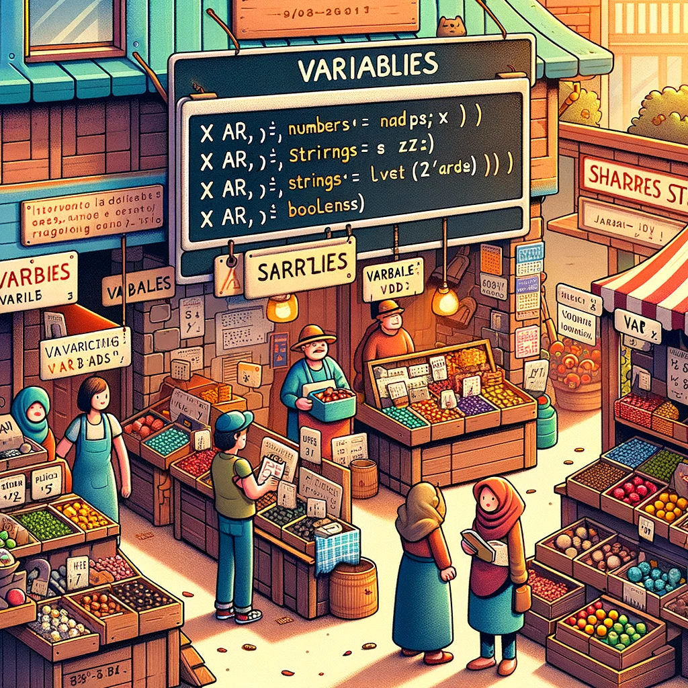

# Muutujad

Selles peatükis õpime Javascriptis muutujate kohta, mis need on, kuidas neid deklareerida ja kuidas neile väärtusi omistada.



Pildi allikas: Dall-E by OpenAI

- [Muutujad](#muutujad)
  - [Õpitulemused](#õpitulemused)
  - [Mis on muutuja?](#mis-on-muutuja)
  - [Kuidas deklareerida muutujat?](#kuidas-deklareerida-muutujat)
  - [Väärtuste omistamine muutujatele](#väärtuste-omistamine-muutujatele)
  - [Harjutused](#harjutused)
    - [Harjutus 1](#harjutus-1)
    - [Harjutus 2](#harjutus-2)
    - [Harjutus 3](#harjutus-3)

## Õpitulemused

Pärast selle teema läbimist suudate:
- Määratleda, mis on muutuja
- Deklareerida muutujaid
- Omistada muutujatele väärtusi
- Selgitada erinevust `var`, `let` ja `const` vahel

## Mis on muutuja?

Muutuja on nimetatud piirkond arvuti mälus, mida saab kasutada andmete salvestamiseks. Muutujaid kasutatakse väärtuste salvestamiseks, mida saab programmi täitmise ajal kirjutada, lugeda ja muuta. Näiteks muutujat nimega `x` saab kasutada väärtuse `5` salvestamiseks. Muutuja `x` väärtust saab muuta `10`-ks, omistades muutujale `x` väärtuse `10`. Muutujaid kasutatakse andmete salvestamiseks, et neid programmis kasutada.

Muutujat võib kujutada kui kasti, millel on silt (`muutuja nimi`), mis võib sisaldada midagi (`väärtus`). Me saame panna midagi kasti (`omistada muutujale väärtuse`) ja me võime võtta midagi kastist välja (`väärtust lugeda`). Kui me tahame teada, mis on kastis, saame vaadata silti (`muutuja nimi`), et tuvastada kast ja seejärel avada kast, et näha, mis on sees (`pääseda väärtusele ligi`).

Näiteks võiks meil olla `apples` muutuja, mis sisaldab mõningaid õunu. Kui me tahame teada, mitu õuna meil `apples` muutujas on, saame vaadata silti (`apples`), et tuvastada kast ja seejärel avada kast, et näha, mitu õuna sees on (`lugeda muutuja väärtust`).

Javascriptis oleks see midagi sellist:

```javascript
let apples = 5; // deklareeri muutuja nimega õunad ja omista sellele väärtus 5 (pane 5 õuna kasti)
console.log(apples); // väljasta õunad muutuja väärtus konsooli (ava kast, vaata, mitu õuna sees on ja prindi väärtus konsooli)
```

## Kuidas deklareerida muutujat?

Programmis muutuja kasutamiseks peame selle esmalt deklareerima. Javascriptis saame muutuja deklareerida kasutades `var`, `let` või `const` võtmesõnu.

- `var` võtmesõna kasutatakse muutuja deklareerimiseks, millele saab väärtust uuesti omistada, kuid me peaksime tänapäeval `var` kasutamist vältima ja kasutama selle asemel `let`-i. `var`on vananenud viis muutujate deklareerimiseks, kuid see on siiani siiski kasutusel, et tagada tagasiühilduvus vanemate Javascripti versioonidega.
- `let` võtmesõna kasutatakse muutuja deklareerimiseks, mille väärtust saab muuta.
- `const` võtmesõna kasutatakse muutuja deklareerimiseks, mida ei saa hiljem muuta.

```javascript
let firstName; // deklareeri muutuja nimega eesnimi
let age, lastName; // deklareeri mitu muutujat
```

Eelnevas näites deklareerisime muutujad nimega `firstName`, `age` ja `lastName`. Samuti saame muutujaid deklareerida ja neile ka kohe väärtuse omistada.

## Väärtuste omistamine muutujatele

Muutujatele saame väärtusi omistada kasutades omistamisoperaatorit `=`. Paremal pool omistamisoperaatorit olev väärtus omistatakse vasakul pool omistamisoperaatorit olevale muutujale.

```js
let firstName = 'John'; // deklareeri muutuja nimega eesnimi ja omista sellele väärtus 'John'
let age = 25, lastName = 'Doe'; // deklareeri mitu muutujat ja omista neile väärtused
const PI = 3.14; // deklareeri konstant nimega PI ja omista sellele väärtus 3.14
```

> Peab meeles pidama, et kasutades muutuja deklareerimiseks `const`, tuleb muutujale kohe ka väärtus omistada, kuna hiljem seda muuta ei saa.

## Harjutused

Loo fail nimega `index.js` (või mõni muu valitud nimi) ja alusta allpool olevate harjutuste lahendamist.

Testi oma koodi käivitades `index.js` faili kasutades käsku `node index.js`.

Samuti võid testida oma koodi erinevate muutujate väärtustega.

### Harjutus 1

Deklareeri muutuja nimega `firstName` ja määra sellele väärtuseks `John`.

Väljasta `firstName` muutuja väärtus konsooli.

> Vihje: Kasuta `console.log()` meetodit muutuja väärtuse väljastamiseks konsooli.

<details>
  <summary>Lahendus</summary>

```js
let firstName = 'John'; // Deklareeri muutuja nimega firstName ja määra sellele väärtuseks 'John'

console.log(firstName); // Väljasta lastName muutuja väärtus konsooli
```


</details>

### Harjutus 2

Samas failis deklareeri muutuja nimega `lastName` ja määra sellele väärtuseks `Doe`.

Väljasta konsooli `firstName` ja `lastName` muutujate väärtused samal real. Väljund peaks olema selline: `John Doe`.

> Vihje: Kasuta + operaatorit eesnime ja perekonnanime muutujate väärtuste ühendamiseks.

<details>
  <summary>Lahendus</summary>

```js
let firstName = 'John'; // deklareeri muutuja nimega firstName ja määra sellele väärtuseks 'John'
let lastName = 'Doe'; // deklareeri muutuja nimega lastName ja määra sellele väärtuseks 'Doe'

console.log(firstName + ' ' + lastName); // prindi välja eesnimi ja perekonnanimi muutujate väärtused ühel real
```
</details>

### Harjutus 3

Samas failis deklareeri muutuja nimega `age` ja määra sellele väärtuseks `25`.

Väljasta tekst `John on 25 aastat vana` kasutades `firstName` ja `age` muutujaid.
