# Harudega töötamine

Selles peatükis vaatame, mis on harud, kuidas neid luua ja kuidas nendega töötada.

Pildi allikas: Dall-E by OpenAI

- [Harudega töötamine](#harudega-töötamine)
  - [Õpiväljundid](#õpiväljundid)
  - [Mis on haru?](#mis-on-haru)
  - [Harude tüübid](#harude-tüübid)
  - [Kuidas harude loomine käib](#kuidas-harude-loomine-käib)
  - [Harude loomise protsessi näide](#harude-loomise-protsessi-näide)
  - [Harjutused](#harjutused)

## Õpiväljundid

Pärast selle teema läbimist oskad:

- kirjeldada, mis on haru ja miks see on kasulik;
- kirjeldada erinevaid harude tüüpe;
- luua uue haru ja teha selles muudatusi;
- luua tõmbetaotluse (_pull request_) ja ühendada haru peamise koodibaasiga.

## Mis on haru?

Haru (_branch_) on tarkvaraversioonide haldamise kontseptsioon, mis võimaldab arendajatel luua tarkvara koodipaasist isoleeritud koopiaid. Harude loomine võimaldab arendajatel töötada uute funktsioonide, paranduste või eksperimentide kallal, ilma et see mõjutaks peamist koodibaasi.

Harudega töötamine on oluline oskus tarkvaraarenduses, kuna see võimaldab arendajatel teha järgmist ilma peamist koodibaasi mõjutamata:

- **Uute funktsioonide arendamine:** Arendaja saab harude abil töötada uute funktsionaalsute kallal isoleeritud keskkonnas.
- **Vigade parandamine:** Harude kasutamine võimaldab arendajatel tegeleda leitud vigade parandamisega samal ajal, kui peamine koodibaas on stabiilne.
- **Koodi eksperimenteerimine:** Harude loomine võimaldab arendajatel eksperimenteerida turvaliselt uute ideedega.
- **Koodi ülevaatamine:** Harude loomine võimaldab arendajatel luua koodi ülevaatamiseks isoleeritud keskkonna.
- **Koodi testimine:** Harude loomine võimaldab arendajatel testida koodi erinevates keskkondades.

## Harude tüübid

Tarkvaraversioonide haldamise süsteemides on mitmeid harude tüüpe, mida saab kasutada erinevate eesmärkide jaoks. Kasutatavad harude nimetused ja tüübid võivad erineda vastavalt koodihaldussüsteemile, organisatsiooni praktikatele ja projekti vajadustele. Mõned levinumad harude tüübid on:

- **Peamine haru (_master branch_ või _main branch_):** Peamine haru on koodibaasi põhiline haru, kus asub stabiilne kood. See on tavaliselt haru, kust teised harud hargnevad.
- **Funktsiooniharud (_feature branches_, _development branch_):** Funktsiooniharud on harud, mis on loodud uute funktsioonide arendamiseks. Need harud on ajutised ja neid kasutatakse uute funktsioonide arendamiseks.
- **Vigade parandamise harud (_bug fix branches_, _hotfix branches_):** Vigade parandamise harud on harud, mis on loodud vigade parandamiseks peamises koodibaasis.

## Kuidas harude loomine käib

Harude loomine käib tavaliselt järgmiselt:

1. **Haru loomine:** Arendaja loob uue haru, kasutades koodihaldussüsteemi käsklusi või tööriistu.
2. **Harusse vahetamine:** Arendaja vahetab oma töökeskkonna harule, millel ta soovib töötada.
3. **Töö harus:** Arendaja teeb muudatusi ja arendab uusi funktsioone haru koodibaasis.
4. **Tõmbetaotluse (_pull request_) loomine:** Arendaja loob tõmbetaotluse, et ühendada haru muudatused peamise koodibaasiga.
5. **Tõmbetaotluse ülevaatamine ja ühendamine:** Tõmbetaotlus läbib ülevaatamise ja kui see on heaks kiidetud, ühendatakse muudatused peamise koodibaasiga.
6. **Haru kustutamine:** Pärast muudatuste ühendamist peamise koodibaasiga võib haru kustutada.

## Harude loomise protsessi näide

Alljärgnev näide näitab, kuidas harude loomise protsess võib välja näha kasutades Github-i ja Github Desktop-i.

Alguses on olemas peamine haru (_main branch_), kus asub stabiilne kood. Arendaja soovib luua uue funktsiooni jaoks haru, et arendada seda isoleeritud keskkonnas.

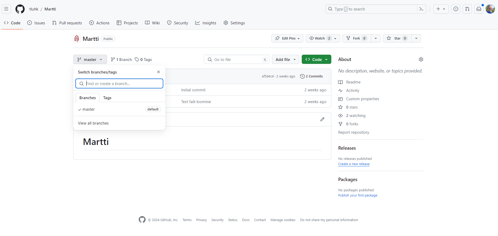

Seejärel loob arendaja uue haru, mille nimi on `feature/new-feature`, ja avaldab selle kasutades Github Desktop-i.

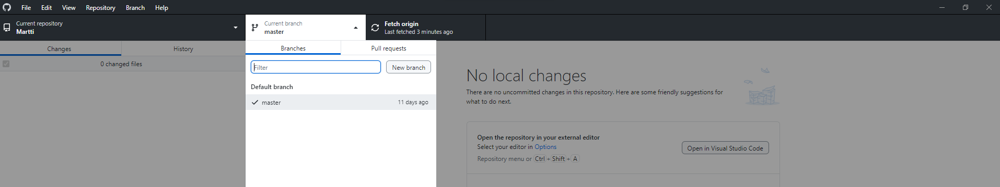

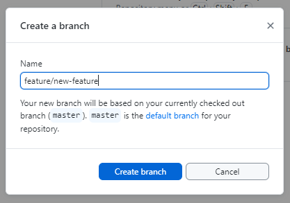

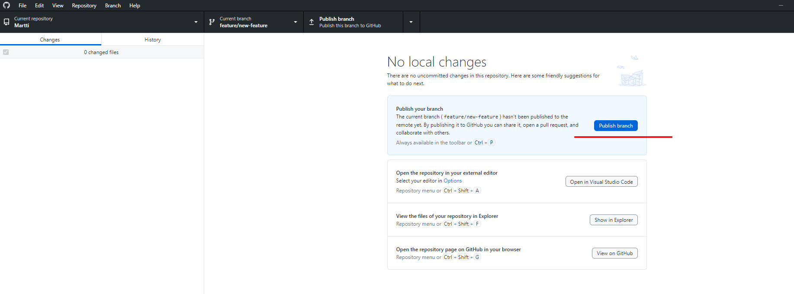

Seejärel avab arendaja oma koodiredaktori, milles on aktiivne juba uus haru, ja hakkab arendama uut funktsiooni.

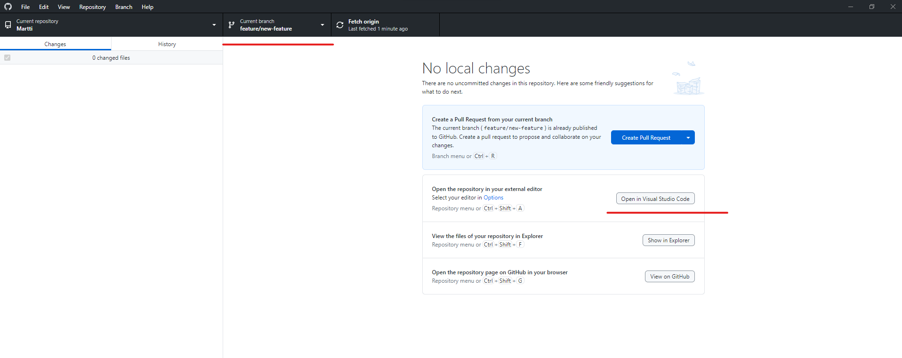

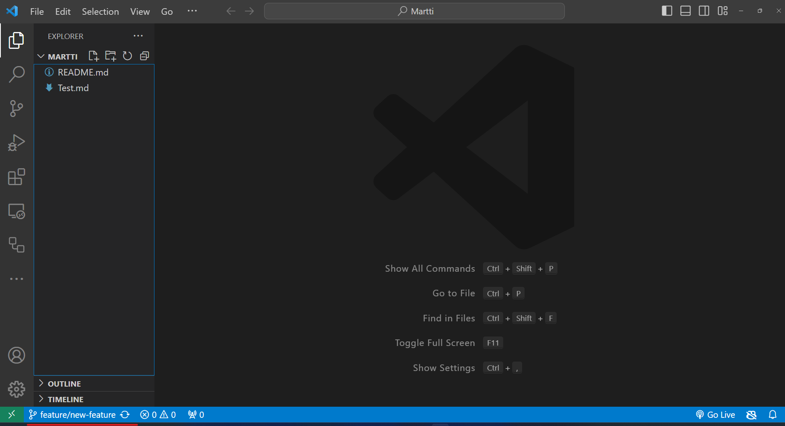

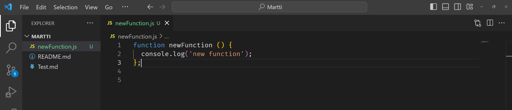

Kui uus kood on kirjutatud, teeb arendaja `commit`-i ja `push`-ib muudatused uude harusse.

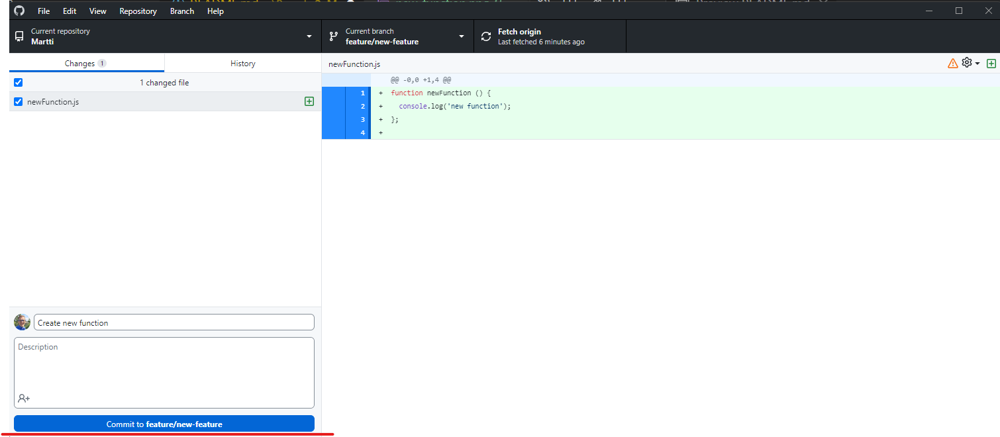

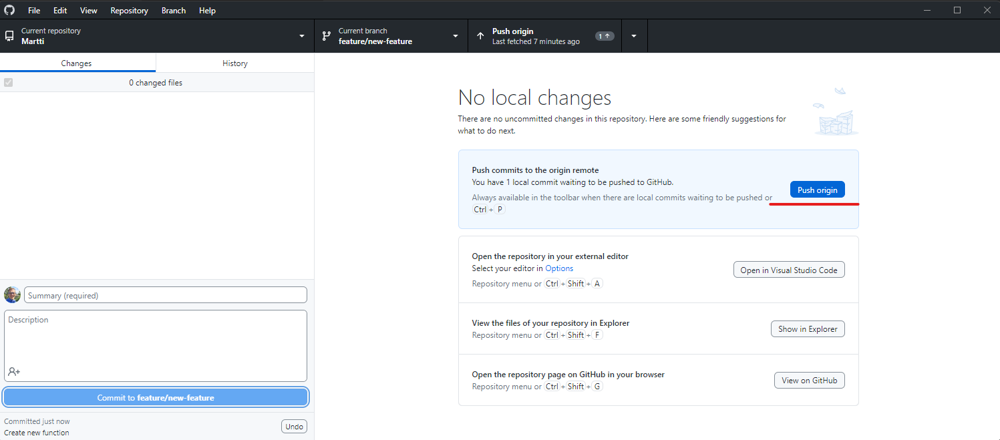

Nüüd on uus haru koos uue koodiga nähtav ka Github-is, lisaks on näha ka võimalus luua tõmbetaotlus (_pull request_) - nupp `Compare & pull request`.

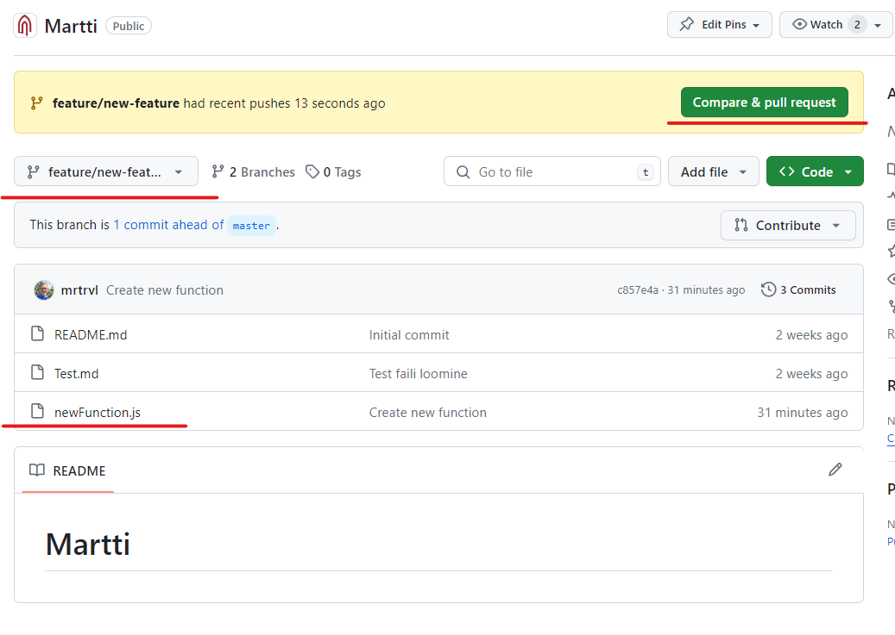

Samal ajal, kui vaadata peamist haru (_main_ või _master_), siis seal veel uued muudatused nähtavad ei kajastu.

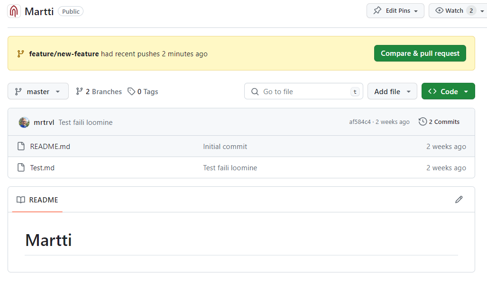

Nüüd selleks, et uued muudatused peaharusse saada, tuleb teha tõmbetaotlus (_pull request_), mille kaudu saab uued muudatused peamise haruga ühendada.

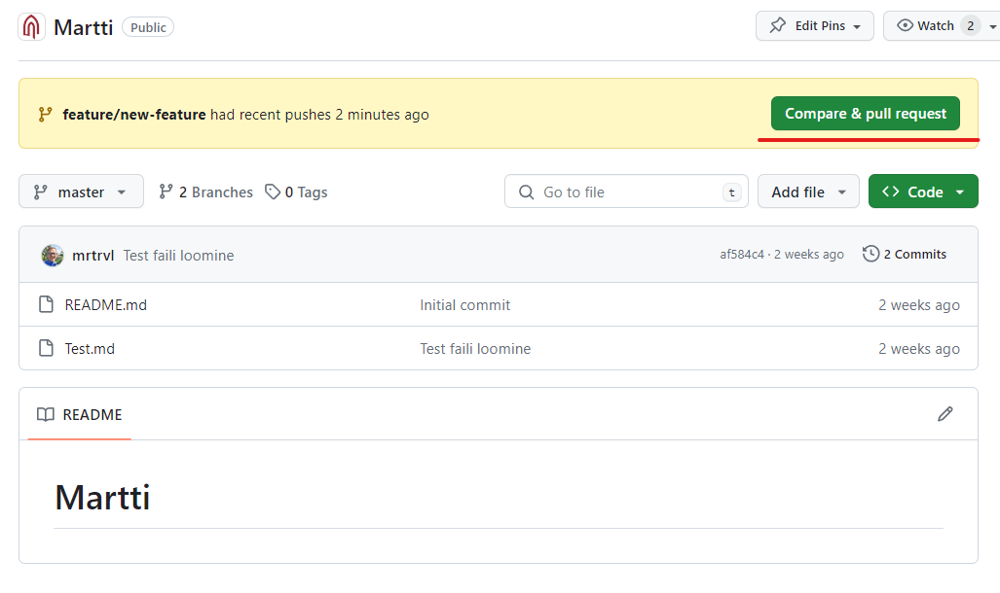

Seejärel on võimalik üle vaadata, milliste harude vahel muudatusi soovitakse teha, määrata vajaduse korral ülevaatajad (_Reviewers_) ja kirjutada lühike kirjeldus, mida muudatused endast kujutavad. Seejärel saab tõmbetaotluse avaldada vajutades nupule `Create pull request`.

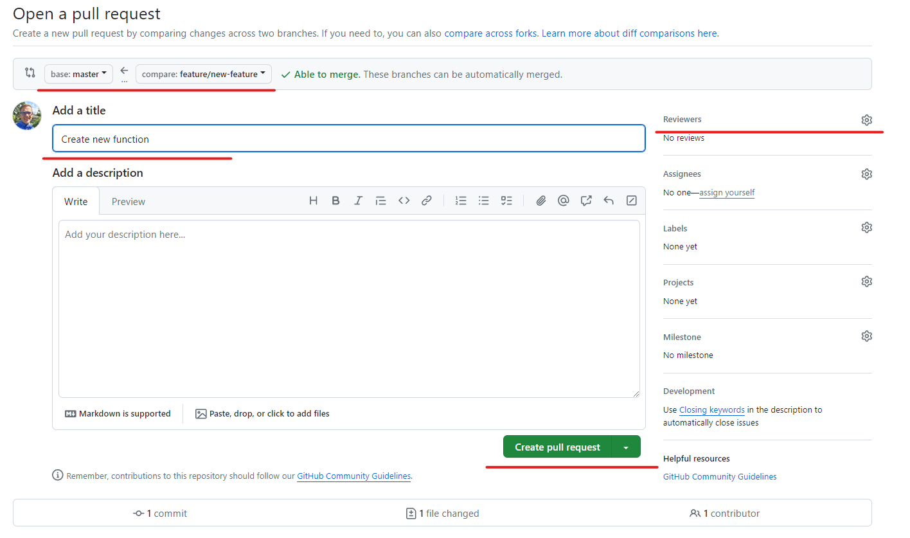

Seejärel on võimalik tõmbetaotlust üle vaadata, lisada kommentaare ja teha muudatusi, kui on vaja. Kui kõik on korras, siis saab tõmbetaotluse ühendada peamise haruga vajutades nupule `Merge pull request`.

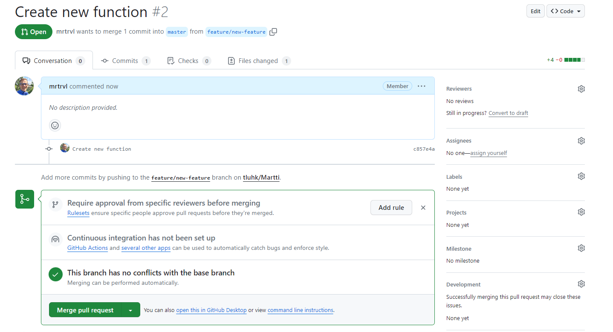

Pärast tõmbetaotluse ühendamist on uued muudatused peamises harus nähtavad.

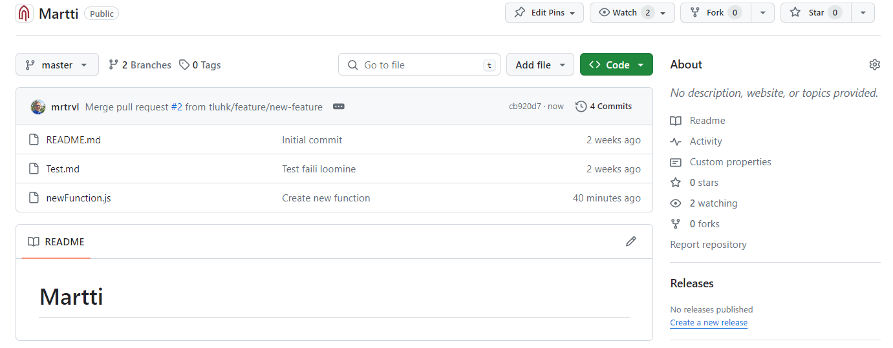

Lõpuks võib ka uue haru kustutada, kui see enam vajalik ei ole ja lülituda tagasi peamisse harusse.

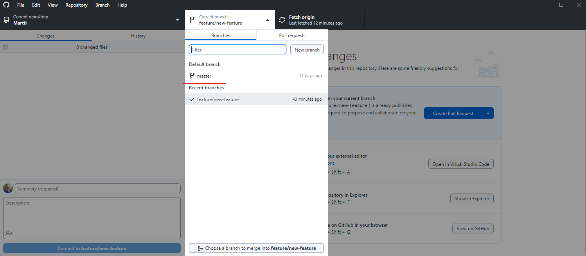

## Harjutused

- Tee läbi ülalolevad sammud, et luua uus haru, teha selles muudatusi ja ühendada see peamise haruga.
