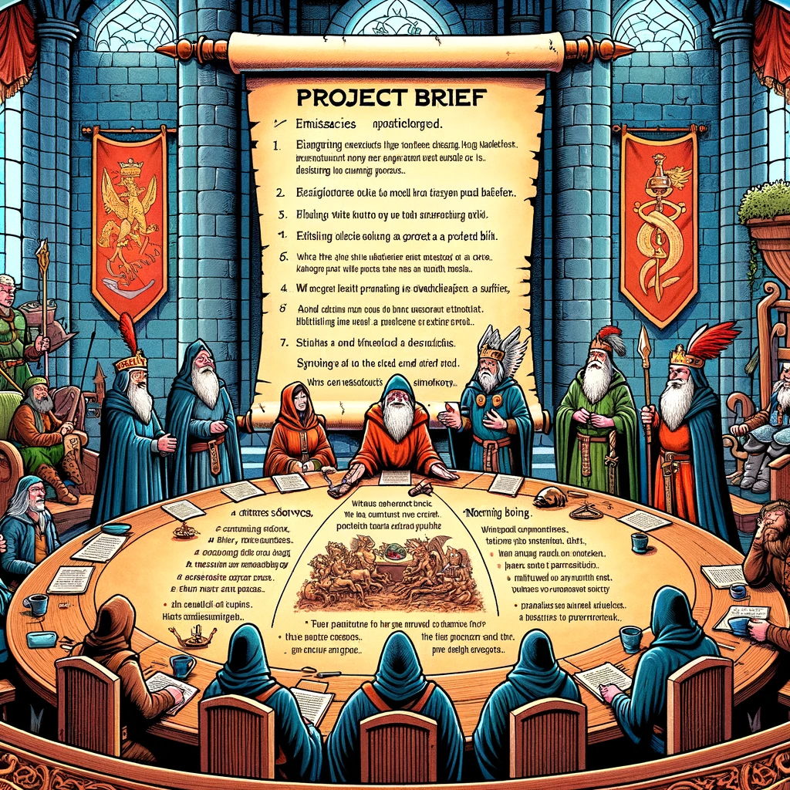

# Lähteülesanne, ehk *briif*

- [Lähteülesanne, ehk *briif*](#lähteülesanne-ehk-briif)
  - [Õpiväljundid](#õpiväljundid)
  - [Mis on lähteülesanne?](#mis-on-lähteülesanne)
  - [Lähteülesanne lühidalt](#lähteülesanne-lühidalt)
  - [Mida lähteülesanne sisaldab?](#mida-lähteülesanne-sisaldab)
  - [Lähteülesande koostamise mall](#lähteülesande-koostamise-mall)

## Õpiväljundid

Pärast selle teema läbimist suudad:

- selgitada, mis on lähteülesanne;
- tuvastada lähteülesande eesmärke ja eeliseid;
- koostada lähteülesannet veebilehe loomiseks.

## Mis on lähteülesanne?

Lähteülesanne veebilehe loomise kontekstis on dokument või juhend, mis sisaldab kogu vajalikku teavet ja nõudeid, et arendajad, disainerid ja muud osapooled saaksid mõista, mida veebiprojektilt oodatakse. See on aluseks veebilehe disaini ja arenduse protsessile ning aitab tagada, et kõik osapooled mõistavad projekti eesmärke, ulatust ja ootusi.

## Lähteülesanne lühidalt

- Lühikirjeldus loodava veebilehe eesmärgist, nõuetest ja ajakavast;
- Annab osapooltele selge ühise arusaama projekti ootustest;
- Üldjuhul koostab lähteülesande veebilehe tellija;
- Põhjalik ja konkreetne briif tagab projekti õnnestumise.

## Mida lähteülesanne sisaldab?

Lähteülesanne võib sisaldada järgmist:

- **Ettevõtte kirjeldus**
  - Ülevaade ettevõttest
  - Brändi väärtused, missioon ja visioon
  - Ärilised eesmärgid ja arenguplaanid
  - Peamised sidusrühmad.
- **Projekti skoop**
  - Projekti ulatus ja tulemused
  - Ootused visuaalidele ja tekstidele
  - Peamised funktsionaalsused
  - Kliendi kaasatus projekti
  - Probleemide lahendamine
  - Analüütika, mõõdikud
- **Projekti eesmärk**
  - Probleem, mida lahendatakse
  - Eesmärgid
    - bränditeadlikkuse või veebis kohaloleku kasv
    - müügi või külastuste suurendamine
    - peamiseks infoallikaks kujunemine
    - jne
- **Sihtrühma määratlus**
  - Demograafia
    - sugu
    - vanus
    - rahvus
    - sissetulek
  - Psühhograafia
    - elustiil
    - väärtused
    - eelistused
  - Tarbimismuster
    - esmaostja
    - sage ostja
    - erakorraline ostja jne
  - Vajadused.
- **Peamised konkurendid**
  - Kes pakuvad samalaadset teenust / toodet / infot vms?
  - Millised on nende veebilehed – peamiste tugevuste ja nõrkuste kaardistamine!
- **Tehnilised nõuded**
  - Asjakohased nõuded ja spetsifikatsioonid!
  - SEO-optimeerimine!
  - Olulisemad funktsionaalsused
    - nt sisselogimine
    - kliendiandmete haldus
    - maksevõimalused jne
  - Brändi stiilijuhised jt fikseeritud visuaalid
- **Ajakava ja eelarve**
  - Orienteeruv tähtaeg!
  - Jälgida, et oleks töömahu osas realistlik!
  - Milline on eelarve?
  - Rahalised vahendid võivad olla tehnoloogia valikul määravad.
- **Kokkulepete fikseerimine**
  - Kontaktisikute ja vastutajate kinnitamine
  - Kuidas ja kui tihti toimub suhtlus?
  - Mis komponendid ja milline toode antakse projekti lõpuks üle?
- **Lansseerimine ja hooldus**
  - Kes vastutab valminud lehe ülesseadmise eest?
  - Domeeni ja majutuse hankimine
  - Kuidas on tagatud edaspidi asetleidvad hooldustööd?

## Lähteülesande koostamise mall

- [Lähteülesande mall](Briif.pdf)
