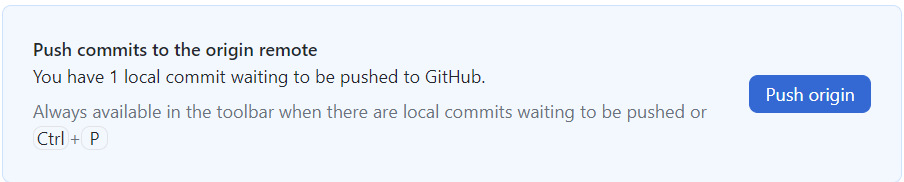
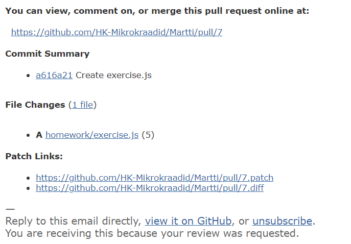
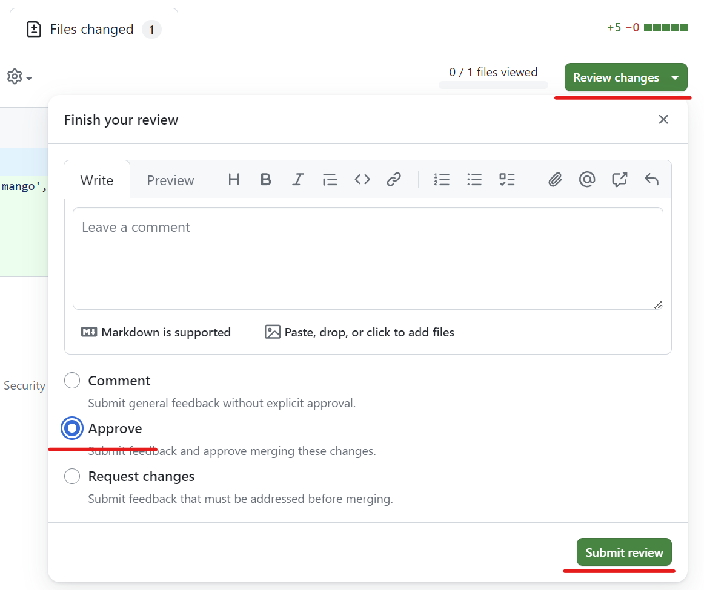

# Koodi ülevaatuse juhend

Sellest, mida koodi ülevaatus endast kujutab ja millised on selle eelised, saab lugeda [siit](../Code-Review/README.md). Kuidas aga koodi ülevaatus praktikas toimub? Selleks, et koodi ülevaatust saaks teha, tuleb teha mõned konkreetsed sammud.

- [Koodi ülevaatuse juhend](#koodi-ülevaatuse-juhend)
  - [Koodi ülevaatuse protsess](#koodi-ülevaatuse-protsess)
    - [Uue haru loomine](#uue-haru-loomine)
    - [Muudatuste tegemine](#muudatuste-tegemine)
    - [Tõmbetaotluse loomine](#tõmbetaotluse-loomine)
    - [Koodi ülevaataja määramine](#koodi-ülevaataja-määramine)
    - [Koodi ülevaatus](#koodi-ülevaatus)
  - [Kokkuvõte](#kokkuvõte)

## Koodi ülevaatuse protsess

Selleks, et koodi ülevaatust oleks võimalik teha, tuleb läbida järgmised etapid:

1. **Uue haru (*branch*) loomine** - Koodi ülevaatus tehakse tavaliselt uues harus, mis on loodud põhikoodibaasist (või mõnest muust harust, kuhu soovitakse muudatusi teha). See võimaldab arendajatel teha muudatusi eraldi ja seejärel teha koodi ülevaatus enne muudatuste ühendamist põhikoodibaasi.
2. **Uude harusse muudatuste tegemine** - Tuleb olla veendunud, et muudatused lisatakse uude harusse, mitte põhikoodibaasi. Koodi ülevaatus tehakse uues harus, et tagada, et muudatused on korrektsed ja vastavad projekti nõuetele.
3. ***Commit*-id ja *Push*-id** - Kui muudatused on tehtud, tuleb need *commit*ida ja *push*ida uude harusse. Seejärel saab teha tõmbetaotluse (*Pull Request*), et paluda muudatusi ühendada põhikoodibaasiga
4. **Tõmbetaotluse (*Pull Request*) loomine** - Koodi ülevaatus tehakse tavaliselt tõmbetaotluse kaudu, see võimaldab teistel arendajatel vaadata muudatusi ja anda tagasisidet enne nende ühendamist põhikoodibaasiga.
5. **Koodi ülevaataja (*Reviewer*) määramine** - Tõmbetaotluse looja määrab koodi ülevaataja, kes vaatab muudatused üle ja annab tagasisidet. Koodi ülevaataja võib olla üks või mitu arendajat, sõltuvalt projekti nõuetest ja meeskonna suurusest.
6. **Koodi ülevaatus** - Koodi ülevaataja vaatab muudatused üle ja annab tagasisidet. See võib hõlmata koodi ridade kaupa läbilugemist, vigade otsimist, jõudluse hindamist ja soovitusi koodi kvaliteedi parandamiseks. Ülevaataja võib lisada lihtsalt kommentaare (*Comments*), nõuda muudatusi (*Request Changes*) või kinnitada muudatused (*Approve*).
7. **Muudatuste tegemine** - Kui koodi ülevaataja soovitab muudatusi, tuleb muudatused sisse viia ja *commit*ida ja *push*-ida uuesti. Seejärel saab lasta uuesti koodi üle vaadata.
8. **Muudatuste kinnitamine** - Kui koodi ülevaataja on rahul muudatustega, saab ta kinnitada muudatused (*Approve*) ja tõmbetaotluse looja saab muudatused ühendada põhikoodibaasiga (*Merge*).

Käesoleva kursuse raames kasutatavate tööriistadega näeb kogu eelnev protsess välja järgmine:

### Uue haru loomine

Uue haru loomiseks on mitu võimalust. Üks variant on avada *Github Desktop*, vajutada nupule *Current branch* ja valida *New branch*. Seejärel tuleb sisestada haru nimi ja vajutada nupule *Create branch*.

> **NB!** Haru nimi peaks olema lühike ja kirjeldav. Praeguses näites on haru nimi `homework-1`, mis viitab sellele, et haru on loodud kodutöö esitamiseks.

Kui haru on loodud, võib vajutada nupule *Publish branch*, et haru üles laadida *Github* keskkonda (see ei ole kohustuslik, kuid soovitatav).

Peale viimast tegevust on ka *Github* keskkonnas näha uus haru.

### Muudatuste tegemine

Nüüd, kui uus haru on loodud, võib hakata tegema muudatusi koodibaasi. Enne muudatuste tegemise alustamist tuleks üle veenduda, et ollakse õiges harus. Seda saab kontrollida *Github Desktop*  rakenduses, kus on *Current branch* nupul näha aktiivse haru nimi.

Kui Sul ei ole veel koodieditor avatud, siis kõige kiiremini saad selle avada *Github Desktop* rakendusest, vajutades nupule *Open in Visual Studio Code* (või mõni muu koodiredaktor).

Aktiivse haru nimi peaks olema näha ka *VS Code* rakenduses (või mõnes muus koodiredaktoris).

Nüüd võib hakata tegema muudatusi koodibaasi, sealhulgas uute failide loomine, uue funktsionaalsuse lisamine, vigade parandamine jne. Mingi ajaperioodi tagant tuleks teha *commit*-e ja *push*-e, et muudatused oleksid registreeritud ja kättesaadavad *Github* keskkonnas.

> **NB!** *Commit*-i tegemisel tuleks lisada ka *commit*ile kirjeldus, mis kirjeldab, mida muudatused endast kujutavad. See aitab teistel arendajatel ja ka iseendal hiljem aru saada, mida muudatused endast kujutavad.

*Commit*-e ja *push*-e saab teha *Github Desktop* rakendusest, vajutades nupule *Commit to `haru nimi`* ja seejärel *Push origin*.

> *Github Desktop* rakenduses on ka näha, mis faile on muudetud ja mida on muudetud.

Peale *commit*-i tegemist ilmub nähtavale *Push* nupp, millele vajutades saab muudatused üles laadida *Github* keskkonda.

### Tõmbetaotluse loomine

Kui muudatused on tehtud, need *commit*-itud ja *push*-itud, siis on tehtud muudatused näha ka *Github* keskkonnas. Kui tahad veenduda, et muudatused on tõesti üles laetud, saad neid näha *Github* keskkonnas, valides kõigepealt õige haru ja seejärel vaadates muudatusi.

> Siin on näha, et `homework-1` haru on valitud ja on näha, et sinna on lisandunud kaust `homework` ja *commit*-i kirjeldus - `Create exercise.js`.

Nüüd on võimalik luua tõmbetaotlus (*Pull Request*), et paluda muudatusi ühendada põhikoodibaasiga. Selleks on taas mitu võimalust. Kui oled juba *Github* keskkonnas, siis saad vajutada sinna ilmunud nupule *Compare & pull request*.

Või kui oled *Github Desktop* rakenduses, siis saad vajutada nupule *Create pull request*.

Mõlemal juhul viiakse Sind *Github* keskkonnas samale lehele, kus saad luua tõmbetaotluse. Lehe ülaosas on näha, milliste harude vahel tõmbetaotlus tehakse. Lisaks saad määrata tõmbetaotlusele pealkirja ja kirjelduse, et teised arendajad saaksid aru, mida muudatused endast kujutavad.

### Koodi ülevaataja määramine

Enne veel, kui tõmbetaotlus luuakse, saab määrata koodi ülevaataja (*Reviewer*), kes vaatab muudatused üle ja annab tagasisidet. Selleks tuleb vajutada nupule *Reviewers* ja valida sealt koodi ülevaataja.

> Siin on näha, et koodi ülevaatajaks on määratud `mrttlu`.
>
> Koodi ülevaatajaks võib olla üks või mitu arendajat, sõltuvalt projekti nõuetest ja meeskonna suurusest.

Kui koodi ülevaataja on määratud, saab luua tõmbetaotluse, vajutades nupule *Create pull request*.

> Koodi ülevaatajat on võimalik lisada ja muuta ka pärast tõmbetaotluse loomist.

### Koodi ülevaatus

Koodi ülevaatuse määramise kohta tuleb teade ülevaatajaks määratud arendajale e-mailie või *Github* keskkonna teavituste kaudu.

E-mailis olevale lingile vajutades, või muul moel tõmbetaotluse lehele jõudes, saab koodi ülevaatust tegema hakata vajutades nupule *Add your review*.

Muudatuste sisu on näha *Files changed* vaates. Siin on näha, milliseid muudatusi on tehtud ja millistes failides on need tehtud.

Vastavalt vajadusele saab lisada kommentaare (*Comments*), nõuda muudatusi (*Request Changes*) või kinnitada muudatused (*Approve*).

Soovi korral on võimalik kommentaare või küsimusi lisada ka konkreetsele reale, vajutades vastava rea ees olevale `+` märgile.

Praegusel hetkel oletame, et koodi ülevaataja on rahul muudatustega ja kinnitab need. Selleks vajutab ta nupule *Approve* ja seejärel nupule *Submit review*.

> Selle kursuse raames on sellel hetkel vaja määrata veel üks koodi ülevaataja (`mrtrvl`), kes annab lõpliku kinnituse muudatustele ja ühendab muudatuse põhikoodibaasiga.

Seejärel on võimalik tõmbetaotlus ühendada põhikoodibaasiga, vajutades nupule *Merge pull request*.

Seejärel tuleb kinnitada muudatused, vajutades nupule *Confirm merge*.

Viimase sammuna on võimalik kustutada haru, kui see enam ei ole vajalik, vajutades nupule *Delete branch*.

Peale seda on muudatused ühendatud põhikoodibaasiga ja koodi ülevaatus on lõppenud.

## Kokkuvõte

Käesolev juhend kirjeldab koodi ülevaatuse protsessi, alates uue haru loomisest kuni muudatuste ühendamiseni põhikoodibaasiga. Koodi ülevaatuse protsess on oluline osa tarkvaraarendusest, kuna see aitab tagada, et muudatused on korrektsed ja vastavad projekti nõuetele. Koodi ülevaatus aitab ka arendajatel õppida teiste arendajate koodi lugema ja mõistma, samuti saada tagasisidet omaenda koodi kohta.
