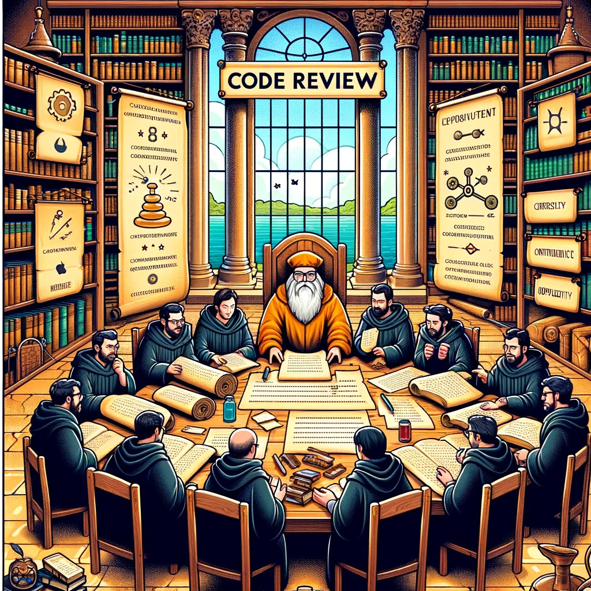
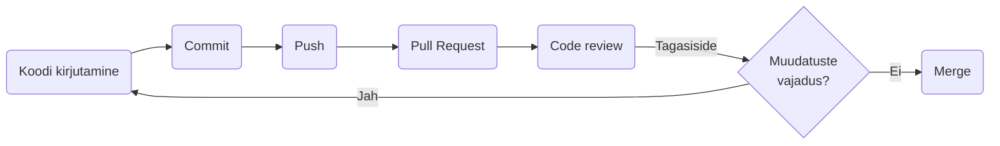

# Koodi ülevaatus(_Code Review_)

Koodi ülevaatused teiste arendajate poolt võib olla väärtuslik tööriist, mis tagab koodi kõrge kvaliteedi. Koodiülevaatused võimaldavad teistel arendajatel koodimuudatusi üle vaadata, täiustusi soovitada ning vigu või probleeme tabada.

Pildi allikas: Dall-E by OpenAI

- [Koodi ülevaatus(_Code Review_)](#koodi-ülevaatuscode-review)
  - [Õpiväljundid](#õpiväljundid)
  - [Mis on koodi ülevaatus?](#mis-on-koodi-ülevaatus)
  - [Millises etapis koodi ülevaatust tehakse?](#millises-etapis-koodi-ülevaatust-tehakse)

## Õpiväljundid

Pärast selle teema läbimist suudate:

- selgitada, mis on koodi ülevaatus;
- tuvastada koodi ülevaatuse eesmärke ja eeliseid;
- kirjeldada koodi ülevaatuse protsessi ja etappe;
- rakendada koodi ülevaatust tarkvaraarenduse protsessis.

## Mis on koodi ülevaatus?

Koodi ülevaatus on protsess, mille käigus üks või mitu arendajat vaatavad üle teise arendaja kirjutatud koodi. Koodiülevaatuse eesmärk on tuvastada võimalikud probleemid, parandada koodi kvaliteeti ja tagada koodi vastavus projekti nõuetele.

Koodi ülevaatus hõlmab tavaliselt koodi ridade kaupa läbilugemist, selliste probleemide otsimist nagu:

- vead;
- turvanõrkused;
- jõudlusprobleemid;
- kodeerimisstandardite rikkumised;
- disainivead.

Ülevaataja võib ka soovitada parandusi või anda tagasisidet selle kohta, kuidas muuta kood tõhusamaks, hõlpsamini hooldatavaks ja loetavamaks.

Koodi ülevaatus on tarkvara arendusprotsessi oluline osa, kuna see aitab tuvastada vigu ja parandada koodi kvaliteeti enne selle ühendamist põhikoodibaasi. Samuti annab see arendajatele võimaluse üksteiselt õppida ja teadmisi jagada, mis võib aidata parandada meeskonna oskusi ja teadmisi.

Koodi ülevaatust saab teha käsitsi, kus üks arendaja loeb koodi läbi ja annab tagasisidet, või seda saab automatiseerida, kasutades tööriistu, mis analüüsivad koodi probleemide osas ja soovitavad parandusi. Olenemata lähenemisest on koodide ülevaatus oluline samm tarkvararakenduste kvaliteedi ja töökindluse tagamisel.

## Millises etapis koodi ülevaatust tehakse?

Koodi ülevaatus tehakse tarkvaraarendusprotsessis pärast koodi kirjutamist, kuid enne selle ühendamist põhikoodibaasi.

Enamikus tarkvaraarenduse töövoogudes on koodi ülevaatus osa tõmbetaotluse (_Pull Request_) protsessist. Kui arendaja on lõpetanud uue funktsiooni kirjutamise või vea parandamise, loob ta tõmbetaotluse, mis sisaldab tehtud muudatusi. Teised meeskonna arendajad vaatavad seejärel koodimuudatused üle ja annavad tagasisidet kas käsitsi või automatiseeritud tööriistu kasutades.

Pärast koodi ülevaatamist ja probleemide lahendamist saab muudatused liita põhikoodibaasi. Koodi ülevaatus on sageli iteratiivne protsess, mis tähendab, et enne muudatuste lõplikku kinnitamist võib toimuda mitu tagasiside ja muudatuste vooru.

Koodi ülevaatuse samm-sammulise juhendi leiate [siit](../Code-Review-Guide/README.md).
