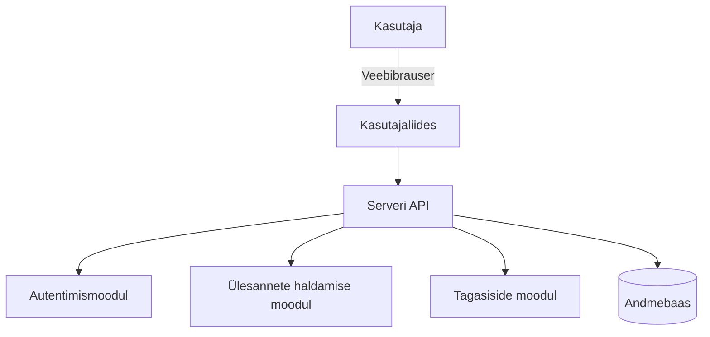

# Näide arhitektuuri ja disainidokumentatsioonist

## 1. Ülevaade süsteemi arhitektuurist

**Projekti nimi:** Online-ülesannete jälgimise süsteem

Süsteem on veebipõhine lahendus, mis koosneb mitmest moodulist, sealhulgas autentimine, ülesannete haldamine ja tagasiside andmine. Süsteemi arhitektuur on jagatud kliendi- ja serveripoolseteks komponentideks ning sisaldab ka andmebaasihaldust.

## 2. Arhitektuuri ülevaade

Süsteemi arhitektuur on kujutatud järgmises diagrammis:

- **Kasutajaliides (UI):** Kasutajaliides on ehitatud kasutades HTML, CSS ja JavaScripti. See tagab, et kasutajakogemus on intuitiivne ja reageeriv.
- **Serveripoolne komponent:** Serverirakendus on loodud Node.js raamistikul, kasutades Express.js. See töötleb kõik päringud kliendilt ja suunab need vastavatele teenustele.
- **Andmebaas:** Süsteemis kasutatakse relatsioonilist andmebaasi PostgreSQL, mis salvestab kasutajate andmed, ülesanded, tagasiside ja muud olulised andmekirjed.
- **API:** Süsteem pakub RESTful API-d, mis võimaldab kolmandate osapoolte rakendustel ja kliendi kasutajaliidesel suhelda serveriga.

## 3. Süsteemi komponendid

### 3.1. Autentimine ja autoriseerimine

- **Kasutaja registreerimine ja sisselogimine:** Kasutajad saavad registreerida süsteemi, kasutades e-posti ja parooli. Kasutajate autentimiseks kasutatakse JWT (JSON Web Token) protokolli.
- **Rollipõhine juurdepääs:** Süsteemil on kaks rolli - õpetaja ja õpilane. Rollipõhine juurdepääs haldab, milliseid funktsioone ja andmeid kasutajad saavad kasutada.

### 3.2. Ülesannete haldamine

- **Ülesannete loomine ja muutmine:** Õpetajad saavad ülesandeid lisada, muuta ja määrata tähtaegu. Need toimingud tehakse kasutajaliidese kaudu, mis saadab vastavad päringud serveri API-le.
- **Õpilaste vastused:** Õpilased saavad esitada oma vastused ülesannetele, laadides üles failid ja täites vastava vormi. Kõik vastused salvestatakse andmebaasi.

### 3.3. Tagasiside ja hindamine

- **Tagasiside andmine:** Õpetajad saavad hinnata ja anda tagasisidet esitatud ülesannetele. Tagasiside on kättesaadav õpilasele kohe, kui see on salvestatud andmebaasis.

## 4. Tehnilised nõuded

- **Server:** Node.js (v16.x või uuem), Express.js
- **Andmebaas:** PostgreSQL (v13 või uuem)
- **API:** RESTful API, mis toetab JSON formaadis andmeedastust
- **Kliendi kasutajaliides:** HTML5, CSS3, JavaScript (kasutades React raamistikku)
- **Turvalisus:** Kasutaja andmete ja paroolide kaitseks kasutatakse bcrypt hashing-meetodit ja JWT-d sessioonide turvamiseks.

## 5. Paigaldusjuhised

1. **Node.js ja PostgreSQL paigaldamine:** Veenduge, et Node.js ja PostgreSQL on serveris paigaldatud.
2. **Koodi kloonimine:** Kloonige projekti kood GitHubi repositooriumist.
3. **Sõltuvuste installimine:** Käivitage \`npm install\` paigaldamaks vajalikud sõltuvused.
4. **Andmebaasi seadistamine:** Looge PostgreSQL andmebaas ja täitke algandmete skript.
5. **Keskkonnamuutujad:** Määrake vajalikud keskkonnamuutujad (\`.env\` failis), sealhulgas andmebaasiühenduse andmed ja JWT salavõti.
6. **Rakenduse käivitamine:** Käivitage server käsuga \`npm start\`.

## 6. Logimine ja vigade jälgimine

- **Logimine:** Süsteem kasutab logimist, et jälgida sündmusi ja vigasid. Logifaile saab kasutada süsteemi toimivuse ja vigade analüüsimiseks.
- **Vigade jälgimine:** Rakenduses on vigade käsitlemise mehhanismid, mis saadavad vigade kohta teateid administraatorile.

## 7. Süsteemi hooldus

- **Varukoopiad:** Andmebaasi varukoopiaid tehakse automaatselt iga päev, et vältida andmekadu.
- **Uuendused:** Süsteemi komponendid, sealhulgas sõltuvused, tuleks regulaarselt uuendada, et tagada turvalisus ja uusimate funktsioonide tugi.
