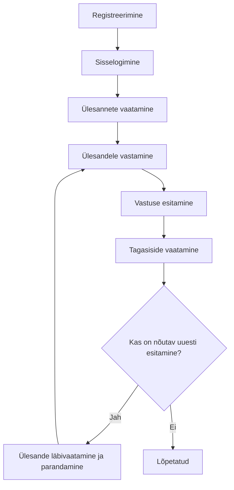

# Näide protsessi dokumentatsioonist (Kasutaja vaade)

## 1. Ülevaade

**Projekti nimi:** Online-ülesannete jälgimise süsteem

Protsessi dokumentatsioon kasutaja vaates kirjeldab, kuidas lõppkasutajad saavad süsteemi kasutada samm-sammult, alates registreerimisest kuni ülesannete täitmiseni ja tagasiside saamiseni. Selle eesmärk on tagada, et kasutajad mõistavad, millised tegevused tuleb läbi viia ja millises järjekorras, et süsteemi tõhusalt kasutada.

## 2. Kasutaja tegevuste järjekord

Kasutaja protsess on kujutatud järgmises mermaid diagrammis:

- **Registreerimine:** Kasutajad peavad esmalt looma konto, sisestades oma e-posti aadressi, parooli ja muu vajaliku teabe.
- **Sisselogimine:** Pärast registreerimist saavad kasutajad süsteemi sisse logida, kasutades oma e-posti ja parooli.
- **Ülesannete vaatamine:** Pärast sisselogimist saavad kasutajad vaadata neile määratud ülesandeid ja nende tähtaegu.
- **Ülesandele vastamine:** Kasutajad saavad ülesandeid täita, vastates küsimustele või täites ülesande kirjelduse järgi nõutud toimingud.
- **Vastuse esitamine:** Pärast ülesande täitmist saavad kasutajad esitada oma vastuse, lisades vajadusel faile või täiendavat teavet.
- **Tagasiside vaatamine:** Õpetajad annavad tagasisidet esitatud ülesannetele, mida kasutajad saavad oma profiilis vaadata.
- **Ülesande läbivaatamine ja parandamine:** Kui tagasiside nõuab parandusi, saavad kasutajad oma vastuse uuesti läbi vaadata ja parandada.
- **Lõpetatud:** Kui täiendav esitamine ei ole vajalik, loetakse ülesanne lõpetatuks.

## 3. Kasutajate tegevuste kirjeldus

### 3.1. Registreerimine ja sisselogimine

- **Registreerimine:** Kasutajad loovad oma konto, täites registreerimisvormi ja kinnitades oma e-posti aadressi. Registreerimine on vajalik, et saada juurdepääs süsteemi funktsioonidele.
- **Sisselogimine:** Pärast konto loomist saavad kasutajad oma mandaatidega sisse logida ja alustada süsteemi kasutamist.

### 3.2. Ülesannete haldamine

- **Ülesannete vaatamine:** Kasutajad näevad oma ülesandeloendit, mis sisaldab ülesannete kirjeldusi ja tähtaegu. Ülesannete vaatamine aitab kasutajatel planeerida oma tegevusi ja ülesannete täitmist.
- **Ülesandele vastamine ja esitamine:** Kasutajad täidavad ülesanded ja esitavad vastused süsteemis. Vastuste esitamise järel ootab ülesanne õpetaja hinnangut ja tagasisidet.

### 3.3. Tagasiside ja parandus

- **Tagasiside vaatamine:** Pärast ülesande esitamist annab õpetaja tagasisidet, mis aitab kasutajal mõista oma tugevusi ja nõrkusi.
- **Ülesande läbivaatamine ja parandamine:** Kui tagasiside nõuab parandusi, saavad kasutajad oma vastuse parandada ja uuesti esitada.

## 4. Parimad tavad kasutajatele

- **Tähtaegade jälgimine:** Kontrollige regulaarselt oma ülesannete tähtaegu, et vältida hilinemisi ja tagada ülesannete õigeaegne esitamine.
- **Tagasiside kasutamine:** Kasutage õpetaja antud tagasisidet, et parandada oma oskusi ja saavutada paremaid tulemusi edaspidistes ülesannetes.
- **Küsimuste korral abi küsimine:** Ärge kartke pöörduda kasutajatoe poole, kui vajate abi või selgitusi süsteemi kasutamise kohta.

## 5. Järeldus

Kasutaja vaates protsessi dokumentatsioon aitab lõppkasutajal mõista, milliseid samme tuleb teha süsteemi tõhusaks kasutamiseks. Õige tegevuste järjekorra järgimine tagab, et kasutaja saab parima võimaliku kogemuse ja suudab süsteemi võimalusi täielikult ära kasutada.
