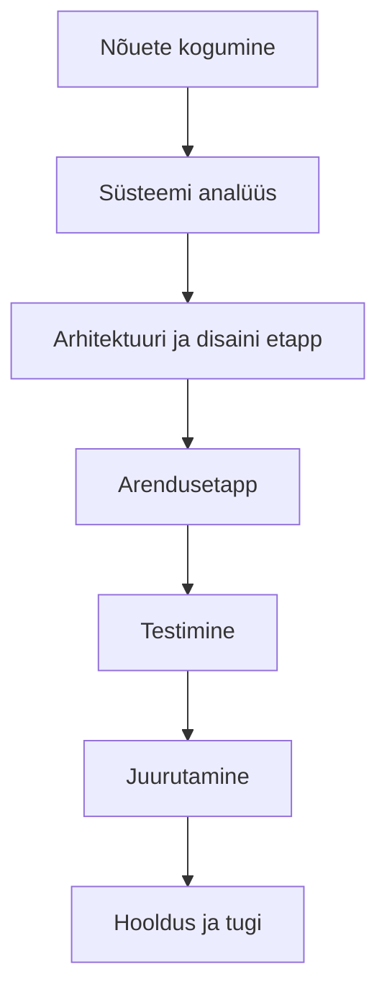

# Näide projekti dokumentatsioonist

## 1. Ülevaade

**Projekti nimi:** Online-ülesannete jälgimise süsteem

Protsessi dokumentatsioon kirjeldab tarkvaraarenduse elutsüklit, hõlmates arenduse, testimise ja juurutamise etappe. See aitab mõista, kuidas arendusprotsessis liigutakse ühest etapist teise ning kuidas tagatakse projekti edukas lõpetamine.

## 2. Tarkvaraarenduse elutsükkel

Arendusprotsess on jagatud mitmeks oluliseks etapiks, nagu on näidatud järgmises mermaid diagrammis:

- **Nõuete kogumine:** Projekti algusfaasis kogutakse kasutajate ja sidusrühmade nõuded, et määratleda, mida süsteem peab tegema.
- **Süsteemi analüüs:** Nõuete põhjal tehakse süsteemi analüüs, et mõista, kuidas need nõuded süsteemi kontekstis rakenduvad.
- **Arhitektuuri ja disaini etapp:** Süsteemi arhitektuur ja disain kavandatakse, et tagada lahenduse sobivus ja skaleeritavus.
- **Arendusetapp:** Koodi kirjutamine ja komponentide loomine vastavalt süsteemi nõuetele ja disainile.
- **Testimine:** Süsteemi testitakse põhjalikult, et tagada kõikide funktsioonide korrektne töö ja vastavus nõuetele.
- **Juurutamine:** Pärast edukat testimist paigaldatakse süsteem tootmiskeskkonda.
- **Hooldus ja tugi:** Pärast juurutamist tegeletakse süsteemi hoolduse, värskenduste ja kasutajatoega.

## 3. Arenduse protsess

### 3.1. Versioonihaldus

- **Git ja GitHub:** Kasutatakse versioonihaldustarkvara Git ning repositooriumina GitHubi, et hallata arendusprotsessi, jälgida muudatusi ja teha koostööd tiimiliikmetega.
- **Branching strateegia:** Kasutatakse Git Flow strateegiat, kus on eraldi harud (branches) arenduseks, testimiseks ja tootmiseks, et hoida projekt organiseerituna ja vältida konflikte.

### 3.2. Koosolekud ja suhtlus

- **Sprintide planeerimine:** Arendusprotsess toimub sprintides, kus iga sprindi alguses määratakse konkreetse ajaperioodi eesmärgid.
- **Igapäevased stand-up koosolekud:** Lühikesed igapäevased koosolekud, et arendustiim saaks jagada edenemist ja tuvastada võimalikke takistusi.

## 4. Testimise protsess

- **Automatiseeritud testid:** Kasutatakse Seleniumit ja JUnit'i automatiseeritud testide läbiviimiseks, et tagada pidev kvaliteedikontroll.
- **Manuaalsed testid:** Lisaks automatiseeritud testidele viiakse läbi manuaalsed testid, et kontrollida süsteemi kasutajakogemust ja leida võimalikke vigu.

## 5. Juurutamise protsess

- **Testimiskeskkond:** Enne tootmiskeskkonda paigaldamist viiakse süsteem läbi testimiskeskkonnas, et kontrollida selle toimivust.
- **Tootmiskeskkonda paigaldamine:** Kasutatakse automatiseeritud CI/CD torujuhet (nt Jenkins või GitHub Actions), et tagada sujuv ja vigadeta juurutusprotsess.

## 6. Hooldus ja pidev parendamine

- **Probleemide jälgimine:** Kõik probleemid ja vead logitakse ja hallatakse vigade jälgimise tööriistas (nt Jira).
- **Tagasiside kogumine:** Kasutajatelt kogutakse pidevalt tagasisidet, et teha süsteemis parendusi ja arendusi vastavalt vajadustele.

## 7. Kokkuvõte

Projekti protsessi dokumentatsioon annab ülevaate tarkvaraarenduse elutsüklist, kirjeldades erinevaid etappe alates nõuete kogumisest kuni hoolduse ja parendamiseni. See tagab, et kõik tiimiliikmed mõistavad arendusprotsessi ja nende rolli selles, aidates projekti edukalt lõpule viia.
