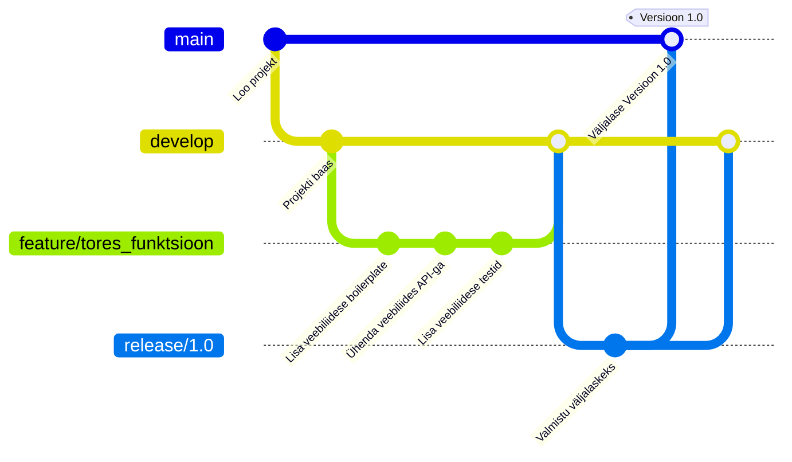

# Git

- [Git](#git)
  - [Õpitulemused](#õpitulemused)
  - [Mis on Git?](#mis-on-git)
  - [Git'i põhiarhitektuur](#giti-põhiarhitektuur)
  - [Giti paigaldamine](#giti-paigaldamine)
  - [Git'i põhisõnavara](#giti-põhisõnavara)
  - [Git'i põhikäsud](#giti-põhikäsud)
  - [Graafilised Git'i kliendid](#graafilised-giti-kliendid)
    - [Mõned populaarsed graafilised kliendid Git'ile:](#mõned-populaarsed-graafilised-kliendid-gitile)
    - [Graafiliste Git'i klientide kasutamise põhjused:](#graafiliste-giti-klientide-kasutamise-põhjused)
  - [Git flow](#git-flow)
    - [1. **Peamised harud**:](#1-peamised-harud)
    - [2. **Toetavad harud**:](#2-toetavad-harud)
    - [**Git flow põhiprotsess**:](#git-flow-põhiprotsess)
  - [Git'i majutusplatvormid](#giti-majutusplatvormid)
  - [Harjutused](#harjutused)

## Õpitulemused

Pärast selle teema läbimist suudate:

- mõista versioonihaldussüsteemide tähtsust;
- kirjeldada Git'i ja versioonihalduse põhitõdesid;
- kirjeldada Git'i põhiarhitektuuri;
- kirjeldada Git'i põhisõnavara;
- kirjeldada Git flow'd;

## Mis on Git?

**Git** on hajutatud versioonihaldussüsteem (_DVCS_), mida kasutatakse tarkvaraarenduses lähtekoodi muudatuste jälgimiseks. See on loodud nii väikeste kui ka väga suurte projektidega toimetulekuks kiiresti ja tõhusalt. **Git** võimaldab mitmel arendajal koostööd teha sama koodibaasi kallal üksteist segamata.

Git loodi 2005. aastal Linus Torvaldsi poolt Linuxi tuuma arendamiseks. Selle kasutuselevõtt on kiiresti kasvanud ja nüüd on see tarkvaratööstuses domineeriv versioonihaldussüsteem. Seda kasutavad ettevõtted nagu Google, Facebook, Microsoft ja Twitter oma koodibaaside haldamiseks.

Siin on mõned **Git**i peamised aspektid ja omadused:

- **Hajutatud süsteem**: Erinevalt kesksetest versioonihaldussüsteemidest, kus on üks keskne hoidla, on **Git**is iga arendaja koodikoopia ka hoidla, mis võib sisaldada kogu ajalugu ja versioonijälgimise võimalusi. See tagab andmete dubleerimise ja muudab harude loomise ja ühendamise äärmiselt tõhusaks.
- **Harud ja ühendamine**: **Git**i harusüsteem võimaldab arendajatel luua isoleeritud harusid funktsioonide arendamiseks või vigade parandamiseks. Need harusid saab seejärel ühendada tagasi peamisse harusse, tavaliselt tuntud kui "master/main" haru.
- **Ajalugu**: **Git** jälgib kogu projekti ajalugu. Iga pühendumine on kontrollsummeeritud ja taastatav, tagades tervikluse ja jälgitavuse.
- **Lavastusala**: **Git** tutvustab ainulaadset kontseptsiooni lavastusalast või indeksist. See on vaheala, kus pühendumisi saab vormistada ja üle vaadata enne pühendumise lõpuleviimist.
- **Jõudlus**: **Git**i toimingud viiakse läbi kohapeal, muutes selle kiiremaks kui paljud teised võrgutoimingutel põhinevad versioonihaldussüsteemid.
- **Terviklus**: **Git** kasutab oma andmete kontrollsummeerimiseks SHA-1 räsialgoritmi. See tagab versiooniajaloo tervikluse.
- **Paindlikkus**: **Git** toetab erinevaid töövooge, alates kesksest kuni täielikult hajutatud, muutes selle kohandatavaks erinevate projektivajaduste jaoks.
- **Koostööplatvormid**: Platvormid nagu _GitHub_, _GitLab_ ja _Bitbucket_ täiendavad **Git**i koostöövõimalusi, pakkudes koodi majutamist, tõmbetaotlusi, koodi ülevaatusi ja probleemide jälgimist.
- **Tasuta ja avatud lähtekoodiga**: **Git** on tasuta tarkvara, mis on levitatud GNU General Public License versiooni 2 tingimustel.

## Git'i põhiarhitektuur

Git'il on ainulaadne arhitektuur ja andmemudel, mis muudab selle tõhusaks ja võimsaks. Siin on Git'i põhiarhitektuuri põhikomponentide jaotus:

- **Blobid**:
  - Esindab faili sisu Git'is.
  - Blob hoiab faili andmeid, kuid ei sisalda faili kohta metaandmeid.
  - See on binaarne suur objekt ja seda tuvastatakse SHA-1 räsi abil.
- **Puud**:
  - Esindab kataloogi või kausta Git'is.
  - Puu objekt kaardistab nimed blobidele või puudele (sisuliselt võib see viidata alamkataloogide jaoks teistele puudele).
  - Nagu blobid, tuvastatakse puud SHA-1 räsi abil.
- **Pühendumised**:
  - Esindab konkreetset punkti hoidla ajaloos.
  - Pühendumine viitab puule, mis jäädvustab hoidla oleku teatud hetkel.
  - Sisaldab metaandmeid nagu:
    - Autor
    - Pühendaja
    - Kuupäev
    - Pühendumise sõnum
  - Iga pühendumine viitab ka oma vanemapühendumisele, luues lingitud loendi. See loob "ajaloo" Git'is. Ühendamispühendumised võivad viidata mitmele vanemale.
  - Tuvastatud SHA-1 räsi abil.
- **Harud**:
  - Liikuv viide pühendumisele.
  - Kui loote haru, loob Git viite pühendumisele, kus te praegu olete.
  - Uute pühendumiste loomisel liigub haru viide automaatselt viimasele pühendumisele.
  - Enamikus hoidlates on vaikimisi haru nimega "master" (kuigi hiljuti on täheldatud nihet nimetamaks seda "main"-iks).
  - Harud võimaldavad arengut eristada, kus funktsioone või katsetusi saab arendada isoleeritult enne nende tagasi ühendamist peamisse koodibaasi.

See arhitektuur, mis on üles ehitatud suunatud tsüklita graafi objektidele, võimaldab Git'il tõhusalt jälgida muudatusi, luua harusid ja ühendada ajalugusid. SHA-1 räside kasutamine tagab hoidla tervikluse ja järjepidevuse kloonide ja versioonide vahel.

## Giti paigaldamine

Giti viimase versiooni ja paig aldusjuhised leiate aadressilt [git-scm.com](https://git-scm.com/book/en/v2/Getting-Started-Installing-Git).

## Git'i põhisõnavara

Git'il on oma unikaalne sõnavara ja nende terminite mõistmine on tõhusaks tööks Git'iga võtmetähtsusega. Siin on põhiline ülevaade mõningatest olulistest Git'i terminitest:
- **Hoidla (Repository)**:
  - Kataloog või salvestusruum, kus teie projekt elab. See sisaldab kõiki projekti faile ja kogu muudatuste ajalugu.
  - Võib olla kohalik (teie arvutis) või kaugel (nt serveril või teenusel nagu GitHub).
- **Pühendumine (Commit)**:
  - Failide muudatuste kogum. Iga pühendumine on unikaalselt tuvastatud SHA-1 räsi koodiga.
  - Esindab hoidla failide ja kataloogistruktuuri hetkeseisu teatud ajahetkel.
- **Haru (Branch)**:
  - Hoidla paralleelne versioon. See hargneb peatööprojektist eraldi alasse, kus saate töötada ilma peamist või "master/main" haru mõjutamata.
  - Kasulik uute funktsioonide arendamiseks või ideede testimiseks.
- **Master või main**:
  - Vaikimisi arendusharu. Iga kord, kui loote Git'i hoidla, luuakse haru nimega "master" või "main" ja see saab aktiivseks haruks.
  > Märkus: Tööstuses on täheldatud nihet nimetamaks seda vaikimisi haru "main"-iks.
- **Kloon (Clone)**:
  - Hoidla koopia, mis elaasubb teie arvutis, mitte kusagil serveril või algse hoidla saidil.
  - `git clone [URL]` on käsk, mida kasutatakse hoidla kloonimiseks (või kopeerimiseks) olemasolevast URL-ist.
- **Fork**:
  - Teise kasutaja hoidla isiklik koopia. Forkimist kasutatakse kellegi teise projekti muudatuste soovitamiseks või kellegi teise projekti kasutamiseks oma idee alustamiseks.
- **Tõmbamine (Pull)**:
  - Viitab sellele, kui te tõmbate muudatusi kaugelt hoidlast või harusse ja ühendate need oma praegusesse harusse.
  - `git pull [remote] [branch_name]` on käsk muudatuste tõmbamiseks.
- **Lükkamine (Push)**:
  - Saatke oma pühendatud muudatused kaugesse hoidlasse.
  - `git push [remote] [branch_name]` on käsk oma muudatuste lükkamiseks.
- **HEAD**:
  - Eriline viide või osutus konkreetsele pühendumisele hoidlas. Vaikimisi osutab see viimasele pühendumisele harus, kus te praegu olete.
- **Ühendamine (Merge)**:
  - Integreerimisprotsess, kus ühest harusse tehakse muudatusi teise harusse.
- **Ühendamiskonflikt (Merge Conflict)**:
  - Tekib siis, kui konkureerivaid muudatusi tehakse sama faili samale reale või kui üks inimene muudab faili ja teine inimene kustutab sama faili.
  - Git tõstab esile erinevused ja nõuab, et valiksite, milliseid muudatusi hoida.
- **Tõmbetaotlus (Pull Request)**:
  - Platvormidel nagu GitHub on tõmbetaotlus viis muudatuste pakkumiseks forkist või harus, mida saab seejärel ühend ada teise harusse, tavaliselt master/main harusse.
- **Lavastusala (või indeks)**:
  - Vaheala, kus pühendumisi saab vormistada ja üle vaadata enne pühendumise lõpuleviimist.
  - `git add [file_name]` kasutatakse muudatuste lisamiseks lavastusalale.
- **Tõmbamine (Fetch)**:
  - Uute andmete allalaadimise toiming kaugelt hoidlast. Erinevalt `pull`-ist saab `fetch` andmed, kuid ei ühenda neid.
- **Silt**:
  - Viide või osutus konkreetsele pühendumisele, mida kasutatakse sageli ajaloo punkti tähistamiseks, mis on oluline, näiteks väljalaskeversioon.

See ülevaade hõlmab põhilisi termineid, mida kohtate Git'iga alustades. Kui sukeldute sügavamale, kohtate loomulikult palju keerukamaid kontseptsioone ja termineid.

## Git'i põhikäsud

Siin on põhiline ülevaade mõningatest olulistest Git'i käskudest ja nende kirjeldustest:

- **`git init`**:
  - Algatab uue Git'i hoidla ja hakkab jälgima olemasolevat kataloogi.
  - Lisab olemasolevasse kataloogi peidetud alamkataloogi, mis majutab versioonikontrolli nõutava sisemise andmestruktuuri.
- **`git clone [url]`**:
  - Loob serveris olevast projektist koopia kohalikku arvutisse.
  - Kloon sisaldab kõiki projekti faile, ajalugu ja harusid.
- **`git add [file-name.txt]`**:
  - Lisab faili muudatused lavastusalale.
  - Valmistab ja pakendab muudatused pühendumiseks ette.
- **`git add .`**:
  - Lisab kõik praeguse kataloogi muudatused lavastusalale (kasulik mitme muudatuse jälgimiseks erinevates failides).
- **`git commit -m "[commit message]"`**:
  - Loob projekti uue hetkeseisu praegu lavastatud muudatustega.
- **`git status`**:
  - Näitab muudatuste staatust kui jälgimata, muudetud või lavastatud.
- **`git branch`**:
  - Loetleb kõik kohalikud harusd hoidlas.
  - Kui peate nägema kõiki harusid (ka kaugel), kasutage `git branch -a`.
- **`git branch [branch-name]`**:
  - Loob uue haru.
- **`git checkout [branch-name]`**:
  - Lülitub määratud harusse ja uuendab töökataloogi.
  > Märkus: Käsk on arenenud. Uuemates Git'i versioonides saate nüüd kasutada `git switch [branch-name]`.
- **`git merge [branch-name]`**:
  - Ühendab määratud haru ajaloo praegusesse harusse.
- **`git pull`**:
  - Uuendab teie praegust kohalikku tööharu kõigi uute pühendumistega vastavast harust serverist.
- **`git push [remote-name] [branch-name]`**:
  - Lükkab teie kohaliku haru uuendused vastavasse harusse serveris.
- **`git log`**:
  - Kuvab järjestatud nimekirja kõigist pühendumistest, mis viivad kuni haru praeguse seisundini.
  - On palju võimalusi väljundi vormingu kohandamiseks, nagu `git log --oneline` kokkuvõtliku vaate jaoks.
- **`git diff`**:
  - Näitab failide erinevusi, mis pole veel lavastatud.
- **`git diff --staged`**:
  - Näitab failide erinevusi, kui võrrelda lavastatud muudatusi viimase pühendumisega.
- **`git fetch`**:
  - Hangib kõik uuendused kaugelt hoidlast (ei ühenda neid).
- **`git revert [commit]`**:
  - Tühistab kõik muudatused, mis tehti konkreetses pühendumises uue pühendumisega.
- **`git reset`**:
  - Lähtestab teie lavastusala vastavaks viimasele pühendumisele, kuid jätab töökataloogi muutmata. Kasulik `git add` tühistamiseks.

See loetelu katab põhitõed, et saaksite alustada. Git on keeruline tööriist mitmekesiste käskudega ja kogenumaks saades avastate palju rohkem keerukamaid käske ja võimalusi, mida saab kasutada erinevates stsenaariumides.

## Graafilised Git'i kliendid

**Graafilised Git'i kliendid** on rakendused, mis pakuvad visuaalset liidest Git'iga suhtlemiseks, selle asemel, et tugineda ainult käsureale. Nad kujutavad visuaalselt versiooniajalugu, harusid ja muid Git'i hoidla aspekte.

Kuigi graafilised kliendid võivad olla uskumatult kasulikud, eriti neile, kes pole käsureaga mugavad, varjavad nad mõningaid Git'i keerukusi. Sügavamate, keerukamate toimingute või Git'i sisemise töö tõeliseks mõistmiseks on käsurea tundmine kasulik. Mõlemal lähenemisel on oma eelised ja paljud arendajad leiavad, et kõige tõhusam on hübriidlähenemine (kasutades nii käsurida kui ka GUI-d).

### Mõned populaarsed graafilised kliendid Git'ile:

- [**GitHub Desktop**](https://desktop.github.com/): See on GitHubi ametlik GUI. See on avatud lähtekoodiga ja platvormideülene (saadaval macOS-ile ja Windowsile).
- [**Sourcetree**](https://www.sourcetreeapp.com/): Arendanud Atlassian, see on tasuta tööriist saadaval macOS-ile ja Windowsile. See pakub visuaalset suhtlust teie hoidlatega ja toetab Mercurialit samuti kui Git'i.
- [**GitKraken**](https://www.gitkraken.com/): See platvormideülene tööriist (saadaval Windowsile, macOS-ile ja Linuxile) pakub erksat ja interaktiivset liidest. See on tuntud oma graafi visualiseerimise poolest ja sellel on integreerimine GitHubi, GitLabi, Bitbucketi ja muuga.
- [**TortoiseGit**](https://tortoisegit.org/): Peamiselt Windowsile, TortoiseGit integreerub otse Windowsi kesta, nii et saate paremklõpsata kaustal, et pääseda juurde selle funktsioonidele.

### Graafiliste Git'i klientide kasutamise põhjused:

- **Kasutajasõbralik**: Algajatele võib käsurea kasutamine olla hirmutav. Graafilised kliendid pakuvad interakt

iivsema ja intuitiivsema liidese Git'iga suhtlemiseks.
- **Visualiseerimine**: Nad pakuvad selget visuaalset esitust harusid, pühendumisi, ühendamisi ja muud. See on eriti kasulik hoidla pühendumiste voo ja struktuuri mõistmiseks.
- **Lihtsustab keerukaid ülesandeid**: Mõned Git'i ülesanded võivad olla keerulised ja pikad käsureal. GUI kliendid sageli lihtsustavad neid protsesse haldatavamateks sammudeks või pakuvad lohistamise ja kukutamise liidest.
- **Konfliktide lahendamine**: Paljud graafilised kliendid pakuvad visuaalset viisi ühendamiskonfliktide lahendamiseks, muutes selle selgemaks ja mõnikord lihtsamaks kui konfliktimärkide käsitsi redigeerimine tekstiredaktoris.
- **Integreeritud tööriistad**: Graafilistel klientidel võib olla sisseehitatud tööriistu või integreerimisi, nagu Git'i süüdistamine, hoidlate majutamise teenused ja muud.
- **Mitme ülesande täitmine**: GUI-d võimaldavad tavaliselt töötada mitme hoidlaga eraldi vahekaartidel/akendel, muutes kontekstivahetuse lihtsamaks.
- **Kohene tagasiside**: Paljud GUI-d pakuvad enamiku toimingute jaoks kohese visuaalse tagasiside, nagu ühendamise tulemus või konkreetse pühendumise tutvustatud muudatused.
- **Mittestandardsete Git'i toimingute tugi**: Mõned GUI-d pakuvad funktsioone, mis pole rangelt Git'i toimingud, nagu faili avamine eelistatud redaktoris, käskude ajaloo vaatamine või isegi kohandatud skriptide käivitamine.

## Git flow

Git Flow on populaarne töövoogude metodoloogia Git'is, mis määratleb struktureeritud lähenemise harusid loomiseks ja ühendamiseks. See pakub kindlat raamistikku suuremate projektide haldamiseks ja võib lihtsustada koostööprotsessi teiste arendajatega ühises hoidlas. Allpool kirjeldan Git Flow protsessi, keskendudes harusid loomise rollile:

### 1. **Peamised harud**:

- **`main` (endine `master`)**:
  - See haru sisaldab ametlikku väljalaskeajalugu.
  - Kõik `main` harus olevad pühendumised esindavad tarkvara versiooni, mis on täielikult testitud ja valmis kasutuseks.
- **`develop`**:
  - Toimib funktsioonide integreerimise harusena.
  - Kõik järgmise väljalaske jaoks ette nähtud muudatused on integreeritud sellesse harusse.

### 2. **Toetavad harud**:

Neid harusid kasutatakse paralleelse arenduse toetamiseks, funktsioonide lihtsaks jälgimiseks, väljalasete ettevalmistamiseks ja elus probleemide kiireks lahendamiseks.

- **Funktsioonide harusid**:
  - Haru alguspunkt: `develop`
  - Tagasiühendamine: `develop`
  - Nimetamise konventsioon: midagi peale `main`, `develop`, `release-*` või `hotfix-*`
  - Eesmärk: Kasutatakse uute funktsioonide või täiustuste arendamiseks. Need harusid eksisteerivad nii kaua, kui funktsioon on arenduses.

    ```mermaid
    graph LR
        A[develop] --> B[feature/funktsiooni_nimi]
        B --> A
    ```

- **Väljalasete harusid**:


  - Haru alguspunkt: `develop`
  - Tagasiühendamine: `main` ja `develop`
  - Nimetamise konventsioon: `release-*`
  - Eesmärk: Kasutatakse uue tooteversiooni ettevalmistamiseks. Siin märgistame meie versioonid enne tootmisse minekut. Veaparandusi saab rakendada selles harus.

    ```mermaid
    graph LR
        A[develop] --> B[release/versiooni_number]
        B --> C[main]
        B --> A
    ```

- **Kuumad parandused harusid**:
  - Haru alguspunkt: `main`
  - Tagasiühendamine: `main` ja `develop`
  - Nimetamise konventsioon: `hotfix-*`
  - Eesmärk: Neid kasutatakse vajaduse korral viivitamatult tegutsemiseks soovimatu `main` haru seisundi korral. Kasutatakse tootmisväljalasete kiireks parandamiseks.

    ```mermaid
    graph LR
        A[main] --> B[hotfix/probleem]
        B --> A
        B --> C[develop]
    ```

### **Git flow põhiprotsess**:



1. **Alustamine**:
   Alustage Git'i hoidla algatamisega ja seejärel seadistage tühi `main` ja `develop` haru.
2. **Uue funktsiooni alustamine**:
   Iga uue funktsiooni jaoks looge uus haru `develop`-ist ja nimetage see vastavalt töötatava funktsiooni järgi.
3. **Lõpetatud funktsiooni lisamine**:
   Kui funktsioon on lõpetatud ja testitud, ühendatakse see tagasi `develop`-isse. See ootab järgmist väljalaset, et integreerida `main`-isse.
4. **Väljalaske aeg**:
   Kui piisavalt funktsioone on valmis või saavutatakse ettemääratud väljalaskepunkt, hargneb `develop` väljalaske harusse, kus toimub lõplik testimine.
5. **Ühendamine Main'iga**:
   Kui väljalaske haru on põhjalikult testitud, ühendatakse see `main`-iga ja märgistatakse versiooninumbriga. Seejärel tuleb see ka tagasi ühendada `develop`-isse, et tagada järgmises tsüklis lisatud funktsioonidele kuumad parandused ja uuendused.
6. **Kuumad parandused**:
   Kui `main` harus tuvastatakse probleem ja on vaja kohest parandust, luuakse kuumade paranduste haru. Kui kuum parandus on lõpetatud, ühendatakse see nii `main`-i (ja märgistatakse) kui ka `develop`-isse.

Git Flow pakub rangeid raamistikke suurtele projektidele, kuid väiksemate projektide või meeskondade jaoks võib see olla liiga keeruline. Mõned meeskonnad eelistavad lihtsamaid töövooge, nagu GitHubi voog või GitLabi voog. Siiski, Git Flow mõistmine annab tugeva aluse selle kohta, kuidas harusid saab kasutada keerukates stsenaariumides.

## Git'i majutusplatvormid

Me võiksime Git'i kasutada kohalikult, kuid tavalisem on kasutada kaugset Git'i majutusplatvormi. Need platvormid pakuvad keskset kohta Git'i hoidlate hoidmiseks ja koostööks. Lisaks pakuvad nad täiendavaid funktsioone nagu veajälgimine, tõmbetaotlused, koodi ülevaatused ja muud.

Siin on mõned populaarsed Git'i majutusplatvormid:

- [**GitHub**](https://github.com)
- [**GitLab**](https://gitlab.com)
- [**Bitbucket**](https://bitbucket.org)
- jne.

## Harjutused

Proovi selgitada järgmisi kontseptsioone oma sõnadega:
- Mis on Git ja versioonihaldus?
- Nimeta vähemalt neli terminit Git'i sõnavarast
- Nimeta vähemalt üks Git'i majutusplatvorm

Järgmised sammud:
- installeeri `git` oma arvutisse
