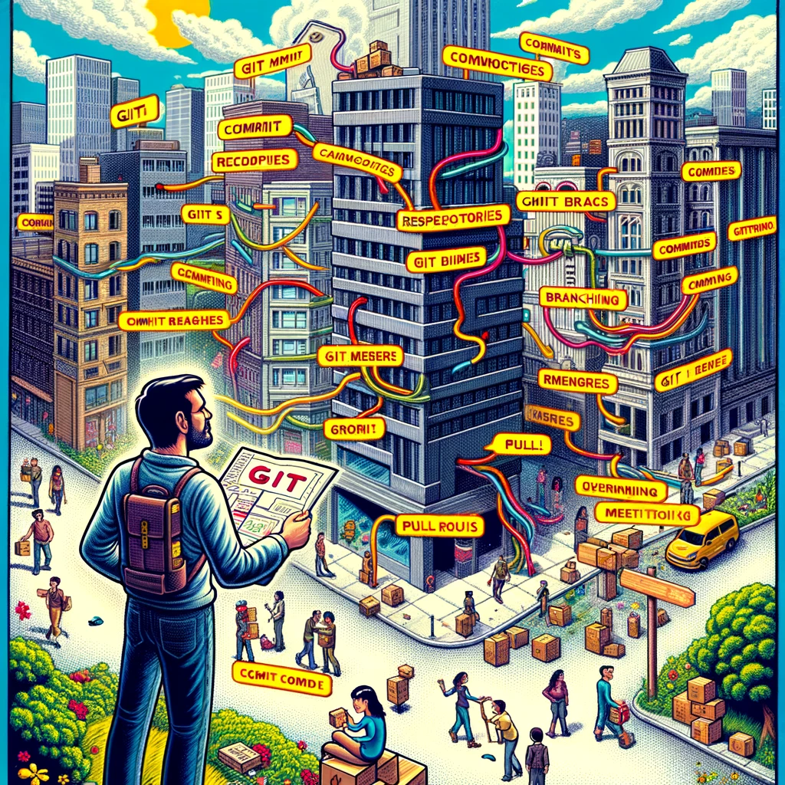

# Git

Selles peatükis räägime hajutatud versioonihaldussüsteemist Git. Õpime Git'i põhitõdesid, -arhitektuuri, -sõnavara, -käske ja Git flow'd. Lisaks räägime graafilistest Git'i klientidest ja Git'i majutusplatvormidest.



Pildi allikas: Dall-E by OpenAI

- [Git](#git)
  - [Õpiväljundid](#õpiväljundid)
  - [Mis on Git?](#mis-on-git)
  - [Git'i põhiarhitektuur](#giti-põhiarhitektuur)
  - [Giti paigaldamine](#giti-paigaldamine)
  - [Git'i põhisõnavara](#giti-põhisõnavara)
  - [Git'i põhikäsud](#giti-põhikäsud)
  - [Graafilised Git'i kliendid](#graafilised-giti-kliendid)
    - [Mõned populaarsed graafilised kliendid Git'ile](#mõned-populaarsed-graafilised-kliendid-gitile)
    - [Graafiliste Git'i klientide kasutamise põhjused](#graafiliste-giti-klientide-kasutamise-põhjused)
  - [Git flow](#git-flow)
    - [1. **Peamised harud**](#1-peamised-harud)
    - [2. **Toetavad harud**](#2-toetavad-harud)
    - [**Git flow põhiprotsess**](#git-flow-põhiprotsess)
  - [Git'i majutusplatvormid](#giti-majutusplatvormid)
  - [Harjutused](#harjutused)
  - [Järgmised sammud:](#järgmised-sammud)

## Õpiväljundid

Pärast selle teema läbimist suudad:

- kirjeldada, mis on Git;
- kirjeldada Git'i põhitõdesid;
- kirjeldada Git'i põhiarhitektuuri;
- kirjeldada Git'i põhisõnavara;
- kirjeldada Git flow'd;

## Mis on Git?

**Git** on hajutatud versioonihaldussüsteem (_DVCS_), mida kasutatakse tarkvaraarenduses lähtekoodi muudatuste jälgimiseks. See on loodud nii väikeste kui ka väga suurte projektidega toimetulekuks kiiresti ja tõhusalt. **Git** võimaldab mitmel arendajal koostööd teha sama koodibaasi kallal üksteist segamata.

**Git** loodi 2005. aastal Linus Torvaldsi poolt Linuxi tuuma arendamiseks. Selle kasutuselevõtt on kiiresti kasvanud ja nüüd on see tarkvaratööstuses domineeriv versioonihaldussüsteem. Seda kasutavad ettevõtted nagu **Google**, **Facebook**, **Microsoft** ja **Twitter** oma koodibaaside haldamiseks.

Siin on mõned **Git**i peamised aspektid ja omadused:

- **Hajutatud süsteem**: Erinevalt kesksetest versioonihaldussüsteemidest, kus on üks keskne hoidla, on **Git**is iga arendaja arvutis olev koodikoopia ka hoidla, mis võib sisaldada kogu ajalugu ja versioonijälgimise võimalusi. See tagab andmete dubleerimise ja muudab harude loomise ja ühendamise äärmiselt tõhusaks.
- **Harud ja ühendamine** (*Branch* ja *Merge*): **Git**i harusüsteem võimaldab arendajatel luua peamisest koodibaasist isoleeritud harusid funktsioonide arendamiseks või vigade parandamiseks. Need harud saab seejärel ühendada tagasi peamisse harusse, mis on tavaliselt tuntud kui "master/main" haru.
- **Ajalugu**: **Git** jälgib kogu projekti ajalugu. Iga muudatuste fikseerimine on kontrollsummeeritud ja taastatav, tagades tervikluse ja jälgitavuse.
- **Muudatuste fikseerimine** (*commit*): **Git** võimaldab arendajatel fikseerida muudatused koodibaasis, millele on lisatud sõnum, mis kirjeldab muudatuste olemust. `commit` on justkui fikseeritud olek koodibaasis, mida saab hiljem taastada.
- **Ettevalmistusala**: **Git** tutvustab ainulaadset kontseptsiooni ettevalmistusalast. See on vaheala, kus `commit`-e saab vormistada ja üle vaadata enne `commit`-imise lõpuleviimist.
- **Jõudlus**: **Git**i toimingud viiakse läbi kohapeal, muutes selle kiiremaks kui paljud teised võrgutoimingutel põhinevad versioonihaldussüsteemid.
- **Terviklus**: **Git** kasutab oma andmete kontrollsummeerimiseks SHA-1 räsialgoritmi. See tagab versiooniajaloo tervikluse.
- **Paindlikkus**: **Git** toetab erinevaid töövooge, alates kesksest kuni täielikult hajutatuks, muutes selle kohandatavaks erinevate projektivajaduste jaoks.
- **Koostööplatvormid**: Platvormid nagu _GitHub_, _GitLab_ ja _Bitbucket_ täiendavad **Git**i koostöövõimalusi, pakkudes koodi majutamist, tõmbetaotlusi, koodi ülevaatusi ja probleemide jälgimist.
- **Tasuta ja avatud lähtekoodiga**: **Git** on tasuta tarkvara, mis on levitatud GNU General Public License versiooni 2 tingimustel.

## Git'i põhiarhitektuur

Git'il on ainulaadne arhitektuur ja andmemudel, mis muudab selle tõhusaks ja võimsaks. Siin on Git'i põhiarhitektuuri põhikomponentide jaotus:

- **Blob**:
  - Esindab faili sisu Git'is.
  - Blob hoiab faili andmeid, kuid ei sisalda faili kohta metaandmeid.
  - See on binaarne suur objekt ja seda tuvastatakse SHA-1 räsi abil.
- **Puu (_tree_)**:
  - Esindab kataloogi või kausta Git'is.
  - Puu objekt kaardistab nimed blobidele või puudele (sisuliselt võib see viidata alamkataloogide jaoks teistele puudele).
  - Nagu blobid, tuvastatakse puud SHA-1 räsi abil.
- **Commit** (fikseering, muudatuste kinnitamine):
  - Esindab konkreetset punkti hoidla ajaloos.
  - `commit` viitab puule, mis jäädvustab hoidla oleku teatud hetkel.
  - Sisaldab metaandmeid nagu:
    - Autor
    - `commit`-i tegija
    - Kuupäev
    - `commit`-i sõnum
  - Iga `commit` viitab ka oma vanem`commit`ile, luues lingitud loendi. See loob Git'is muudatuste "ajaloo".
  - Tuvastatav SHA-1 räsi abil.
- **Harud**:
  - Harud võimaldavad arengut eristada, kus funktsioone või katsetusi saab arendada isoleeritult enne nende tagasi ühendamist peamisse koodibaasi.
  - Liikuv viide `commit`-ile.
  - Kui loote haru, loob Git viite `commit`-ile, kus te praegu olete.
  - Uute `commit`-ide loomisel liigub haru viide automaatselt viimasele `commit`-ile.
  - Enamikus hoidlates on vaikimisi haru nimega "master" (kuigi hiljuti on täheldatud nihet nimetamaks seda "main"-iks).
  

See arhitektuur, mis on üles ehitatud suunatud tsüklita graafi objektidele, võimaldab Git'il tõhusalt jälgida muudatusi, luua harusid ja ühendada ajalugusid. SHA-1 räside kasutamine tagab hoidla tervikluse ja järjepidevuse kloonide ja versioonide vahel.

## Giti paigaldamine

Giti viimase versiooni ja paigaldusjuhised leiate aadressilt [git-scm.com](https://git-scm.com/book/en/v2/Getting-Started-Installing-Git).

## Git'i põhisõnavara

Git'il on oma unikaalne sõnavara ja nende terminite mõistmine on tõhusaks tööks Git'iga võtmetähtsusega. Siin on põhiline ülevaade mõningatest olulistest Git'i terminitest:
- **Hoidla (Repository)**:
  - Kataloog või salvestusruum, kus teie projekt elab. See sisaldab kõiki projekti faile ja kogu muudatuste ajalugu.
  - Võib olla kohalik (teie arvutis) või kaugel (nt serveril või teenusel nagu GitHub).
- **Muudatuste fikseerimine (Commit)**:
  - Failide muudatuste kogum. Iga `commit` on unikaalselt tuvastatud SHA-1 räsi koodiga.
  - Esindab hoidla failide ja kataloogistruktuuri hetkeseisu teatud ajahetkel.
- **Haru (Branch)**:
  - Hoidla paralleelne versioon. See hargneb peatööprojektist eraldi alasse, kus saate töötada ilma peamist või "master/main" haru mõjutamata.
  - Kasulik uute funktsioonide arendamiseks või ideede testimiseks.
- **Master või main**:
  - Vaikimisi arendusharu. Iga kord, kui loote Git'i hoidla, luuakse haru nimega "master" või "main" ja see saab aktiivseks haruks.
  > Märkus: Tööstuses on täheldatud nihet nimetamaks seda vaikimisi haru "main"-iks.
- **Kloon (Clone)**:
  - Hoidla koopia, mis asub kohalikus arvutis, mitte kusagil serveris või algse hoidla saidil.
  - `git clone [URL]` on käsk, mida kasutatakse hoidla kloonimiseks (või kopeerimiseks) olemasolevast URL-ist.
- **Fork**:
  - Teise kasutaja hoidla isiklik koopia. Forkimist kasutatakse kellegi teise projekti muudatuste soovitamiseks või kellegi teise projekti kasutamiseks oma idee alustamiseks.
- **Tõmbamine (Pull)**:
  - Viitab sellele, kui te tõmbate muudatusi serverist või harusse ja ühendate need oma praegusesse harusse.
  - `git pull [remote] [branch_name]` on käsk muudatuste tõmbamiseks.
- **Lükkamine (Push)**:
  - Fikseeritud muudatuste saatmine serverisse.
  - `git push [remote] [branch_name]` on käsk oma muudatuste lükkamiseks.
- **HEAD**:
  - Eriline viide või osutus konkreetsele `commit`-ile hoidlas. Vaikimisi osutab see viimasele `commit`-ile harus, kus te praegu olete.
- **Ühendamine (Merge)**:
  - Integreerimisprotsess, kus ühest harusse viiakse muudatused teise harusse.
- **Ühendamiskonflikt (Merge Conflict)**:
  - Tekib siis, kui konkureerivaid muudatusi tehakse sama faili samale reale või kui üks inimene muudab faili ja teine inimene kustutab sama faili.
  - Sellisel juhul tõstab Git esile erinevused ja nõuab, et valiksite, milliseid muudatusi hoida.
- **Tõmbetaotlus (Pull Request)**:
  - Platvormidel nagu `GitHub` on tõmbetaotlus viis muudatuste pakkumiseks forkist või harust, mida saab seejärel ühendada teise harusse, tavaliselt `master/main` harusse.
- **`Lavastusala` (või indeks)**:
  - Vaheala, kus `commit`-e saab vormistada ja üle vaadata enne `commit`-i lõpuleviimist.
  - `git add [file_name]` kasutatakse muudatuste lisamiseks `lavastusala`le.
- **Tõmbamine (Fetch)**:
  - Uute andmete allalaadimise toiming kaugelt hoidlast. Erinevalt `pull`-ist saab `fetch` andmed, kuid ei ühenda neid.

See ülevaade hõlmab põhilisi termineid, mida kohtate Git'iga alustades. Kui sukeldute sügavamale, kohtate loomulikult palju keerukamaid kontseptsioone ja termineid.

## Git'i põhikäsud

Siin on põhiline ülevaade mõningatest olulistest Git'i käskudest ja nende kirjeldustest:

- **`git init`**:
  - Algatab uue Git'i hoidla ja hakkab jälgima olemasolevat kataloogi.
  - Lisab olemasolevasse kataloogi peidetud alamkataloogi, mis majutab versioonikontrolli nõutavat sisemist andmestruktuuri.
- **`git clone [url]`**:
  - Loob serveris olevast projektist koopia kohalikku arvutisse.
  - Kloon sisaldab kõiki projekti faile, ajalugu ja harusid.
- **`git add [file-name.txt]`**:
  - Lisab faili muudatused `lavastusala`le.
  - Valmistab ja pakendab muudatused `commit`-imiseks ette.
- **`git add .`**:
  - Lisab kõik praeguse kataloogi muudatused `lavastusala`le (kasulik mitme muudatuse jälgimiseks erinevates failides).
- **`git commit -m "[commit message]"`**:
  - Loob projekti uue hetkeseisu praegu `lavastatud` muudatustega.
- **`git status`**:
  - Näitab muudatuste staatust kui `jälgimata`, `muudetud` või `lavastatud`.
- **`git branch`**:
  - Loetleb kõik kohalikud harud hoidlas.
  - Kui peate nägema kõiki harusid (ka serverist), kasutage `git branch -a`.
- **`git branch [branch-name]`**:
  - Loob uue haru ja annab sellele nime.
- **`git checkout [branch-name]`**:
  - Lülitub määratud harusse ja uuendab töökataloogi.
  > Märkus: Käsk on arenenud. Uuemates Git'i versioonides saate nüüd kasutada `git switch [branch-name]`.
- **`git merge [branch-name]`**:
  - Ühendab määratud haru ajaloo praegusesse harusse.
- **`git pull`**:
  - Uuendab aktiivset kohalikku tööharu kõigi uute muudatustega vastavast harust serverist.
- **`git push [remote-name] [branch-name]`**:
  - Saadab kohaliku haru uuendused vastavasse harusse serveris.
- **`git log`**:
  - Kuvab järjestatud nimekirja kõigist muudatustest, mis viivad kuni haru praeguse seisundini.
  - On palju võimalusi väljundi vormingu kohandamiseks, nagu `git log --oneline` kokkuvõtliku vaate jaoks.
- **`git diff`**:
  - Näitab failide erinevusi, mis pole veel `lavastusala`le lisatud.
- **`git diff --staged`**:
  - Näitab failide erinevusi, kui võrrelda muudatusi viimase `commit`-iga.
- **`git fetch`**:
  - Hangib kõik uuendused serverist, aga ei ühenda neid aktiivsesse harusse.
- **`git revert [commit]`**:
  - Tühistab kõik muudatused, mis tehti konkreetses `commit`-is.
- **`git reset`**:
  - Lähtestab teie `lavastusala` vastavaks viimasele `commit`-ile, kuid jätab töökataloogi muutmata. Kasulik `git add` tühistamiseks.

See loetelu katab põhitõed, et saaks Git-i kasutamisega alustada. Git on üsna keeruline tööriist mitmekesiste käskudega ja kogenumaks saades võib ilmneda vajadus palju rohkemate ja keerukamate käskude järele, mis on suunatud spetsiifilistele ülesannetele.

## Graafilised Git'i kliendid

**Graafilised Git'i kliendid** on rakendused, mis pakuvad visuaalset liidest Git'iga suhtlemiseks, selle asemel, et tugineda ainult käsureale. Need võivad kujutada visuaalselt versiooniajalugu, harusid ja muid Git'i hoidla aspekte.

Kuigi graafilised kliendid võivad olla uskumatult kasulikud, eriti neile, kes ennast käsureaga väga mugavalt ei tunne, varjavad nad mõningaid Git'i keerukusi ja ei pruugi võimaldada keerulisemaid tegevusi. Sügavamate ja keerukamate toimingute või Git'i sisemise töö tõeliseks mõistmiseks on käsurea tundmine kasulik. Mõlemal lähenemisel on oma eelised ja paljud arendajad leiavad, et kõige tõhusam on hübriidlähenemine (kasutades nii käsurida kui ka graafilise kasutajaliidesega tööriistu).

### Mõned populaarsed graafilised kliendid Git'ile

- [**GitHub Desktop**](https://desktop.github.com/): GitHubi ametlik graafilise kasutajaliidesega (_GUI_ - Graphical User Interface) tööriist. See on avatud lähtekoodiga ja platvormideülene (saadaval macOS-ile ja Windowsile).
- [**Sourcetree**](https://www.sourcetreeapp.com/): Arendatud  Atlassiani poolt. Tasuta tööriist, mis on saadaval macOS-ile ja Windowsile. Pakub visuaalset suhtlust hoidlatega ja toetab lisaks Git-ile ka Mercurialit.
- [**GitKraken**](https://www.gitkraken.com/): Platvormideülene tööriist (saadaval Windowsile, macOS-ile ja Linuxile), mis pakub erksat ja interaktiivset kasutajaliidest. See on tuntud graafi visualiseerimise poolest ja see integreerub GitHubi, GitLabi, Bitbucketi ja muude teenusepakkujatega.

### Graafiliste Git'i klientide kasutamise põhjused

- **Kasutajasõbralik**: Algajatele võib käsurea kasutamine olla hirmutav. Graafilised kliendid pakuvad interaktiivsemat ja intuitiivsemat liidest Git'iga suhtlemiseks.
- **Visualiseerimine**: Võivad pakkuda selget visuaalset esitust harudest, `commit`-idest, ühendamistest jne. See on eriti kasulik hoidla `commit`-ide voo ja struktuuri mõistmiseks.
- **Lihtsustab keerukaid ülesandeid**: Mõned Git'i ülesanded võivad olla käsurealt kasutades võrdlemisi keerulised ja pikad. Graafilise kasutajaliidesega kliendid lihtsustavad neid protsesse haldatavamateks sammudeks.
- **Konfliktide lahendamine**: Paljud graafilised kliendid pakuvad visuaalset viisi ühendamiskonfliktide lahendamiseks, muutes selle selgemaks ja mõnikord lihtsamaks kui konfliktide käsitsi redigeerimine tekstiredaktoris.
- **Integreeritud tööriistad**: Graafilistel klientidel võib olla sisseehitatud tööriistu või integratsioone, nagu  hoidlate majutamise teenused jms.
- **Mitme ülesande täitmine**: Graafilised kasutajaliidesed võimaldavad tavaliselt töötada mitme hoidlaga eraldi vahekaartidel/akendel, muutes kontekstivahetuse lihtsamaks.
- **Kohene tagasiside**: Paljud graafilised kasutajaliidesed pakuvad enamiku toimingute jaoks kohese visuaalse tagasiside, nagu ühendamise tulemus või konkreetses `commit`-is fikseeritud muudatused.
- **Mittestandardsete Git'i toimingute tugi**: Mõned GUI-d pakuvad funktsioone, mis pole rangelt Git'i toimingud, nagu faili avamine eelistatud redaktoris, käskude ajaloo vaatamine või isegi kohandatud skriptide käivitamine.

## Git flow

Git Flow on populaarne töövoogude metodoloogia Git'is, mis määratleb struktureeritud lähenemise harude loomiseks ja ühendamiseks. See pakub kindlat raamistikku suuremate projektide haldamiseks ja võib lihtsustada koostööprotsessi teiste arendajatega ühises hoidlas. Allpool on kirjeldatud `Git Flow` protsessi, keskendudes harude loomise rollile:

### 1. **Peamised harud**

- **`main` (endine `master`)**:
  - See haru sisaldab ametlikku väljalaskeajalugu.
  - Kõik `main` harus olevad `commit`-id esindavad tarkvara versiooni, mis on täielikult testitud ja valmis kasutuseks.
- **`develop`**:
  - Toimib funktsioonide integreerimise haruna.
  - Kõik järgmise väljalaske jaoks ette nähtud muudatused on integreeritud sellesse harusse.

### 2. **Toetavad harud**

Neid harusid kasutatakse paralleelse arenduse toetamiseks, funktsioonide lihtsaks jälgimiseks, väljalasete ettevalmistamiseks ja probleemide kiireks lahendamiseks.

- **Funktsioonide harud**:
  - **Haru alguspunk**t: `develop`
  - **Tagasiühendamine**: `develop`
  - **Nimetamise konventsioon**: midagi peale `main`, `develop`, `release-*` või `hotfix-*`. Näiteks `feature/new-feature`.
  - **Eesmärk**: Kasutatakse uute funktsioonide või täiustuste arendamiseks. Need harud eksisteerivad nii kaua, kui funktsioon on arenduses.

    ```mermaid
    graph LR
        A[develop] --> B[feature/funktsiooni_nimi]
        B --> A
    ```

- **Väljalaske haru**:

  - **Haru alguspunkt**: `develop`
  - **Tagasiühendamine**: `main` ja `develop`
  - **Nimetamise konventsioon**: `release-*`
  - **Eesmärk**: Kasutatakse uue tooteversiooni ettevalmistamiseks. Siin märgistatakse versioonid enne tootmisse minekut. Veaparandusi saab rakendada selles harus.

    ```mermaid
    graph LR
        A[develop] --> B[release/versiooni_number]
        B --> C[main]
        B --> A
    ```

- **Paranduste harud**:
  - **Haru alguspunkt**: `main`
  - **Tagasiühendamine**: `main` ja `develop`
  - **Nimetamise konventsioon**: `hotfix-*`
  - **Eesmärk**: Neid kasutatakse vajaduse korral viivitamatult tegutsemiseks soovimatu `main` haru seisundi korral. Kasutatakse tootmisväljalasete kiireks parandamiseks.

    ```mermaid
    graph LR
        A[main] --> B[hotfix/probleem]
        B --> A
        B --> C[develop]
    ```

### **Git flow põhiprotsess**


1. **Alustamine**:
   Alustage Git'i hoidla loomisega ja seejärel seadistage tühi `main` ja `develop` haru.
2. **Uue funktsiooni alustamine**:
   Iga uue funktsiooni jaoks looge uus haru `develop`-ist ja nimetage see vastavalt töötatava funktsiooni järgi.
3. **Lõpetatud funktsiooni lisamine**:
   Kui funktsioon on lõpetatud ja testitud, ühendatakse see tagasi `develop` harusse. See ootab järgmist väljalaset, et integreerida `main` harusse.
4. **Väljalaske aeg**:
   Kui piisavalt funktsioone on valmis või saavutatakse ettemääratud väljalaskepunkt, hargneb `develop` väljalaske harusse, kus toimub lõplik testimine.
5. **Ühendamine peaharuga**:
   Kui väljalaske haru on põhjalikult testitud, ühendatakse see `main`-iga ja märgistatakse versiooninumbriga. Seejärel tuleb see ka tagasi ühendada `develop` harusse, et tagada järgmises tsüklis lisatud funktsioonidele parandused ja uuendused.
6. **Parandused**:
   Kui `main` harus tuvastatakse probleem ja on vaja kohest parandust, luuakse paranduste haru. Kui parandus on lõpetatud, ühendatakse see nii `main`-i (ja märgistatakse) kui ka `develop`-isse.

`Git Flow` pakub rangeid raamistikke suurtele projektidele, kuid väiksemate projektide või meeskondade jaoks võib see olla liiga keeruline. Mõned meeskonnad eelistavad lihtsamaid töövooge, nagu `GitHubi` voog või `GitLabi` voog. Siiski, `Git Flow` mõistmine annab tugeva aluse selle kohta, kuidas harusid saab kasutada keerukates stsenaariumides.

## Git'i majutusplatvormid

Git'i saab kasutada ka oma arvutis, kuid lihtsam on kasutada mõne teenusepakkuja poolt pakutavat Git'i majutusplatvormi. Need platvormid pakuvad keskset kohta Git'i hoidlate hoidmiseks ja koostööks. Lisaks pakuvad nad täiendavaid funktsioone nagu veajälgimine, tõmbetaotlused, koodi ülevaatused jms.

Siin on mõned populaarsed Git'i majutusplatvormid:

- [**GitHub**](https://github.com)
- [**GitLab**](https://gitlab.com)
- [**Bitbucket**](https://bitbucket.org)
- jne.

## Harjutused

Proovi selgitada järgmisi kontseptsioone oma sõnadega:

- Mis on Git ja versioonihaldus?
- Nimeta vähemalt neli terminit Git'i sõnavarast
- Nimeta vähemalt üks Git'i majutusplatvorm

## Järgmised sammud:

- installeeri `git` oma arvutisse (kui see pole veel tehtud)
