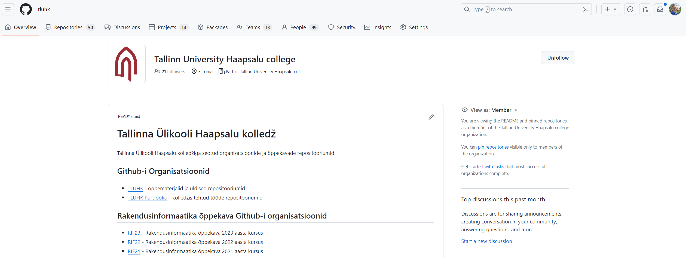
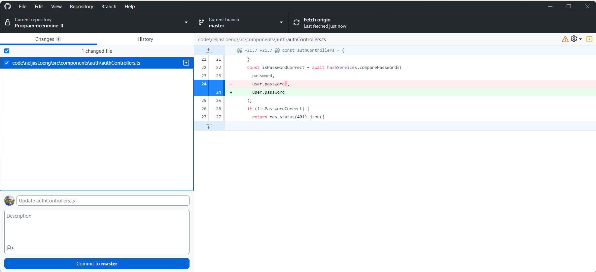

# Github

Selles teemas õpime tundma GitHubi, mis on üks maailma populaarsemaid koodi majutamise platvorme. Uurime selle funktsioone, õpime seda kasutama ja avastame, kuidas seda saab kasutada tarkvaraprojektide koostööks.

- [Github](#github)
  - [Õpitulemused](#õpitulemused)
  - [Mis on Github?](#mis-on-github)
  - [Konto loomine](#konto-loomine)
  - [Github Desktop](#github-desktop)
  - [Harjutused](#harjutused)

## Õpitulemused

Pärast selle teema läbimist oskad:

- kirjeldada, mis on GitHub ja miks see on populaarne;
- luua GitHubi konto;
- navigeerida GitHubi kasutajaliideses.
- kasutada Github Desktopi klooni loomiseks, muudatuste pühendamiseks, tõukamiseks ja tõmbamiseks hoidlasse.
- kasutada Github Desktopi harusid looma, muudatusi tegema ja neid ühendama.

## Mis on Github?

**GitHub** on veebipõhine platvorm, mis pakub majutust tarkvaraarenduseks ja versioonikontrolliks Git'i abil. See pakub Git'i hajutatud versioonikontrolli võimekust koos Github-i poolt lisatud funktsionaalsustega.

GitHub asutati 2008. aastal Tom Preston-Werneri, Chris Wanstrathi ja PJ Hyetti poolt. 2018. aastal omandas selle Microsoft. Täna on see üks maailma suurimaid koodi majutamise platvorme, millel on väga suur arendajate kogukond ja mis sisaldab väga palju avatud lähtekoodiga projekte ja privaatseid hoidlad.

Siin on mõned peamised Githubi aspektid ja funktsioonid:

- **Hoidlad**: GitHubi südames on "hoidla" (tihti lühendatud "repo"). Hoidla sisaldab kõiki projekti faile, sealhulgas muudatuste ajalugu. Hoidlad võivad olla avalikud (kõigile ligipääsetavad), privaatsed (piiratud ligipääsuga) või organisatsiooni sisesed (nähtavad organisatsiooni liikmetele).
- **Forkimine**: Kasutajad saavad "forkida" hoidlat, mis tähendab isikliku koopia loomist teise kasutaja projektist. See võimaldab kasutajatel teha muudatusi ilma algset projekti mõjutamata. Kui forkis on muudatusi tehtud, saavad kasutajad saata tõmbetaotluse algse hoidla omanikule, et soovitada nende muudatuste integreerimist.
- **Tõmbetaotlused (PR - Pull Requestid)**: Tõmbetaotlused võimaldavad teavitada teisi hoidlas tehtud muudatustest. Kui tõmbetaotlus on saadetud, saavad projekti haldurid üle vaadata muudatuste kogumi, arutada võimalikke modifikatsioone ja isegi teha järelmuudatusi enne muudatuste ühendamist hoidlasse.
- **Probleemid (Github Issue)**: GitHub pakub probleemide jälgimise süsteemi, kus kasutajad saavad teatada vigadest, taotleda funktsioone või arutada muid projekti puudutavaid küsimusi. Lisaks kasutatakse Github `Issue`-sid sageli ka ülesannete jagamiseks/jälgimiseks ja projektide haldamiseks.	
- **GitHub Actions**: See funktsioon võimaldab CI/CD (pidev integratsioon/pidev väljastamine) ja muude sündmustele reageerivate ülesannete automatiseeritud töövoogude loomist otse GitHubi hoidlas.
- **GitHubi lehed**: Kasutajad saavad otse oma hoidlatest GitHubis staatilisi veebisaite majutada. See on populaarne isiklike portfooliote, projekti dokumentatsiooni jms jaoks.
- **Gistid**: Gist on teenus, mida GitHub pakub koodilõikude jagamiseks. Kuigi hoidlad on suuremate projektide jaoks, on gistid mõeldud väiksemate koodilõikude jagamiseks.
- **Koostöö**: GitHub pakub mitmesuguseid tööriistu nagu koodi ülevaatused, projektijuhtimise tahvlid ja ulatuslikud koostööfunktsioonid, et muuta meeskonnatöö lihtsamaks.
- **Turg**: GitHubi turg pakub hulga tööriistu ja integratsioone, mis laiendavad ja suurendavad GitHubi funktsionaalsust, ulatudes pideva integratsiooni teenustest koodi kvaliteedi kontrollijateni ja muuni.
- **Turvalisus**: GitHubil on mitu turvafunktsiooni, sealhulgas automaatsed turvakontrollid teadaolevate haavatavuste kohta sõltuvustes ja "Dependabot", mis saab automaatselt luua tõmbetaotlusi sõltuvuste uuendamiseks uuematele, turvalisematele versioonidele.
- **Sponsorlus**: GitHub tutvustas "Sponsor" funktsiooni, mis võimaldab kasutajatel oma lemmik avatud lähtekoodiga arendajaid ja projekte GitHubis rahaliselt toetada.
- **Integratsioonid**: GitHubi saab integreerida laia valiku kolmandate osapoolte tööriistade ja platvormidega, suurendades selle funktsionaalsust.
- **GitHubi projektid**: See funktsioon võimaldab kasutajatel luua Kanban-stiilis tahvleid projektide ja ülesannete haldamiseks.

## Konto loomine

GitHubi konto loomiseks minge [github.com](https://github.com/signup) ja järgige juhiseid.

## Github Desktop

GitHub Desktop on graafiline kasutajaliides (GUI) Git'i jaoks, mille on loonud GitHub. Selle eesmärk on lihtsustada Git'i hoidlate ja GitHubi projektide haldamise protsessi võrreldes Git'i kasutamisega ainult käsurea kaudu. Siin on mõned GitHub Desktopi peamised aspektid:

- **Hoidlate haldamine**:
  - GitHub Desktop võimaldab kasutajatel luua uusi hoidlaid, kloonida olemasolevaid hoidlaid ja hallata kohalikke hoidlaid.
  - See pakub visuaalset esitust teie hoidlatest, muutes struktuuri ja muudatuste mõistmise aja jooksul lihtsamaks.

- **Harude loomine ja ühendamine**:
  - Kasutajad saavad otse liidesest luua, vahetada ja ühendada harusid, muutes harusid loomise protsessi intuitiivsemaks.
  - See pakub visuaaliseerimist ühendamiskonfliktidele ja aitab neid lahendada.

- **Muudatuste ajalugu**:
  - Rakendus pakub visuaalset muudatuste ajalugu, mis võib olla kasulik projekti arengu mõistmiseks.
  - Kasutajad saavad hõlpsalt näha, kes tegi muudatusi, milliseid muudatusi tehti ja millal need muudatused tehti.

- **Lihtsad pühendamised ja tõukamised**:
  - GitHub Desktop lihtsustab muudatuste lavastamise, pühendamise ja tõukamise protsessi GitHubi.
  - See pakub lihtsat vormi pühendamissõnumite sisestamiseks ja valimiseks, milliseid muudatusi pühendamisse kaasata.

- **Integratsioon GitHubiga**:
  - Rakendus on tihedalt integreeritud GitHubiga, võimaldades kohalike hoidlate ja GitHubi hoidlate vahel hõlpsat sünkroniseerimist.
  - Kasutajad saavad avada

 pull requeste, vaadata probleeme ja palju muud, kõik GitHub Desktopi liideses.

- **Platvormideülene**:
  - GitHub Desktop on saadaval Windowsile ja macOSile, muutes selle mitmekülgseks tööriistaks segatud operatsioonisüsteemidega meeskondadele.

- **Avatud lähtekood**:
  - GitHub Desktop on avatud lähtekoodiga, võimaldades kellelgi panustada selle arendusse või uurida selle koodi.

- **Abi keerukate Git'i funktsioonide jaoks**:
  - Kuigi GitHub Desktop keskendub Git'i põhifunktsioonide lihtsustamisele, pakub see abi ka keerukamate Git'i funktsioonide jaoks, olles sild käsurea ja GUI operatsioonide vahel.

Üldiselt on GitHub Desktop mõeldud arendajatele, kes eelistavad graafilist liidest, ja see võib olla eriti kasulik neile, kes on Git'i uued või eelistavad visuaalseid suhtlusi käsurea suhtluste asemel.

## Harjutused

Minge [github.com](https://www.github.com), registreerige konto (kui teil pole veel kontot) või logige sisse (kui teil juba on).

Tutvuge GitHubi kasutajaliidesega. Harjutage erinevate funktsioonide ja veebisaidi osadega.

Seejärel tehke järgmist:

- installeerige `Github Desktop` oma arvutisse
- looge `Githubis` uus hoidla
- kloonige hoidla oma arvutisse
- lisage hoidlasse uus fail
- pühendage muudatused
- tõugake muudatused kaughoidlasse
- looge oma hoidlas `Githubis` uus `Issue` ja määrake see endale