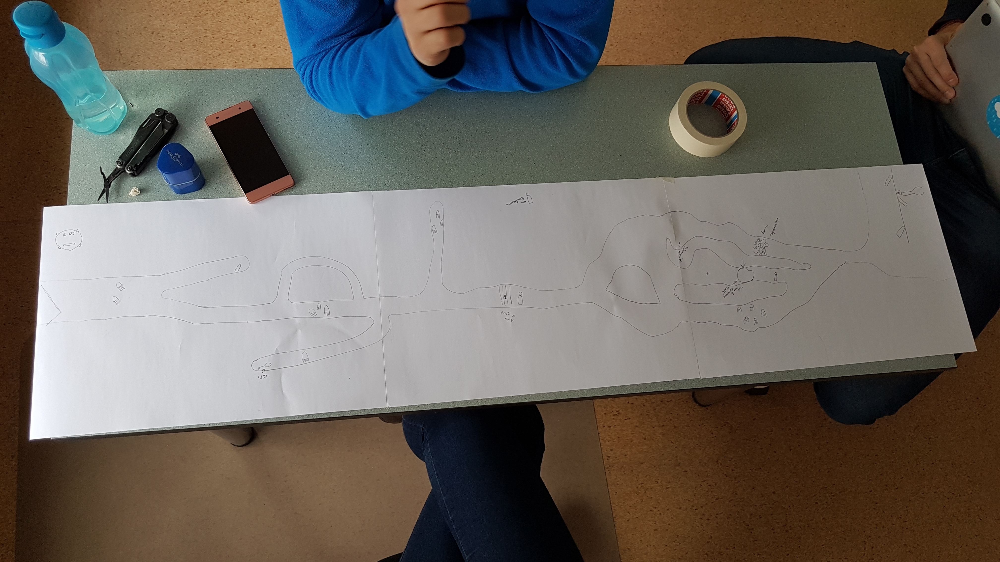

# Prototüüpimine

Prototüüpimine on tehnika, mida kasutatakse tarkvaraarenduses tarkvaratoote või -süsteemi varajaste töötavate versioonide loomiseks. Prototüüpimine hõlmab lõpptootest lihtsustatud, kuid funktsionaalse versiooni loomist, mida saab kasutada tagasiside kogumiseks, ideede testimiseks ja nõuete täpsustamiseks enne lõpliku versiooni loomist.

- [Prototüüpimine](#prototüüpimine)
  - [Õpiväljundid](#õpiväljundid)
  - [Prototüüpimisest üldiselt](#prototüüpimisest-üldiselt)
  - [Paberprototüüpimine](#paberprototüüpimine)
  - [Paberprototüüpimine - Eelised](#paberprototüüpimine---eelised)
  - [Paberprototüüpimine - Miinused](#paberprototüüpimine---miinused)
  - [Digitaalsed prototüüpimise tööriistad](#digitaalsed-prototüüpimise-tööriistad)
  - [Digitaalsete prototüüpimise tööriistade eelised](#digitaalsete-prototüüpimise-tööriistade-eelised)
  - [Digitaalsete prototüüpimise tööriistade miinused](#digitaalsete-prototüüpimise-tööriistade-miinused)

## Õpiväljundid

Peale selle õppematerjali läbimist:

- oskad selgitada prototüüpimise eeliseid tarkvaraarenduses
- oskad selgitada paberprototüüpimise eeliseid tarkvaraarenduses
- oskad nimetada mõnda digitaalset prototüüpimise tööriista

## Prototüüpimisest üldiselt

Prototüüpimise peamine eesmärk on pakkuda lõpptootest käegakatsutavat interaktiivset esitust, mida saab kasutada võimalike probleemide ja parendusvaldkondade tuvastamiseks. Prototüübi loomisega saavad arendajad kiiresti katsetada ja itereerida erinevaid disainikontseptsioone ja töövooge ning saada paremat arusaama sellest, kuidas lõpptoode töötab ja kuidas seda lõppkasutajad kasutavad.

Prototüüpimine võib esineda mitmel kujul, alates lihtsatest visanditest ja paberprototüüpidest kuni täiustatud digitaalsete prototüüpideni, mis on loodud spetsiaalsete tarkvaratööriistadega. Kasutatava prototüübi tüüp sõltub projekti vajadustest, eelarvest ja ajakavast.

Mõned prototüüpide loomise eelised tarkvaraarenduses on järgmised:

- Parem suhtlus ja koostöö meeskonnaliikmete ja sidusrühmade vahel
- Võimalike probleemide ja parendusvaldkondade varajane tuvastamine
- Arusaamatuste ja valesti suhtlemise oht arendajate ja sidusrühmade vahel
- Disainikontseptsioonide ja töövoogude kiirem iteratsioon ja testimine
- Parem kasutajate seotus ja rahulolu varajase tagasiside ja sisendi kaudu

Üldiselt on prototüüpimine tarkvaraarenduses väärtuslik tehnika, mis aitab arendajatel luua paremaid, kasutajakesksemaid tooteid, mis vastavad lõppkasutajate vajadustele.

## Paberprototüüpimine

Pildi autor: Oliver Õunap

Paberprototüüpimine on odav ja madala täpsusega prototüüpimise tehnika, mida kasutatakse tarkvaraarenduses toote või süsteemi kiire, lihtsa ja interaktiivse esituse loomiseks. See hõlmab paberi, pastakate ja muude põhimaterjalide kasutamist kasutajaliidese või töövoo füüsilise mudeli loomiseks.

Paberprototüübi loomiseks kasutavad arendajad visandeid, jooniseid ja muid lihtsaid materjale erinevate ekraanide, menüüde ja muude liidese elementide kujutamiseks. Neid elemente saab vastavalt vajadusele korraldada ja ümber paigutada, et simuleerida erinevaid kasutaja interaktsioone ja töövooge.

Paberprototüüpide loomine on kiire ja lihtne viis erinevate disainikontseptsioonide ja töövoogude uurimiseks ning sidusrühmadelt ja lõppkasutajatelt tagasiside kogumiseks. Kuna prototüübid on lihtsad ja madala täpsusega, saab neid kiiresti luua ja muuta, ilma et oleks vaja kallist tarkvara või erioskusi.

## Paberprototüüpimine - Eelised

Mõned paberprototüüpide loomise eelised on järgmised:

- **Madalad kulud:** paberist prototüüpimine on odav tehnika, mis nõuab minimaalseid ressursse, muutes selle kättesaadavaks igasuguse oskustaseme ja eelarvega arendajatele ja disaineritele.
- **Kiire iteratsioon:** paberist prototüüpe saab kiiresti luua ja muuta, võimaldades arendajatel lühikese aja jooksul katsetada ja itereerida erinevaid disainikontseptsioone ja töövooge.
- **Parandatud suhtlus:** paberprototüübid võivad aidata arendajatel ja sidusrühmadel keerukamaid ideid ja töövooge paremini mõista ja edastada ning tuvastada võimalikke probleeme ja parendusvaldkondi.
- **Suurem kasutajate kaasatus:** paberprototüüpe saab kasutada lõppkasutajatelt tagasiside kogumiseks arendusprotsessi alguses, võimaldades arendajatel luua tooteid, mis vastavad nende sihtrühma vajadustele ja ootustele.

## Paberprototüüpimine - Miinused

Mõned paberprototüüpide loomise miinused võiksid olla järgmised:

- **Madal täpsus:** paberprototüübid on lihtsad ja madala täpsusega, mis võib piirata nende kasutatavust keerukamate disainikontseptsioonide ja töövoogude jaoks.
- **Piiratud funktsionaalsus:** paberprototüübid ei pruugi olla võimelised simuleerima kõiki interaktsioone ja funktsioone, mis võivad olla vajalikud lõpptootes.
- **Piiratud kasutatavus:** paberprototüübid võivad olla piiratud kasutatavuse ja interaktiivsuse osas, mis võib muuta nende sobivuse keerukamate kasutajaliideste ja töövoogude jaoks.
- **Keskkonna piirangud:** paberprototüüpide loomine nõuab füüsilist keskkonda ja materjale, mis võivad olla piiravad, eriti kaugtöö ja hajusate meeskondade jaoks.

Üldiselt on paberprototüüpimine tarkvaraarenduses väärtuslik tehnika, mis aitab arendajatel ja disaineritel luua paremaid, kasutajakesksemaid tooteid. Kasutades kasutajaliideste ja töövoogude interaktiivsete mudelite loomiseks lihtsaid ja odavaid materjale, saavad arendajad kiiresti katsetada ja viimistleda erinevaid disainikontseptsioone ning koguda tagasisidet sidusrühmadelt ja lõppkasutajatelt, et tagada lõpptoote vastavus kasutajate vajadustele ja ootustele.

## Digitaalsed prototüüpimise tööriistad

Prototüüpimise tööriistad on tarkvaraarenduse oluline tööriistade klass, mis aitab arendajatel kiiresti luua ja testida interaktiivse kasutajaliidese (UI) kujundusi, ilma et oleks vaja kodeerida. Prototüüpimise tööriistad võimaldavad arendajatel luua kasutajaliideste ja töövoogude realistlikke simulatsioone, mida saab kasutada sidusrühmadelt tagasiside kogumiseks, kasutatavuse testimiseks ja kujunduste itereerimiseks enne koodi kirjutamist.

Saadaval on palju erinevaid prototüüpimistööriistu, alates lihtsatest veebipõhistest tööriistadest, mis ei vaja installimist, kuni keerukamate funktsioonidega töölauarakendusteni. Mõned näited populaarsetest prototüüpimistööriistadest on järgmised:

- **Sketch:** Sketch on populaarne kasutajaliidese kujundamise tööriist, mis sisaldab sisseehitatud prototüüpimisfunktsioone. Kasutajad saavad luua klõpsatavaid prototüüpe, ühendades joonised omavahel ja lisades üleminekuefekte.
  - <https://www.sketch.com/>

- **Adobe XD:** Adobe XD on kasutajaliidese/UX-i disainitööriist, mis sisaldab funktsioone interaktiivsete prototüüpide loomiseks ja jagamiseks. Kasutajad saavad luua interaktiivseid kujundusi animatsioonide, üleminekute ja muude efektidega.
  - <https://www.adobe.com/products/xd/learn/get-started-xd-prototype.html>

- **InVision:** InVision on veebipõhine prototüüpimise tööriist, mis võimaldab kasutajatel luua interaktiivseid kujundusi animatsioonide, levialade ja muude interaktiivsete elementidega. InVision sisaldab ka funktsioone kujunduse kallal koostöö tegemiseks ja sidusrühmadelt tagasiside kogumiseks.
  - <https://www.invisionapp.com/>

- **Figma:** Figma on veebipõhine kasutajaliidese disaini- ja prototüüpimistööriist, mis võimaldab kasutajatel luua ja jagada interaktiivseid kujundusi koos animatsioonide, üleminekute ja muude efektidega. Figma sisaldab ka funktsioone reaalajas koostööks ja versioonikontrolliks.
  - <https://www.figma.com/>

- **Axure RP:** Axure RP on töölauarakendus, mis võimaldab kasutajatel luua veebi- ja mobiilirakenduste jaoks interaktiivseid traatkaare, prototüüpe ja spetsifikatsioone. Axure RP sisaldab täiustatud funktsioone keerukate interaktsioonide ja töövoogude kujundamiseks.
  - <https://www.axure.com/>

- Igasugused muud veebipõhised ja töölauarakendused, mis võimaldavad kasutajatel luua interaktiivseid või mitteinteraktiivseid prototüüpe ja kujundusi.

## Digitaalsete prototüüpimise tööriistade eelised

Mõned digitaalsete prototüüpimise tööriistade eelised on järgmised:

- **Interaktiivsus:** digitaalsed prototüübid võimaldavad kasutajatel luua interaktiivseid kujundusi, mis simuleerivad reaalset kasutajakogemust ja interaktsioone.
- **Animatsioonid ja üleminekud:** digitaalsed prototüübid võimaldavad kasutajatel lisada animatsioone, üleminekuid ja muid efekte, et paremini visualiseerida disainikontseptsioone ja töövooge.
- **Koostöö ja jagamine:** digitaalsed prototüübid võimaldavad kasutajatel koostööd teha ja jagada kujundusi ja prototüüpe meeskonnaliikmete ja sidusrühmadega reaalajas.
- **Tagasiside ja iteratsioon:** digitaalsed prototüübid võimaldavad kasutajatel koguda tagasisidet ja sisendit sidusrühmadelt ja lõppkasutajatelt ning kiiresti itereerida ja kohandada disainikontseptsioone vastavalt saadud tagasisidele.
- **Korduvkasutatavus:** digitaalsed prototüübid võimaldavad kasutajatel korduvkasutada kujunduselemente ja interaktsioone, mis võib säästa aega ja ressursse disainiprotsessi käigus.
- **Disainisüsteemide tugi:** mõned digitaalsed prototüüpimise tööriistad toetavad disainisüsteeme ja komponentide raamatukogusid, mis võimaldavad kasutajatel luua korduvkasutatavaid ja konsistentseid kujundusi.
- **Arendajatele koodi eksportimise võimalus:** mõned digitaalsed prototüüpimise tööriistad võimaldavad kasutajatel eksportida kujunduselemente ja interaktsioone arendajatele koodi kirjutamiseks ja lõpliku toote loomiseks.

## Digitaalsete prototüüpimise tööriistade miinused

Mõned digitaalsete prototüüpimise tööriistade miinused võiksid olla järgmised:

- **Kõrged kulud:** mõned digitaalsed prototüüpimise tööriistad võivad olla kallid, eriti täiustatud funktsioonide ja meeskonnatöö funktsioonide kasutamisel.
- **Õppimiskõver:** mõned digitaalsed prototüüpimise tööriistad võivad nõuda aega ja vaeva õppimiseks ja kasutamiseks, eriti algajatele kasutajatele.
- **Aeganõudev:** digitaalsed prototüübid võivad olla aeganõudvad luua ja kohandada, eriti keerukamate disainikontseptsioonide ja töövoogude jaoks.

Prototüüpimise tööriistad võivad olla väärtuslikuks täienduseks tarkvaraarenduse tööriistakomplektile, eriti projekti algfaasis, kui kasutajaliidese kujundusi veel täiustatakse. Interaktiivseid prototüüpe luues saavad arendajad kiiresti katsetada ja korrata disainikontseptsioone, koguda tagasisidet sidusrühmadelt ning tagada, et lõpptoode vastab kasutajate vajadustele ja ootustele.
