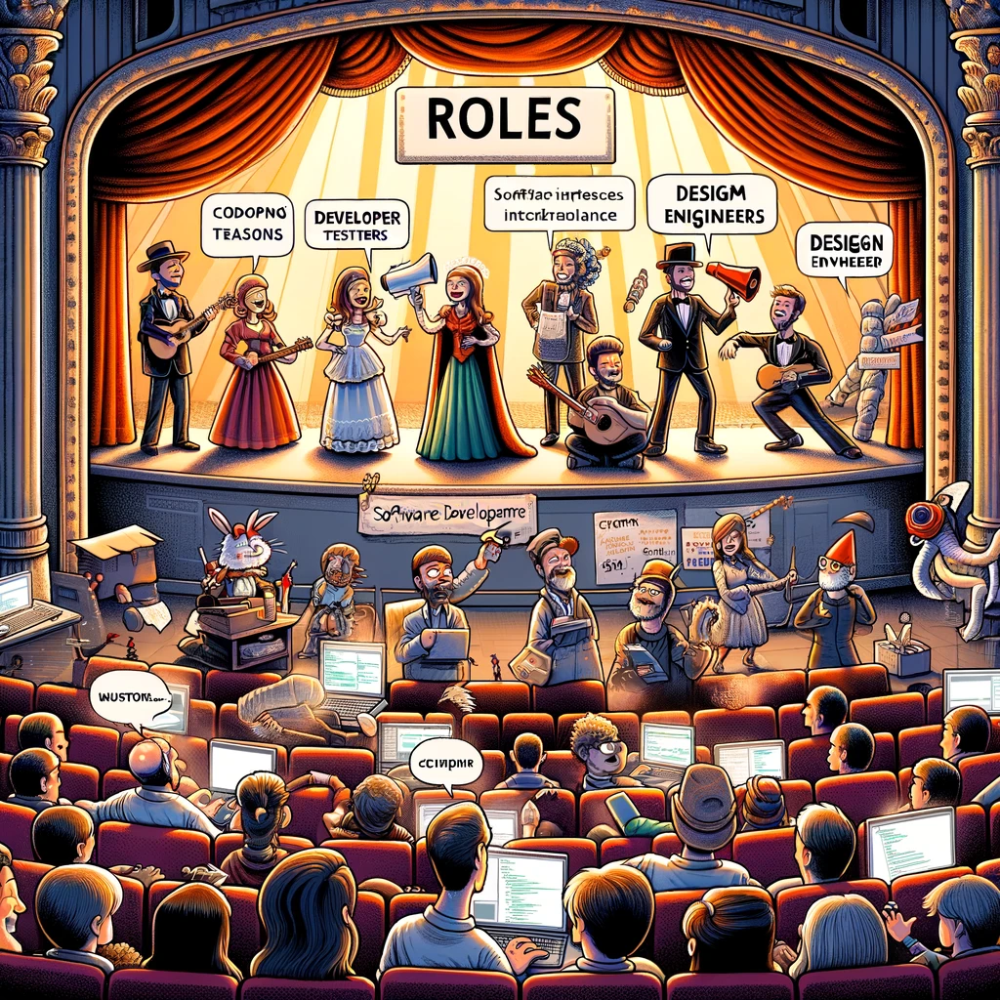

# Tarkvaraarenduse rollid

Selles teemas uurime tarkvaraarenduse võtmerolle. Tarkvaraarenduse valdkonnas võivad isikud täita erinevaid rolle, millest igaühel on oma eripärad ja panused üldprojekti.

Pildi allikas: Dall-E by OpenAI

- [Tarkvaraarenduse rollid](#tarkvaraarenduse-rollid)

## Õpiväljundid

Pärast selle teema läbimist suudate:

- mõista erinevaid rolle tarkvaraarenduses;
- tuvastada erinevate rollide vastutused ja vajalikud oskused;
- kirjeldada erinevate rollide vahelisi suhteid.

Tarkvaraarenduse valdkonnas võivad isikud täita erinevaid rolle, millest igaühel on oma eripärad ja panused üldprojekti.

Siin on ülevaade mõningatest tarkvaraarenduse võtmerollidest:

## Tarkvaraarendaja/Insener

- **Vastutusalad:** Koodi kirjutamine, vigade otsimine, funktsionaalsuse rakendamine disainispetsifikatsioonide põhjal.
- **Oskused:** Valdamine programmeerimiskeeltes, probleemide lahendamine, algoritmide ja andmestruktuuride mõistmine.

## Arhitekt

- **Vastutusalad:** Määratleb tarkvara üldistruktuuri ja tagab arhitektuurilise terviklikkuse.
- **Oskused:** Sügav mõistmine tehnoloogiast, arhitektuurilistest mustritest ja disainipõhimõtetest.

## QA Insener/Testija

- **Vastutusalad:** Tagab tarkvara kvaliteedi testimise kaudu. Tuvastab vigu ja probleeme.
- **Oskused:** Testide automatiseerimine, manuaalsete testimismeetodite mõistmine, tarkvara elutsükli mõistmine.

## Tooteomanik

- **Vastutusalad:** Määrab toote suuna ja ulatuse. Prioritiseerib funktsioone turu- ja kliendivajaduste põhjal.
- **Oskused:** Turuanalüüs, kliendisuhtlus, sidusrühmade suhtlus, strateegiline planeerimine.

## Projektijuht

- **Vastutusalad:** Jälgib projekti algusest lõpuni. Juhib tähtaegu, ressursse ja riske.
- **Oskused:** Projektide planeerimine, riskijuhtimine, sidusrühmade suhtlus, eelarvestamine.

## Ärianalüütik

- **Vastutusalad:** Täidab lünga sidusrühmade ja arendusmeeskonna vahel. Tõlgib ärivajadused tehnilisteks nõueteks.
- **Oskused:** Nõuete kogumine, sidusrühmade suhtlus, mõistmine nii äri- kui tehnoloogiavaldkonnas.

## UI/UX Disainer

- **Vastutusalad:** Kasutajaliidese ja kasutajakogemuse disain. Tagab, et tarkvara on intuitiivne ja visuaalselt meeldiv.
- **Oskused:** Graafiline disain, kasutajakogemuse uurimine, prototüüpimisvahendid.

## Süsteemiadministraator/DevOps Insener

- **Vastutusalad:** Haldab infrastruktuuri, paigaldust, pidevat integratsiooni ja pidevat tarnimist (CI/CD).
- **Oskused:** Pilveplatvormide mõistmine, infrastruktuur kui kood, CI/CD vahendid.

## Andmebaasi Administraator

- **Vastutusalad:** Kujundab, rakendab ja haldab andmebaasi. Tagab andmete terviklikkuse ja kättesaadavuse.
- **Oskused:** SQL, andmebaasi arhitektuurid, varundamise ja taastamise strateegiad.

## Tehniline Kirjutaja

- **Vastutusalad:** Loob dokumentatsiooni, mis selgitab, kuidas tarkvara toimib.
- **Oskused:** Kirjutamine, tarkvara ja tehnoloogia mõistmine, võime selgitada keerulisi teemasid lihtsate terminitega.

## Scrum Master (Agile meeskondades)

- **Vastutusalad:** Hõlbustab Agile töövoogu, kõrvaldab takistused, juhendab meeskonda Scrum praktikas.
- **Oskused:** Agile meetodite mõistmine, meeskonna hõlbustamine, konfliktide lahendamine.

## Turvaanalüütik/Insener

- **Vastutusalad:** Tagab tarkvara ja infrastruktuuri kaitse haavatavuste ja rünnakute eest.
- **Oskused:** Turvaprotokollide tundmine, läbistamistestid, riskihindamine.

## Andmeteadlane (teatud projektides)

- **Vastutusalad:** Tõmbab andmetest välja teadmisi, loob ennustavaid mudeleid.
- **Oskused:** Masinõpe, statistika, andmetöötluskeelte/-vahendite valdamine.

Need rollid võivad sageli kattuda, eriti väiksemates meeskondades või startupides. Suuremates organisatsioonides võib olla rohkem spetsialiseerumist ja täiendavaid rolle võib tekkida projekti keerukuse ja ulatuse põhjal.

Kokkuvõttes võib tõdeda, et tarkvaraarenduses on palju erinevaid rolle ja mitte kõik ei ole seotud koodi kirjutamisega. Iga roll on oluline tarkvaraarenduse protsessi jaoks ning nende vaheline koostöö on võtmetähtsusega projekti edukuse tagamiseks.
