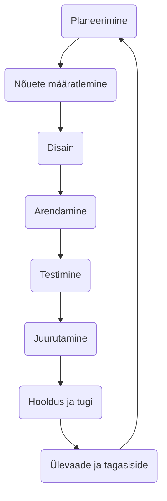

# Tarkvaraarenduse elutsükkel (SDLC)

Selles teemas uurime tarkvaraarenduse elutsükli (SDLC - *Software Development Life Cycle*) kontseptsiooni, õpime tundma selle erinevaid faase ja käsitleme SDLC tähtsust tarkvaraarenduses.

Pildi allikas: Dall-E by OpenAI

- [Tarkvaraarenduse elutsükkel (SDLC)](#tarkvaraarenduse-elutsükkel-sdlc)
  - [Õpiväljundid](#õpiväljundid)
  - [Tüüpilised SDLC faasid](#tüüpilised-sdlc-faasid)
    - [Planeerimine ja nõuete määratlemine](#planeerimine-ja-nõuete-määratlemine)
    - [Nõuete määratlemine](#nõuete-määratlemine)
    - [Disain](#disain)
    - [Arendamine](#arendamine)
    - [Testimine](#testimine)
    - [Juurutamine](#juurutamine)
    - [Hooldus ja tugi](#hooldus-ja-tugi)
    - [Ülevaade ja tagasiside](#ülevaade-ja-tagasiside)
  - [SDLC tähtsus](#sdlc-tähtsus)

## Õpiväljundid

Pärast selle teema läbimist suudate:

- mõista tarkvaraarenduse elutsükli (SDLC) olemust;
- tuvastada SDLC erinevaid faase;
- kirjeldada SDLC tähtsust;
- tuvastada levinud SDLC mudeleid.
- rakendada tarkvaraarenduses SDLC põhimõtteid.

Tarkvaraarenduse elutsükkel (SDLC) on süsteemne protsess tarkvara planeerimiseks, loomiseks, testimiseks, juurutamiseks ja hooldamiseks. See määratleb etapid ja ülesanded, mis on seotud tarkvara tootmisega algusest kuni selle lõpetamiseni.

## Tüüpilised SDLC faasid

Tarkvaraarenduse elutsükkel (SDLC) on struktureeritud protsess, mis määratleb etapid või sammud, mis on seotud tarkvara tootmisega. Kuigi on erinevaid mudeleid või raamistikke SDLC jaoks, jagavad paljud ühiseid faase. Siin on ülevaade tüüpilistest sammudest, mis on kaasatud:

### Planeerimine ja nõuete määratlemine

Nõuete analüüs on SDLC kõige olulisem ja põhiline etapp. Seda viivad läbi meeskonna liikmed kliendi, müügiosakonna, turu-uuringute ja valdkonna ekspertide koostöös. Seda teavet kasutatakse seejärel projekti põhilise lähenemisviisi kavandamiseks ja toote teostatavusuuringu läbiviimiseks majandus-, töö- ja tehnilistes valdkondades.

Planeerimisetapis toimub ka kvaliteedi tagamise nõuete planeerimine ja projektiga seotud riskide väljaselgitamine. Tehnilise teostatavusuuringu tulemuseks on määratleda erinevad tehnilised lähenemisviisid, mida saab järgida projekti edukaks elluviimiseks minimaalsete riskidega

See etapp võib sisaldada järgmiseid samme:

- Projekti ulatuse määramine.
- Potentsiaalsed riskide, piirangute ja ressurside tuvastamine.
- Projekti plaani koostamine (sealhulgas ajakavad, verstapostid ja eelarve hinnangud).
- Kasutajauuringud kasutajate vajaduste ja ootuste mõistmiseks.

### Nõuete määratlemine

Kui nõuete analüüs on tehtud, on järgmine samm tootenõuete selgelt määratlemine ja dokumenteerimine ning kliendi või turuanalüütikute poolt heakskiitmine. Seda tehakse tarkvaranõuete spetsifikatsiooni (Software Requirement Specification - SRS) kaudu, mis sisaldab kõiki projekti elutsükli jooksul kavandatavaid ja arendatavaid tootenõudeid.

Siia etappi võivad kuuluda järgmised tegevused:

- Nõuete ja vajaduste kogumine ja dokumenteerimine.
- Spetsifikatsioonide kogumine sidusrühmadelt (*lõppkasutajad, kliendid jne.*).
- Nõuete teostavuse analüüs.
- Nõuete loetelu prioritiseerimine ja kinnitamine.

### Disain

Tarkvaranõuete spetsifikatsioon on aluseks tootearhitektidele, et tulla välja arendatava toote jaoks parima arhitektuuriga. Tarkvaranõuete spetsifikatsioonis määratletud nõuete alusel pakutakse tavaliselt välja rohkem kui üks tootearhitektuuri disainilahendus ja dokumenteeritakse need projekteerimisdokumendi spetsifikatsioonis (DDS).

Projekteerimisdokumendi spetsifikatsiooni vaatavad üle kõik olulised sidusrühmad ja erinevate parameetrite, nagu riskihinnang, toote vastupidavus, disaini modulaarsus, eelarve ja ajapiirangud, põhjal valitakse toote jaoks välja parim disainilahendus.

Disaini lähenemisviis määratleb selgelt kõik toote arhitektuurimoodulid koos selle side- ja andmevoo esitusega välise ja kolmanda osapoole moodulitega (kui neid on). Kavandatava arhitektuuri kõigi moodulite sisekujundus peaks olema selgelt määratletud Projekteerimisdokumendi spetsifikatsiooni pisimate üksikasjadega.

Samuti luuakse selles etapis kasutajaliidese (UI) ja kasutajakogemuse (UX) disain, mis on oluline kasutajate kaasamiseks ja toote kasutamise lihtsustamiseks.

- Nõuete *tõlkimine* süsteemi spetsifikatsioonideks.
- Süsteemi arhitektuuri ja raamistiku disainimine.
- UX (kasutajakogemus) ja UI (kasutajaliides) disain.
- Sobivate tehnoloogiate, platvormide ja tööriistade valik.

### Arendamine

Selles SDLC etapis algab tegelik arendus ja toote ehitamine. Programmeerimiskood genereeritakse selles etapis vastavalt projekteerimisdokumendi spetsifikatsioonile. Kui disain on läbi viidud üksikasjalikult ja organiseeritult, saab koodi genereerida ilma suurema vaevata.

Arendajad peavad järgima oma organisatsiooni määratletud kodeerimisjuhiseid ja koodi genereerimiseks kasutatakse programmeerimistööriistu, nagu kompilaatorid, silujad jne. Kodeerimiseks kasutatakse erinevaid kõrgetasemelisi programmeerimiskeeli nagu C, C++, Pascal, Java, Javascript ja PHP. Programmeerimiskeel valitakse vastavalt arendatava tarkvara tüübile.

- Koodi kirjutamine.
- Disaini muutmine funktsionaalseks tarkvaraks.
- Erinevate komponentide integratisoon ja koostöö tagamine.

### Testimine

See etapp on tavaliselt kõigi etappide alamhulk, nagu tänapäevaste SDLC mudelite puhul, testimistegevused hõlmavad enamasti kõiki SDLC etappe. See etapp viitab aga toote testimise etapile, kus toote defektidest teatatakse, neid jälgitakse, parandatakse ja testitakse uuesti, kuni toode saavutab SRS-is määratletud kvaliteedistandardid.

- Tarkvara nõuetele vastavuse kontroll.
- Vigade ja ebakõlade parandus ja kontroll.
- Erinevate testimismeetodite rakendamine (ühiktestimine, integratsioonitestimine, manuaaltestimine jne).
- Tarkvara funktsionaalsuse, jõudluse, turvalisuse ja kasutatavuse valideerimine.

### Juurutamine

Kui toode on testitud ja kasutuselevõtuks valmis, lastakse see ametlikult vastavale turule. Mõnikord toimub toote juurutamine selle organisatsiooni äristrateegia kohaselt etapiviisiliselt. Toode võidakse esmalt välja anda piiratud segmendis ja testida reaalses ärikeskkonnas (UAT – kasutaja aktsepteerimise testimine).

Seejärel võidakse toode tagasiside põhjal välja anda sellisel kujul või koos soovitatud täiustustega sihtturusegmendis.

- Tarkvara käivituskeskkonna ettevalmistus.
- Tarkvara tootmiskeskkonda paigaldamine ja rakendamine.
- Vajadusel lõppkasutajte koolitus.
- Tarkvara jõudluse jälgimine ja sujuva töö tagamine.

### Hooldus ja tugi

Pärast tarkvara juurutamist on oluline tagada, et see toimiks tõrgeteta ja vastaks kasutajate vajadustele. See hõlmab tarkvara hooldust ja tuge, et tagada, et tarkvara on ajas töökorras, tõhus ja asjakohane.

- Pärast juurutamist tekkinud probleemide ja vigade lahendamine.
- Uuenduste, paranduste või täiustuste loomine vastavalt kasutajate tagasisidele.
- Tagamine, et tarkvara on ajas töökorras, tõhus ja asjakohane.
- Turvahaavatavuste ja ühilduvusprobleemide lahendamine.

### Ülevaade ja tagasiside

Viimane etapp hõlmab kogu SDLC protsessi ülevaatamist ja tagasiside kogumist, et tuvastada, mida saab järgmises iteratsioonis või tarkvara versioonis paremaks muuta. See etapp on oluline, et tagada, et tarkvaraarendusprotsess on pidevalt täiustatud ja vastab kasutajate vajadustele.

- Tagasiside kogumine sidusrühmadelt ja lõppkasutajatelt.
- Tarkvara jõudluse analüüs ja täiustamiskohtade tuvastamine.
- Järgmise iteratsiooni või tarkvara versiooni planeerimine.

Iga neist faasidest võib olla iteratiivne, eriti agiilsetes või spiraalsetes mudelites, kus tarkvara arendatakse tsüklite või iteratsioonide kaupa. Täpsed sammud ja nende järjekord võivad varieeruda sõltuvalt valitud SDLC mudelist, organisatsioonilistest protsessidest ja projekti olemusest. Siiski on eesmärk sama: **toota kvaliteetset tarkvara, mis vastab kasutajate vajadustele ja ootustele võimalikult tõhusal viisil**.

## SDLC tähtsus

- **Struktureeritud protsess:** SDLC pakub struktureeritud lähenemist tarkvaraarendusele, tagades, et kriitilisi samme ei jäeta vahele.
- **Kvaliteedi tagamine:** Igal SDLC faasil on konkreetsed tulemused ja ülevaatamise protsessid, mis viivad parema tarkvara kvaliteedini.
- **Riskijuhtimine:** Võimalike probleemide või riskide varajane tuvastamine võimaldab neid õigeaegselt leevendada.
- **Projektijuhtimine:** SDLC pakub selget raamistikku projekti edenemise jälgimiseks, ressursside jaotamiseks ja eelarvete järgimiseks.
- **Sidusrühmade suhtlus:** Määratledes selged faasid ja tulemused, hoitakse sidusrühmi kursis edusammude ja oodatavate tulemustega.
- **Tõhusus ja kulutõhusus:** Süstemaatiliselt käsitledes tarkvaraarenduse protsessi, minimeeritakse raiskamist ja suurendatakse tõhusust.
- **Dokumentatsioon:** Nõuetekohane dokumentatsioon on SDLC lahutamatu osa, tagades, et teadmised säilitatakse ja süsteemi üksikasjad on hästi mõistetavad.
