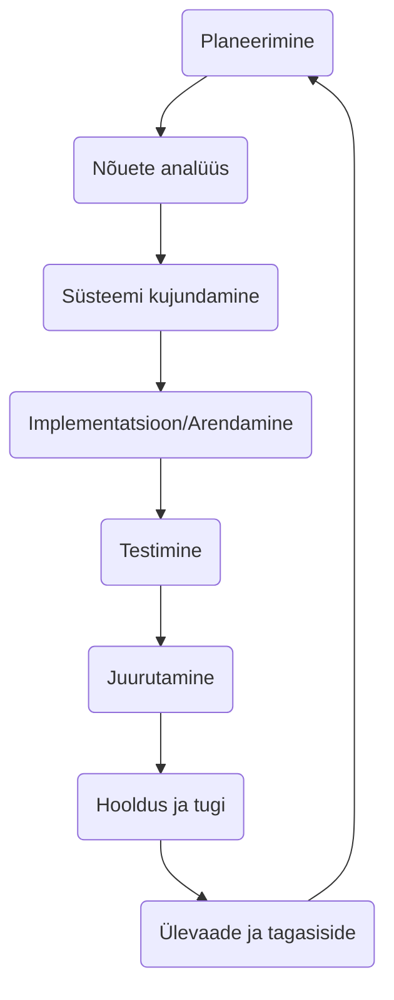

# Tarkvaraarenduse elutsükkel (SDLC):

Selles teemas uurime tarkvaraarenduse elutsükli (SDLC) kontseptsiooni, õpime tundma selle erinevaid faase ja käsitleme SDLC tähtsust tarkvaraarenduses.

- [Tarkvaraarenduse elutsükkel (SDLC):](#tarkvaraarenduse-elutsükkel-sdlc)
  - [Õpitulemused:](#õpitulemused)
  - [Tüüpilised SDLC faasid:](#tüüpilised-sdlc-faasid)
  - [SDLC tähtsus:](#sdlc-tähtsus)
  - [Levinud tarkvaraarenduse elutsükli (SDLC) mudelid:](#levinud-tarkvaraarenduse-elutsükli-sdlc-mudelid)
    - [**Veevalaja mudel:**](#veevalaja-mudel)
    - [**Lean**](#lean)
    - [**Spiraalmudel:**](#spiraalmudel)
    - [**Agiilne mudel:**](#agiilne-mudel)
    - [**Feature-Driven Development (FDD):**](#feature-driven-development-fdd)
    - [**Extreme Programming (XP):**](#extreme-programming-xp)
    - [**Kanban:**](#kanban)
    - [**Scrum:**](#scrum)
  - [Harjutused ja ülesanded](#harjutused-ja-ülesanded)

## Õpitulemused:

Pärast selle teema läbimist suudate:

- mõista tarkvaraarenduse elutsükli (SDLC) olemust;
- tuvastada SDLC erinevaid faase;
- kirjeldada SDLC tähtsust;
- tuvastada levinud SDLC mudeleid.
- rakendada tarkvaraarenduses SDLC põhimõtteid.

Tarkvaraarenduse elutsükkel (SDLC) on süsteemne protsess tarkvara planeerimiseks, loomiseks, testimiseks, juurutamiseks ja hooldamiseks. See määratleb etapid ja ülesanded, mis on seotud tarkvara tootmisega algusest kuni selle lõpetamiseni.

## Tüüpilised SDLC faasid:

Tarkvaraarenduse elutsükkel (SDLC) on struktureeritud protsess, mis määratleb etapid või sammud, mis on seotud tarkvara tootmisega. Kuigi on erinevaid mudeleid või raamistikke SDLC jaoks, jagavad paljud ühiseid faase. Siin on ülevaade tüüpilistest sammudest, mis on kaasatud:

1. **Planeerimine:**
   - Määrata projekti ulatus.
   - Tuvastada potentsiaalsed riskid, piirangud ja ressursid.
   - Koostada projekti plaan, sealhulgas ajakavad, verstapostid ja eelarve hinnangud.
   - Kasutajauuringud kasutajate vajaduste ja ootuste mõistmiseks.
2. **Nõuete analüüs:**
   - Koguda ja dokumenteerida vajadused ja spetsifikatsioonid sidusrühmadelt (*lõppkasutajad, kliendid jne.*).
   - Analüüsida nõuete teostatavust.
   - Prioriseerida ja lõplikult kinnitada nõuete loetelu.
3. **Süsteemi kujundamine:**
   - Tõlkida nõuded süsteemi spetsifikatsioonideks.
   - Kujundada süsteemi arhitektuur ja raamistik.
   - Luua k

õrge taseme ja detailse kujunduse dokumendid.
   - Valida sobivad tehnoloogiad, platvormid ja tööriistad.
4. **Implementatsioon/Arendamine:**
   - Kirjutada tegelik kood tarkvarale.
   - Tõlkida kujunduse dokumendid funktsionaalseks tarkvaraks.
   - Integreerida erinevad komponendid ja tagada nende koostöö.
5. **Testimine:**
   - Kontrollida, kas tarkvara vastab nõuetele.
   - Tuvastada ja parandada vigu, eksimusi ja ebakõlasid.
   - Kasutada erinevaid testimismeetodeid nagu ühiktestimine, integratsioonitestimine, süsteemi testimine, aktsepteerimise testimine jne.
   - Valideerida tarkvara funktsionaalsus, jõudlus, turvalisus ja kasutatavus.
6. **Juurutamine:**
   - Valmistada ette keskkond tarkvara käivitamiseks.
   - Paigaldada ja seadistada tarkvara tootmiskeskkonnas.
   - Vajadusel pakkuda vajalikku koolitust lõppkasutajatele.
   - Jälgida tarkvara jõudlust ja tagada sujuv töö.
7. **Hooldus ja tugi:**
   - Lahendada kõik probleemid või vead, mis tekivad pärast juurutamist.
   - Pakkuda uuendusi, parandusi või täiustusi vastavalt kasutajate tagasisidele.
   - Tagada, et tarkvara jääb töökorras, tõhusaks ja asjakohaseks ajas.
   - Lahendada kõik turvahaavatavused või ühilduvusprobleemid, mis võivad tekkida.
8. **Ülevaade ja tagasiside:**
   - Koguda tagasisidet sidusrühmadelt ja lõppkasutajatelt.
   - Analüüsida tarkvara jõudlust ja tuvastada täiustamise alasid.
   - Plaanida järgmist iteratsiooni või tarkvara versiooni.

Iga neist faasidest võib olla iteratiivne, eriti agiilsetes või spiraalsetes mudelites, kus tarkvara arendatakse tsüklite või iteratsioonide kaupa. Täpsed sammud ja nende järjekord võivad varieeruda sõltuvalt valitud SDLC mudelist, organisatsioonilistest protsessidest ja projekti olemusest. Siiski on eesmärk järjepidev: toota kvaliteetset tarkvara, mis vastab kasutajate vajadustele ja ootustele korraldatud ja tõhusal viisil.

## SDLC tähtsus:

- **Struktureeritud protsess:** SDLC pakub struktureeritud lähenemist tarkvaraarendusele, tagades, et kriitilisi samme ei jäeta vahele.
- **Kvaliteedi tagamine:** Igal SDLC faasil on konkreetsed tulemused ja ülevaatamise protsessid, mis viivad parema tarkvara kvaliteedini.
- **Riskijuhtimine:** Võimalike probleemide või riskide varajane tuvastamine võimaldab neid õigeaegselt leevendada.
- **Projektijuhtimine:** SDLC pakub selget raamistikku projekti edenemise jälgimiseks, ressursside jaotamiseks ja eelarvete järgimiseks.
- **Sidusrühmade suhtlus:** Määratledes selged faasid ja tulemused, hoitakse sidusrühmi kursis edusammude ja oodatavate tulemustega.
- **Tõhusus ja kulutõhusus:** Süstemaatiliselt käsitledes tarkvaraarenduse protsessi, minimeer

itakse raiskamist ja suurendatakse tõhusust.
- **Dokumentatsioon:** Nõuetekohane dokumentatsioon on SDLC lahutamatu osa, tagades, et teadmised säilitatakse ja süsteemi üksikasjad on hästi mõistetavad.

## Levinud tarkvaraarenduse elutsükli (SDLC) mudelid:

### **Veevalaja mudel:**

- **Kirjeldus:** Lineaarne ja järjestikune lähenemine, kus iga faas tuleb lõpetada enne järgmise algust. See on varaseim SDLC lähenemine.
- **Eelised:** Selge struktuur, lihtne mõistmine, hästi määratletud etapid.
- **Puudused:** Pärast faasi lõpetamist on muudatuste tegemine keeruline, ei sobi keerukate projektide jaoks.

### **Lean**

- **Kirjeldus:** Sai alguse tootmisest, keskendub ressursside optimeerimisele ja kliendi väärtuse pakkumisele. Eesmärk on kõrvaldada igasugune "raisakus" protsessist.
- **Eelised:** Tõhus ressursside kasutamine, keskendub väärtuse pakkumisele.
- **Puudused:** Võib jätta tähelepanuta vajalikud ülesanded kui "raisakuse", nõuab korrektseks rakendamiseks sügavat mõistmist.

### **Spiraalmudel:**

- **Kirjeldus:** Ühendab Veevalaja mudeli disainifaasi prototüüpimise iteratiivse filosoofiaga. Keskpunktis on riskide hindamine igal spiraalil.
- **Eelised:** Keskpunktis on riskijuhtimine, paindlikkus disainis ja nõuetes.
- **Puudused:** Võib olla kallis, nõuab riskihindamise asjatundlikkust.

### **Agiilne mudel:**

- **Kirjeldus:** Iteratiivne lähenemine tarkvara tarnimisele, mis ehitab tarkvara järk-järgult, keskendudes kliendi tagasisidele ja kiiretele iteratsioonidele.
- **Eelised:** Paindlik, edendab iteratiivset tagasisidet, julgustab kliendi kaasamist.
- **Puudused:** Vähem ennustatav, võib olla raske mõista neile, kes on harjunud traditsiooniliste meetoditega.

### **Feature-Driven Development (FDD):**

- **Kirjeldus:** Iteratiivne ja inkrementaalne tarkvaraarendusprotsess, mis on juhitud funktsioonide loetelust.
- **Eelised:** Keskendub konkreetsete, kliendi hinnatud funktsioonide loomisele ja tarnimisele.
- **Puudused:** Ei ole nii paindlik kui teised agiilsed metodoloogiad, nõuab üksikasjalikku dokumentatsiooni.

### **Extreme Programming (XP):**

- **Kirjeldus:** Agiilne raamistik, mis rõhutab kliendi rahulolu, pakkudes sagedasi "väljalaskeid" lühikeste arendustsüklite jooksul, eesmärgiga parandada tootlikkust ja tutvustada kontrollpunkte.
- **Eelised:** Rõhutab koodi kvaliteeti, julgustab kliendi kaasamist.
- **Puudused:** Nõuab ulatuslikku kliendi kaasamist, võib olla intensiivne arendajatele.

### **Kanban:**

- **Kirjeldus:** Visuaalne protsessijuhtimise lähenemine, mis võtab vihjeid lean tootmisest ja rõhutab just-õigeaegset tarnimist.
- **Eelised:** Paindlikkus, pidev tarnimine, visuaalne olemus aitab tuvastada pudelikaelu.
- **Puudused:** Vähem struktureeritud, võib viia ulatuse kreeni, kui seda korralikult ei hallata.

### **Scrum:**

- **Kirjeldus:** Agiilse metod

oloogia tüüp, mis korraldab töö tsüklitena, mida nimetatakse "Sprintideks", mis kestavad tavaliselt 2-4 nädalat.
- **Eelised:** Regulaarsed toodete tarned, suur nähtavus, kohandatavus.
- **Puudused:** Nõuab kogenud meeskonnaliikmeid, ulatus võib mõnikord olla liiga paindlik.

Kokkuvõttes sõltub SDLC raamistiku valik projekti olemusest, organisatsioonilistest eelistustest, meeskonna suurusest, projekti ulatusest ja muudest teguritest. Lõppeesmärk on toota kvaliteetset tarkvara, mis vastab kasutaja ootustele, säilitades samal ajal ajalise ja eelarvelise raamistiku.

## Harjutused ja ülesanded