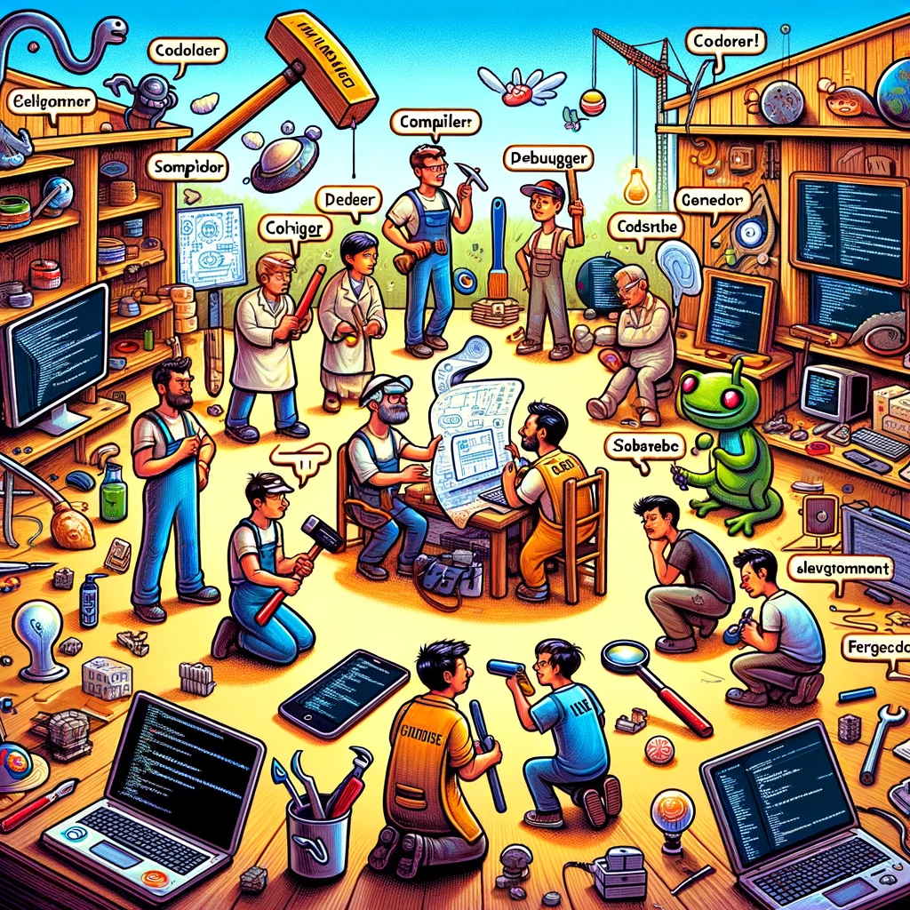

# Tööriistad

Selles peatükis räägime tarkvaraarenduses kasutatavatest tööriistadest.

- [Tööriistad](#tööriistad)
  - [Õpiväljundid](#õpiväljundid)

## Õpiväljundid

Pärast selle teema läbimist suudate:

- nimetada erinevat tüüpi tööriistu, mida kasutatakse tarkvaraarenduses.

Enamasti vajame töö tegemisel erinevaid tööriistu, olgu selleks siis kruvikeeraja, käsipuur, arvuti või midagi muud. Tarkvaraarenduses on tööriistad kriitilise tähtsusega, kuna need võivad märkimisväärselt mõjutada tootlikkust, koodi kvaliteeti, koostööd ja projekti edukust.

Tarkvaraarenduse kontekstis hõlmavad tööriistad laia valikut **tarkvararakendusi**, **teeke**, **raamistikke** ja **utiliite**, mida arendajad kasutavad erinevates tarkvaraarenduse elutsükli (*SDLC*) etappides. Need tööriistad on kavandatud protsesside lihtsustamiseks, tootlikkuse suurendamiseks, koodi kvaliteedi tagamiseks ja koostöö hõlbustamiseks.

Siin on ülevaade erinevatest tööriistade tüüpidest, mida tarkvaraarenduses tavaliselt kasutatakse:

- **Koodiredaktorid:**
  - **Eesmärk:** Kerged tööriistad koodi kirjutamiseks ja redigeerimiseks, mida kasutatakse sageli skriptimiseks või veebiarenduseks. Tõenäoliselt kõige esimene tööriist, mida arendajad kasutavad.
  - **Näited:**
    - Visual Studio Code
    - Sublime Text
    - Atom

> Lihtsa koodieditori kõrval on ka keerukamaid integreeritud arenduskeskkondi (IDE), mis pakuvad täiendavaid funktsioone, nagu koodi haldamine, silumine, testimine, kompileerimine jne. Näited: **IntelliJ IDEA** (Java), **PyCharm** (Python), **Eclipse** (Java).

- **Versioonihaldussüsteemid:**
  - **Eesmärk:** Jälgida ja hallata koodi muudatusi aja jooksul. Kood on tarkvaraarenduses kriitilise tähtsusega vara, mida tuleb hoolikalt hoida, hallata ja kaitsta. Versioonihaldussüsteemid võimaldavad arendajatel teha mugavalt koostööd, jälgida muudatusi ja vajadusel taastada varasemaid versioone rakendusest.
  - **Näited:**
    - [Git](https://git-scm.com/)
    - [Mercurial](https://www.mercurial-scm.org/)'
    - [Subversion (SVN)](https://subversion.apache.org/)
    - [CVS](https://www.gnu.org/software/trans-coord/manual/cvs/cvs.html)

- **Pideva integratsiooni/pideva väljastamise (CI/CD) tööriistad:**
  - **Eesmärk:** Automatiseerida rakenduste kompileerimise, testimise ja väljastamise protsessi. Tänapäeval üha enam liigutakse sinnapoole, et arendusprotsessid toimuvad väikeste ja kiirete sammude kaupa. Kui me peaksime iga kord, kui mingi uuendus tehakse, käsitsi kõik need sammud läbi tegema, siis see võtaks väga palju aega ja sellise protsessi käigus oleksid vead väga kerged tulema. CI/CD tööriistad aitavad seda protsessi automatiseerida, kiirendada ja vähendada vigade tõenäosust.
  - **Näited:**
    - Jenkins
    - Travis CI
    - CircleCI
    - GitLab CI/CD

- **Sõltuvuste haldamise tööriistad:**
  - **Eesmärk:** Hallata tarkvarasõltuvusi ja teeke. Maailmas on kirjutatatud ja kirjutatakse pidevalt uusi rakendusi ja suur osa rakendustest vähemalt mingil tasemel tegeleb sarnaste probleemide lahendamisega, nagu näiteks andmebaasiga suhtlemine, kasutajaliidese loomine, turvalisuse tagamine jne. Iga kord kõike neid probleeme uuesti lahendada oleks üsna mõttetu ja aeganõudev. Selleks kirjutatakse eraldi teeke, mida saab kasutada erinevates rakendustes ja nende kasutamisel nimetatakse neid sõltuvusteks (sest rakendus sõltub mingi probleemi lahendamisel teisest *alamrakendusest*). Selliste sõltuvuste mugavaks haldamiseks ongi olemas erinevad tööriistad.
  - **Näited:**
    - npm (Node.js)
    - pip (Python)
    - Maven (Java)
    - NuGet (.NET)

- **Testimistööriistad:**
- **Eesmärk:** Automaatselt testida tarkvara kvaliteeti, jõudlust ja turvalisust. Mida suuremaks rakendused arendamise käigus muutuvad, seda suuremaks muutub oht, et me ei märka kõiki vigu, mida meie rakendus sisaldab. Alati on võimalik peale rakenduses tehtud muudatusi rakenduse funktsionaalsus käsitsi üle kontrollida veendumaks, et kõik töötab nii nagu peab, kuid see on aeganõudev ja kallis protsess. Selleks on olemas erinevad tööriistad, mis aitavad seda protsessi automatiseerida.
- **Näited:**
  - **Ühiktestimine:**
    - JUnit (Java)
    - NUnit (.NET)
    - Pytest (Python)
  - **Funktsionaalne/lõpp-punktist lõpp-punkti testimine:**
    - Selenium
    - Cypress
    - Protractor
  - **Jõudlustestimine:**
    - JMeter
    - LoadRunner

- **Koodi kvaliteedi ja ülevaatamise tööriistad:**
  - **Eesmärk:** Analüüsida koodi kvaliteeti, stiili ja potentsiaalseid probleeme. Enamus tarkvaraarendusest toimuvaist tegevustest on suunatud sellele, et tagada, et rakendus töötab nii nagu peab. Kuid see ei ole ainus asi, mida arendajad peavad silmas pidama. Oluline on silmas pidada ka seda, et tarkvaraarendus on meeskonnatöö ja kui kood on kirjutatud nii, et seda on teistel arendajatel raske mõista, siis see võib põhjustada probleeme. Samuti on oluline, et kood oleks kirjutatud nii, et see oleks turvaline ja et see ei sisaldaks vigu. Kõik need aspektid on olulised ja selleks on olemas erinevad tööriistad, mis aitavad neid aspekte kontrollida.
  - **Näited:**
    - SonarQube
    - ESLint
    - Pylint
    - CodeClimate

- **Veateadete/Probleemide jälgimise süsteemid:**
  - **Eesmärk:** Jälgida, hallata ja prioriseerida tarkvaravigu ja ülesandeid. Tahes tahtmata teevad arendajad vigu. Alati ei pruugi viga olla isegi arendaja kirjutatud koodis, vaid halvasti kirjeldatud nõuetest, millest arendaja lähtus. Selleks, et selliste vigade üle kontrolli säilitada on olemas erinevad tööriistad, mis aitavad neid vigu jälgida ja hallata.
  - **Näited:**
    - JIRA
    - Bugzilla
    - GitHub Issues
    - Trello
  > Lisaks on võimalik neid tööriistu kasutada ka ülesannete ja projektide haldamiseks ja jälgimiseks.

- **Dokumentatsiooni tööriistad:**
  - **Eesmärk:** Luua ja hallata tarkvaradokumentatsiooni. Tarkvaraarenduses on dokumentatsioon olulise tähtsusega, kuna see aitab uutel arendajatel kiiremini aru saada olemasolevast koodist ja sellest, kuidas rakendus töötab. Samuti aitab dokumentatsioon kasutajatel rakendust paremini mõista ja kasutada. Lisaks erinevatele teksti kujul loodavale dokumentatsioonile (kasutusjuhendid jms) on olemas ka erinevad tööriistad, mis aitavad dokumentatsiooni luua ja hallata spetsiifiliselt tarkvara koodi kohta.
  - **Näited:**
    - Doxygen
    - Sphinx
    - JSDoc

- **Andmebaasihalduse tööriistad:**
  - **Eesmärk:** Kujundada, hallata ja suhelda andmebaasidega. Sageli vajab rakendus mingit tüüpi andmebaasi, kuhu salvestada andmeid. Andmebaaside disainimine, loomine ja haldamine on üsna keeruline protsess, mida on võimalik teha käsitsi, kuid selleks on olemas ka erinevad tööriistad, mis seda protsessi lihtsustavad.
  - **Näited:**
    - MySQL Workbench
    - pgAdmin
    - Microsoft SQL Server Management Studio

- **Konteineriseerimise ja virtualiseerimise tööriistad:**
  - **Eesmärk:** Luua, väljastada ja hallata konteinereid või virtualiseeritud keskkondi. Konteinerid ja virtualiseeritud keskkonnad on viimastel aastatel muutunud väga populaarseks, kuna need võimaldavad arendajatel luua keskkondi, mis on sarnased keskkonnaga, kus rakendus hiljem tööle hakkab ja mida on lihtne luua ja kustutada. Selleks on olemas erinevad tööriistad, mis aitavad seda protsessi lihtsustada ja vältida olukorda, kus rakendus arendaja arvutis/serveris töötab, kuid kliendi arvutis/serveris mitte.
  - **Näited:**
    - Docker
    - Kubernetes
    - VMware
    - VirtualBox

- **Pilveplatvormid:**
  - **Eesmärk:** Arendada, väljastada ja skaleerida rakendusi pilvekeskkondades. Aina vähem ja vähem hoitakse rakendusi kliendi enda serverites ja aina enam majutatakse neid erinevates pilvekeskkondades, mis on paindlikud ja sageli kokkuvõttes ka odavamad.
  - **Näited:**
    - AWS
    - Google Cloud Platform
    - Microsoft Azure
    - Heroku

- **Koostöö ja kommunikatsiooni tööriistad:**
  - **Eesmärk:** Hõlbustada meeskonna suhtlust ja koostööd. Tarvaraarendus on enamasti meeskonnatöö ja selleks on oluline, et meeskonnaliikmed saaksid omavahel suhelda ja koostööd teha. Sageli võib kasutada selleks ka lihtsaid suhtlusvahendeid, nagu näiteks e-mail või mõni tavaline suhtlusrakendus, kuid on olemas ka spetsiaalsed tööriistad, mis on mõeldud just selleks, et hõlbustada tarkvaraarenduses meeskonnatööd. Näiteks võib olla vajalik sõnumirakenduses jagada koodinäidiseid, mida teised meeskonnaliikmed saaksid kiiresti üle vaadata ja tavalised suhtlusvahendid ei pruugi seda väga hästi võimaldada.
  - **Näited:**
    - [Slack](https://slack.com/)
    - [Microsoft Teams](https://www.microsoft.com/en-us/microsoft-teams/group-chat-software)
    - [Confluence](https://www.atlassian.com/software/confluence)

- **Arendusraamistikud ja teegid:**
  - **Eesmärk:** Pakkuda struktureeritud alust rakenduste tõhusamaks loomiseks. Lisaks eelpool mainitud sõltuvustele on olemas ka erinevad raamistikud ja teegid, mis aitavad arendajatel kiiremini rakendusi luua. Näiteks võib olla olemas raamistik, mis aitab kiiresti luua veebirakendusi või teegid, mis aitavad andmebaasiga suhtlemist lihtsustada. 
  - **Näited:**
    - Angular
    - React
    - Vue.js
    - Spring Boot (Java)
    - ... ja palju teisi

- **API arendamise ja testimise tööriistad:**
  - **Eesmärk:** Kujundada, simuleerida, testida ja dokumenteerida API-sid. Rakendusliidesed (*API-d*) on tänapäeva tarkvaraarenduses väga olulised, kuna need pakuvad head võimalust vahetada andmeid erinevate rakenduste vahel. Vahel saame mõnda lihtsamat API-t testida ka lihtsalt brauseri aadressiribale midagi kirjutades, kuid kui API on keerukam, siis on olemas ka spetsiaalsed tööriistad, mis aitavad muu hulgas lihtsustada API-de loomist, testimist ja dokumenteerimist.
  - **Näited:**
    - Postman
    - Swagger/OpenAPI
    - Insomnia

- **Ülesannete ja projektide jälgimine:**
- **Eesmärk:**  Planeerida, jälgida ja hallata tarkvaraprojekte algusest lõpuni. Nagu juba eelnevalt mitu korda mainitud, siis tarkvaraarendus on meeskonnatöö ja selleks, et meeskonnatöö sujuks, on vaja, et kõik meeskonnaliikmed teaksid, mida nad tegema peavad ja millal. Erinevad projekti- ja ülesannete haldamise/jälgimise tööriistad aitavad seda protsessi lihtsustada ja projekti edukust tagada.
  - **Näited:**
    - JIRA (Atlassian)
    - Trello
    - GitHub Projects

> Oluline on märkida, et siin nimekirjas on toodud vaid mõned näited. Tarkvaraarenduses on palju erinevaid tööriistu, mida saab kasutada vastavalt konkreetse projekti vajadustele ja meeskonna eelistustele.
