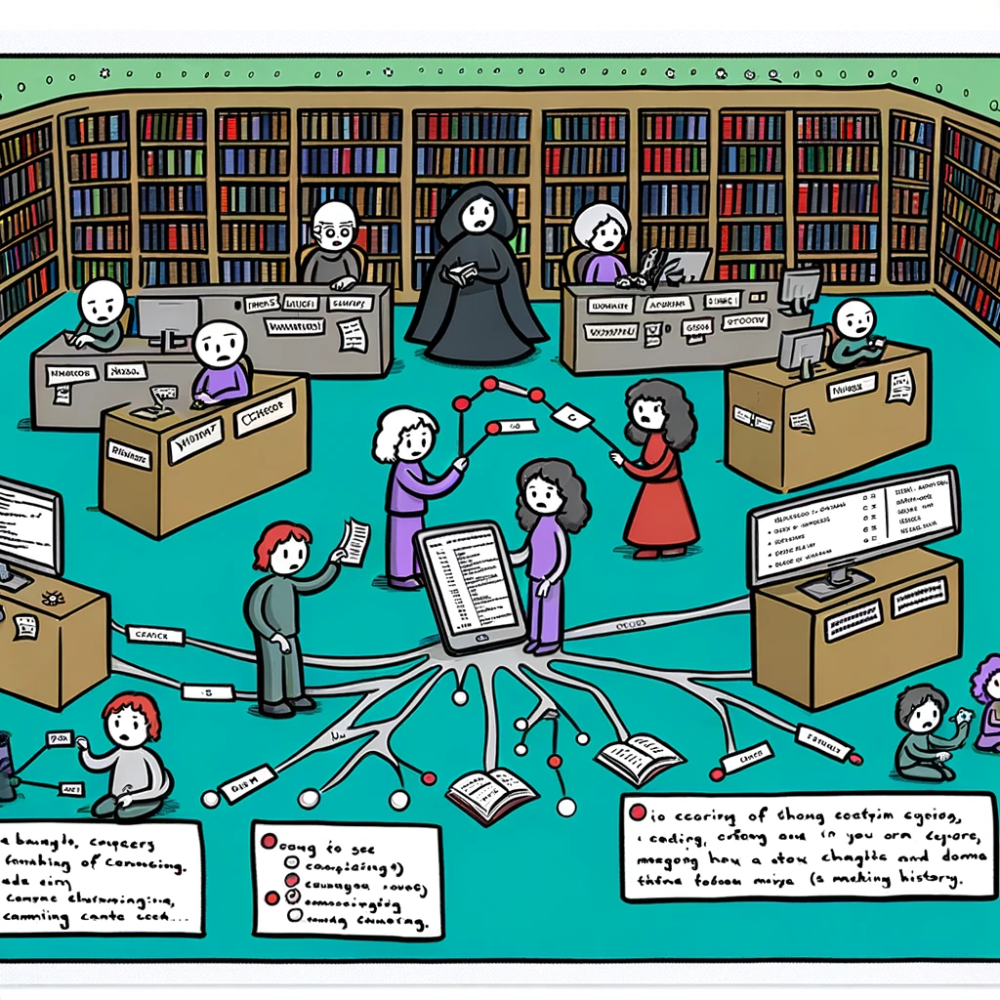
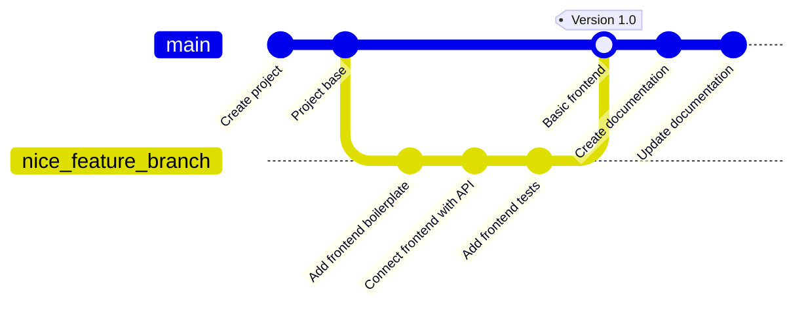

# Versioonihaldus

Selles teemas vaatame versioonihalduse põhimõisteid, ajalugu ja keskseid mõisteid.

Pildi allikas: Dall-E by OpenAI

- [Versioonihaldus](#versioonihaldus)
  - [Õpiväljundid](#õpiväljundid)
  - [Mis on versioonihaldus?](#mis-on-versioonihaldus)
  - [Miks on versioonihaldus oluline?](#miks-on-versioonihaldus-oluline)
  - [Versioonihalduse lühiajalugu](#versioonihalduse-lühiajalugu)
  - [Kesksed vs hajutatud versioonihaldussüsteemid](#kesksed-vs-hajutatud-versioonihaldussüsteemid)
    - [Kesksed versioonihaldussüsteemid (`CVCS`)](#kesksed-versioonihaldussüsteemid-cvcs)
    - [Hajutatud versioonihaldussüsteemid (`DVCS`)](#hajutatud-versioonihaldussüsteemid-dvcs)
    - [Võrdlus](#võrdlus)
  - [Harjutused](#harjutused)

## Õpiväljundid

Pärast selle teema läbimist oskad:

- kirjeldada, mis on versioonihaldus ja miks see on oluline;
- kirjeldada erinevaid versioonihaldussüsteemide tüüpe;
- võrrelda keskset ja hajutatud versioonihaldussüsteeme;

## Mis on versioonihaldus?

Kui kirjutada üksinda ühte dokumenti ja teha sellesse muudatusi, siis ehk ei ole väga oluline jälgida, millal ja mis selles dokumendis muutus. Kuid kui töötad koos teiste inimestega, kes teevad samas dokumendis muudatusi, siis võib see muutuda ühel hetkel oluliseks. Eriti, kui see dokument liigub edasi-tagasi ja seda võidakse muuta paljude erinevate inimeste poolt. Kuidas me sellisel juhul teame, **milline on viimane versioon?** Kuidas me teame, **kes tegi viimase muudatuse?** Kuidas me teame, **mida muudeti?** Rakendused koosnevad sageli väga paljudest failidest ja koodi muudatused võivad olla väga keerulised ja ülevaade muudatustest ja ajaloost nendes failides on väga oluline, et tagada tarkvara kvaliteet ja stabiilsus.

Kui otsida internetis versioonihalduse kohta, siis sageli leiab selle kohta sarnase pildi, mille abil visualiseeritakse koodi ajalugu ja muudatusi:

**Versioonihaldus**, tuntud ka kui **Lähtekoodi haldus** (_SCM_ - Source Code Management) või **Versioonikontroll** (_VCS_ - Version Control System), on süsteem, mis jälgib ja haldab muudatusi failides, kataloogides ja koodibaasides aja jooksul. See võimaldab mitmel inimesel töötada ühe projekti kallal ilma üksteise kirjutatud koodiga konflikti tekitamata ning säilitab iga muudatuse ajaloo.

Tänapäeval on versioonihaldus tarkvaraarendusprotsessi lahutamatu osa. Arendajad kasutavad seda koostööks, muudatuste jälgimiseks ja oma töö ajaloo säilitamiseks. Ettevõtted kasutavad seda oma koodibaaside haldamiseks ja tagamaks, et muudatusi tehakse kontrollitud ja turvalisel viisil.

## Miks on versioonihaldus oluline?

Versioonihaldus on oluline mitmel põhjusel:

- **Ajalugu**: Versioonihaldus pakub detailset ajalugu koodis tehtud muudatustest. See aitab mõista, kuidas kood aja jooksul on arenenud, tuvastada, millal konkreetne muudatus tehti, ja kes selle tegi.
- **Koostöö**: Mitu arendajat saavad töötada samaaegselt sama projekti kallal üksteist segamata. Erinevad arendajad saavad töötada eraldi funktsioonide või veaparanduste kallal ning seejärel ühendada oma muudatused tagasi peamisse koodibaasi ilma konfliktideta (üksteise muudatusi üle kirjutamata).
- **Tagasipööramine**: Vead juhtuvad. Versioonihaldusega, kui uus muudatus tekitab vea või probleemi, saavad arendajad lihtsalt naasta eelmise koodi seisundi juurde, tõhusalt probleemse muudatuse "tagasi pöörates".
- **Harud ja ühendamine**: Arendajad saavad peamisest koodibaasist luua harusid uute funktsioonide, veaparanduste või eksperimentide jaoks ilma peamist või stabiilset tarkvara versiooni mõjutamata. Kui valmis, saab neid muudatusi tagasi ühendada peaharusse.
- **Varundamine**: Kuigi see ei asenda korralikku varundussüsteemi, võivad versioonihaldussüsteemid toimida täiendava varunduskihina. Kui arendaja kohalikus arvutis juhtub midagi, saab koodi hõlpsalt taastada versioonihalduse hoidlast.
- **Dokumentatsioon**: Koodi lisamisega kaasnevad sõnumid versioonihalduses pakuvad kronoloogilist dokumentatsiooni jada. Need võivad anda konteksti, miks teatud otsused tehti konkreetsel ajahetkel.
- **Koodi ülevaatus**: Versioonihaldussüsteemid, eriti kui neid kasutatakse koos platvormidega nagu _GitHub_ või _GitLab_, hõlbustavad koodi ülevaatust, võimaldades teistel arendajatel üle vaadata, kommenteerida ja soovitada koodi muudatusi enne selle ühendamist peaharusse.
- **Väljalasete haldus**: Versioonihaldus aitab hallata väljalaskeid ja parandusi. Arendajad saavad märgistada teatud punkte oma koodi ajaloos kui konkreetseid tooteversioone. See teeb uuenduste ja paranduste jälgimise lihtsamaks.
- **Vastutus**: Tänu korralikule logile, kes tegi millised muudatused ja millal, on olemas selged vastutuse kirjed. See on eriti kasulik meeskonnas töötades, et mõista ja tagada, et koodimuudatusi saab jälgida ja need on seotud konkreetsete isikutega.
- **Paralleelne arendus**: Versioonihaldussüsteemid võimaldavad paralleelse arenduse võimalust, kus tarkvararakenduse mitut versiooni saab arendada samaaegselt.

Kokkuvõttes on versioonihaldus kaasaegse tarkvaraarenduse praktikate alustala. See tagab sujuvama koostöö, pakub vigade jaoks turvavõrke ning säilitab selge ja auditeeritava kirje sellest, kuidas tarkvaraprojekt aja jooksul areneb. Olenemata sellest, kas olete üksikarendaja või osa suurest meeskonnast, on versioonihalduse kasutamine tänapäeval hädavajalik.

## Versioonihalduse lühiajalugu

Versioonihaldus on aastate jooksul arenenud lihtsatest manuaalsetest meetoditest keerukateks hajutatud süsteemideks. Siin on lühike ülevaade selle ajaloost:

1. **Manuaalne versioonihaldus (enne 1970ndaid)**:

   - Enne korralike versioonihaldussüsteemide (`VCS`) olemasolu tegid arendajad oma koodist koopiaid ja hoidsid neid eraldi kataloogides, tihti märgistades neid kuupäevade või versiooninumbritega.
   - Nagu võib ette kujutada, oli see meetod vigadele vastuvõtlik, ei olnud skaleeritav ja tegi koostöö keeruliseks.

1. **Kesksed versioonihaldussüsteemid (`CVCS`, 1970ndad-1990ndad)**:

   - `CVCS`-i peamine idee on üks keskne hoidla, kus kõiki muudatusi jälgitakse.
   - **RCS (Revision Control System)**: Tutvustati 1970ndate lõpus, `RCS` oli üks esimesi tööriistu, mis haldas ja jälgis individuaalsete failide revisjone. See kasutas lihtsat mehhanismi, kus salvestati viimane versioon ja versioonidevahelised erinevused.
   - **SCCS (Source Code Control System)**: Teine varajane süsteem, mis oli ajaliselt paralleelne `RCS`-iga, kuid omas mõningaid erinevaid funktsioone.
   - **CVS (Concurrent Versions System)**: 1980ndatel esile kerkinud `CVS` oli `RCS`-i täiustus ja võimaldas mitmel arendajal samaaegselt projekti kallal töötada.
   - **Perforce**: Omanditarkvara, mis sai paljude suurte organisatsioonide seas populaarseks 1990ndatel.
   - **Subversion (SVN)**: Tutvustati 2000. aastal kui täiustust `CVS`-ile, pakkudes paremat harude haldust, atomaarseid `commit`-e ja järjepidevamat andmemudelit.

1. **Hajutatud versioonihaldussüsteemid (`DVCS`, 2000ndad-tänapäev)**

   - `DVCS`-is on igal arendajal oma kohalik hoidla, mis sisaldab kogu koodibaasi ja selle täielikku ajalugu.
   - **BitKeeper**: 2000ndate alguses oli BitKeeper üks esimesi `DVCS`-e. See oli omanditarkvara, kuid seda kasutasid mõnda aega Linuxi tuuma arendajad.
   - **Git**: Loodud Linus Torvaldsi poolt 2005. aastal, arendati Git välja vajadusest tasuta, avatud lähtekoodiga `DVCS`-i järele pärast seda, kui Linuxi arenduskogukonna ja BitKeeperi suhted katkesid. Git rõhutab kiirust, andmete terviklust ja toetust hajutatud, mitte-lineaarsetele töövoogudele.
   - **Mercurial**: Samuti 2005. aastal esile kerkinud Mercurial oli teine vastus vajadusele avatud lähtekoodiga `DVCS`-i järele. Seda kiidetakse sageli selle lihtsuse ja kasutusmugavuse eest.
   - **Bazaar**: Arendatud Canonicali poolt, sellel oli paindlik arhitektuur, mis võimaldas nii keskset kui ka hajutatud versioonihaldust.
   - **Fossil**: Mitte ainult `DVCS`, vaid integreeris ka veajälgimise ja wiki, pakkudes ühtset kooskõlastatud paketti.

1. **Kaasaegne ajastu (2010ndad-tänapäev)**:

   - Platvormid nagu **GitHub, GitLab ja Bitbucket** on täiustanud versioonihalduse koostööaspekte, tutvustades funktsioone nagu Pull Requestid, koodi ülevaatused, pidev integratsioon ja sotsiaalne kodeerimine.
   - Nende platvormide tõusu tõttu on Git saanud domineerivaks versioonihaldussüsteemiks, arvestades selle integratsiooni ja keskset rolli neis platvormides.

Kuigi see on lühike ülevaade, on versioonihalduse ajalugu tunnistus pidevatest jõupingutustest tarkvarakogukonna poolt koostööarenduse optimeerimiseks, andmete tervikluse tagamiseks ja töövoogude lihtsustamiseks.

## Kesksed vs hajutatud versioonihaldussüsteemid

Järgnevalt võrdleme kesksete (_CVCS_) ja hajutatud versioonihaldussüsteemide (_DVCS_) omadusi:

### Kesksed versioonihaldussüsteemid (`CVCS`)

**Ülevaade**:

1. **Üks hoidla**: `CVCS`-is on üks keskne hoidla serveris. Arendajad saavad viimase versiooni sellest kesksest hoidlast ja laevad muudatused tagasi sinna.
2. **Töökoopia**: Arendajad saavad ainult viimase hetktõmmise (või töökoopia) koodibaasist, mitte kogu versiooniajalugu.
3. **Keskne autoriteet**: Kõik toimingud nagu harude loomine ja ühendamine tehakse keskselt hoidlas.
4. **Näited**: Subversion (`SVN`), Concurrent Versions System (`CVS`), Perforce.

**Eelised**:

1. **Administratiivne kontroll**: Lihtsam jõustada juurdepääsukontrolle ja õigusi.
2. **Lineaarne ajalugu**: Lineaarse muudatuste ajaloo säilitamine on lihtne.
3. **Lihtsam seadistamine**: Üldiselt lihtsam seadistada ja konfigureerida kui `DVCS`.
4. **Keskne varundamine**: Keskserverit saab varundada andmekao vältimiseks.

**Puudused**:

1. **Üksik ebaõnnestumispunkt**: Kui keskserver kukub kokku ja varukoopiaid pole, võib koodiajalugu kaduda.
2. **Võrgusõltuvus**: Enamik toiminguid, nagu muudatuste pühendamine, nõuab ühendust keskse hoidlaga, mis võib töövooge aeglustada.
3. **Ühendamiskonfliktid**: Kuna kõik laadivad muudatusi otse kesksesse hoidlasse, võib eriti suurtes meeskondades olla suurem tõenäosus ühendamiskonfliktideks.

### Hajutatud versioonihaldussüsteemid (`DVCS`)

**Ülevaade**:

1. **Mitmed hoidlad**: Igal arendajal on oma kohalik hoidla, mis sisaldab kogu koodibaasi ja selle täielikku ajalugu.
2. **Täielik versiooniajalugu**: Arendajad kloonivad kogu hoidla, mitte ainult viimast hetktõmmist.
3. **Võrdõiguslik**: Ühendamist ja harude loomist saab teha kohalikult. `commit`-id tehakse kohalikku hoidlasse ja seejärel sünkroniseeritakse (lükatakse muudatused) keskse või kaugse hoidlaga.
4. **Näited**: Git, Mercurial, Bazaar, Fossil.

**Eelised**:

1. **Kiired toimingud**: Kuna enamik toiminguid (`commit`, harude loomine, ühendamine) on kohalikud, on need kiiremad ja ei sõltu võrguühendusest.
2. **Varundamise redundants**: Iga hoidla kloon toimib täieliku varukoopiana, vähendades andmekao riski.
3. **Paindlikud töövood**: Arendajad saavad pühendada muudatusi kohalikult, võimaldades paindlikumaid töövooge ja sagedasi pühendumisi ilma peamist koodibaasi häirimata.
4. **Harude haldamine**: Harude loomine ja ühendamine on tavaliselt `DVCS`-is arenenumad ja lihtsamini hallatavad.
5. **Koostöö soodustamine**: Funktsioonid nagu forkid ja pull requestid (eriti platvormidel nagu GitHub ja GitLab) soodustavad koostööd kodeerimisel.

**Puudused**:

1. **Keerukus**: `DVCS`-i paindlikkus ja võimsus võivad samuti sisaldada suuremat keerukust, eriti neile, kes ei ole selle kontseptsiooniga tutttavad.
2. **Suured hoidlad**: Kogu versiooniajaloo säilitamine võib olla problemaatiline, kui hoidla on väga suur.

### Võrdlus

| Omadus/Aspekt                 | Keskne versioonihaldus (`CVCS`)           | Hajutatud versioonihaldus (`DVCS`)                      |
| ----------------------------- | ----------------------------------------- | ------------------------------------------------------- |
| **Hoidla struktuur**          | Üks keskne hoidla                         | Igal arendajal on täielik kohalik hoidla                |
| **Võrgusõltuvus**             | Nõutav enamike toimingute jaoks           | Enamik toiminguid saab teha võrguühenduseta             |
| **Andmete redundants**        | Keskne varundamine                        | Iga kloon on täielik varukoopia                         |
| **Õppimiskõver**              | Üldiselt lihtsam                          | Võib olla keerukam täiendavate võimaluste tõttu         |
| **Skaleeritavus**             | Sobib paremini väiksematele meeskondadele | Sobib suurtele projektidele ja meeskondadele            |
| **Versiooniajalugu**          | Viimane hetktõmmis kohalikus masinas      | Täielik versiooniajalugu kohalikus masinas              |
| **Jõudlus**                   | Aeglasem võrgusõltuvuse tõttu             | Kiirem enamiku toimingute jaoks, kuna need on kohalikud |
| **Varundamine ja taastamine** | Üksik ebaõnnestumispunkt                  | Redundants vähendab andmekao riski                      |
| **Koostöö**                   | Lineaarne, keskne koostöö                 | Paindlik, võrdõiguslik koostöö                          |

Kokkuvõttes, kuigi nii `CVCS` kui ka `DVCS` omavad oma tugevusi ja nõrkusi, sõltub valik suuresti projekti nõuetest, meeskonna suurusest ja eelistatud töövoost. Siiski on oluline märkida, et `DVCS`, eriti `Git`, on viimastel aastatel leidnud laialdast kasutamist tänu oma paindlikkusele ja koostööfunktsioonidele, mida pakuvad platvormid nagu `GitHub` ja `GitLab`.

## Harjutused

- Too näiteid igapäevaelust, mis illustreerivad versioonihaldust.
- Kirjelda oma sõnadega, mis vahe on kesksel ja hajutatud versioonihaldussüsteemidel.
- Mõtle mõnele eelisele ja puudusele, mida võiksid kogeda keskse ja hajutatud versioonihaldussüsteemide kasutamisel.
